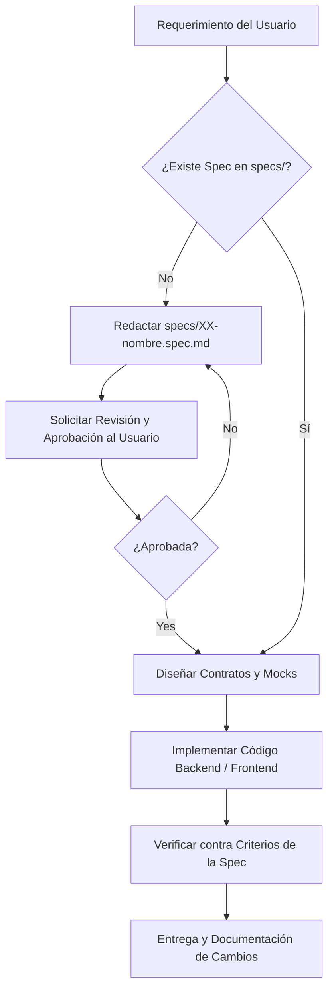

# AGENTS.md — Grimorio Interactivo (Sistema de Magia & Wiki Colaborativa)

> **Regla Suprema del Proyecto:**  
> Este repositorio se rige estrictamente por la metodología **SDD (Spec-Driven Development)**.  
> **"No Spec, No Code"**: Ningún agente de Inteligencia Artificial ni desarrollador humano tiene autorización para crear o modificar código fuente (PHP, JS, CSS, SQL) sin que exista previamente una especificación técnica formal, revisada y validada en el directorio `specs/`.

---

## 1. Visión General del Proyecto

**Grimorio Interactivo** es una biblioteca digital y wiki colaborativa dedicada a sistemas de magia, hechizos, criaturas y artefactos legendarios (inspirada en universos como *Frieren*, *Dungeons & Dragons* y *El Señor de los Anillos*).

### Funcionalidades Núcleo
1. **Creador de Hechizos con Balanceo Automático:** Sistema backend que calcula y asigna el coste de maná según fórmulas matemáticas equilibradas (Daño, Curación, Control, Duración, Área).
2. **Simulador de Grimorio (Frontend Inmersivo):** Interfaz interactiva donde el usuario consulta su colección. Al activar un hechizo, un modal dinámico despliega animaciones de partículas en **Canvas nativo** y pronuncia el conjuro con **Web Speech API**.
3. **Encadenamiento Elemental (Sistema de Combos):** Matriz de afinidad elemental que valida sinergias y reacciones arcanas (ej. *Agua* + *Rayo* = *Electrificación*).
4. **Sistema de Linajes y Dominio:** Clanes mágicos con clasificación semanal basada en contribuciones de contenido validado.
5. **Moderación en 2 Pasos:** Todo hechizo nace en estado `experimental` y solo asciende a `validado` tras 3 firmas independientes de usuarios con rol `Maestro` o intervención del `Admin Supremo`.

---

## 2. Stack Tecnológico & Restricciones Estrictas

El proyecto está diseñado bajo una filosofía de **cero dependencias externas innecesarias**, máximo rendimiento y portabilidad nativa:

### 2.1 Backend (PHP)
* **Versión:** PHP 8.2 o superior.
* **Tipado:** Tipado estricto obligatorio en todos los archivos PHP al inicio:
  ```php
  <?php
  declare(strict_types=1);
  ```
* **Arquitectura:** MVC ligero orientado a **API REST**.
  * Sin frameworks pesados (Laravel, Symfony, etc.).
  * Enrutador frontal (*Front Controller*) en `public/index.php`.
  * Respuestas en formato JSON estándar (`Content-Type: application/json; charset=utf-8`).
* **Base de Datos & Persistencia:**
  * Acceso mediante **PDO nativo**.
  * **100% consultas preparadas** con *parameter binding* (prohibida la concatenación directa de strings en queries SQL).
  * Compatible con MySQL / MariaDB o SQLite.
* **Sesiones y Autenticación:**
  * Sesiones nativas de PHP (`session_start()`).
  * Cookies de sesión con parámetros de seguridad: `httponly = true`, `samesite = 'Strict'`, `secure = true` (en producción).
  * Control de acceso basado en roles (RBAC):
    * `lector`: Solo lectura de contenido validado y consulta pública.
    * `editor`: Creación y edición de hechizos propios (estado inicial: experimental).
    * `maestro`: Capacidad de firmar y moderar hechizos experimentales.
    * `admin_supremo`: Control total del sistema, linajes, usuarios y moderación instantánea.

### 2.2 Frontend (Modern Vanilla Web)
* **HTML5:** Semántica pura (`<main>`, `<article>`, `<dialog>`, `<canvas>`, etc.).
* **CSS3:**
  * **Vanilla CSS puro** sin frameworks (nada de Tailwind, Bootstrap o preprocesadores).
  * Uso de **CSS Custom Properties** (Variables CSS) para la tematización de fantasía oscura y grimorio.
  * Transiciones y animaciones `@keyframes` nativas.
* **JavaScript:**
  * **Modern Vanilla JS** (ES6+) con arquitectura de **ES Modules** nativos (`type="module"`).
  * Modularizado en carpetas funcionales (`services/`, `components/`, `views/`, `utils/`).
  * Sin empaquetadores complejos (Vite/Webpack) para desarrollo base; debe funcionar mediante el servidor web sirviendo los archivos `.js` estáticos directamente.
* **Efectos & Multimedia:**
  * Partículas mágicas y auras: **HTML5 Canvas API nativa** (sin librerías como Three.js o Pixi.js).
  * Pronunciación de conjuros: **Web Speech API** nativa (`window.speechSynthesis`).

---

## 3. Catálogo Oficial de Especificaciones SDD (`specs/`)

Cada especificación en `specs/` debe contener:
* Objetivo y alcance del módulo.
* Contratos de datos (JSON schemas / esquemas SQL).
* Endpoints REST (Método, URL, Headers, Códigos de respuesta HTTP).
* Criterios de aceptación y casos de prueba requeridos.

```
specs/
├── 01-portal-and-navigation.spec.md     # Portal Web, Navegación y Descubrimiento Arcano
├── 02-design-system-layout.spec.md      # Tokens de diseño, Layout responsivo y Componentes UI base
├── 03-auth-rbac.spec.md                 # Sesiones seguras, Registro, Login y Matriz RBAC
├── 04-spell-creator-balance.spec.md     # Creación de hechizos y algoritmo backend de maná
├── 05-grimoire-simulator.spec.md        # Simulador de grimorio, Canvas partículas y Web Speech
├── 06-elemental-affinity-combos.spec.md # Matriz elemental y motor de validación de combos
├── 07-clans-lineages.spec.md            # Linajes mágicos y cálculo de Dominio semanal
└── 08-moderation-two-step.spec.md       # Flujo de moderación (experimental -> 3 firmas -> validado)
```

---

## 4. Protocolo de Trabajo del Agente (SDD Lifecycle)

Todo agente de IA asignado a una tarea debe ejecutar obligatoriamente el siguiente ciclo:



### Reglas de Ejecución:
1. **Fase de Análisis:** Antes de proponer cambios de código, lee la especificación correspondiente en `specs/`. Si el requerimiento cambia la funcionalidad, primero actualiza la especificación y solicita validación.
2. **Fase de Contratos:** Los nombres de campos JSON en la API deben coincidir de forma idéntica con lo estipulado en la spec (`snake_case` para backend/DB y `camelCase` o `snake_case` según se determine en `01-system-architecture.spec.md`).
3. **Fase de Implementación:**
   * Crea código modular, autocontenido y legible.
   * Documenta las fórmulas matemáticas complejas (balanceo de maná, sinergia elemental).
4. **Fase de Verificación:** Ninguna tarea se considera terminada hasta haber probado los endpoints (código 200, 400, 401, 403, 404, 500) y comprobado la renderización visual en el navegador.

---

## 5. Estructura de Directorios del Proyecto

El repositorio debe organizarse de acuerdo a la siguiente estructura estandarizada:

```
grimorio-interactivo/
├── AGENTS.md                            # Constitución del proyecto (este archivo)
├── specs/                               # Especificaciones técnicas SDD
│   ├── 01-system-architecture.spec.md
│   ├── 02-design-system-layout.spec.md
│   └── ...
├── public/                              # Raíz del servidor web accesible públicamente
│   ├── index.php                        # Front Controller de la API y punto de entrada PHP
│   ├── index.html                       # Shell principal de la SPA / aplicación frontend
│   └── assets/                          # Recursos estáticos
│       ├── css/                         # Hojas de estilo CSS nativas
│       │   ├── tokens.css               # Variables CSS, colores, tipografía mística
│       │   ├── layout.css               # Layout principal, cabecera y rejilla
│       │   └── components.css           # Botones, tarjetas, modales, badges
│       ├── js/                          # Código fuente frontend (ES Modules)
│       │   ├── main.js                  # Inicializador y router del cliente
│       │   ├── api/                     # Clientes fetch para comunicarse con el backend
│       │   ├── components/              # Renderizadores de componentes nativos
│       │   ├── views/                   # Vistas principales (Grimorio, Creador, etc.)
│       │   ├── canvas/                  # Motor de partículas e interactividad gráfica
│       │   └── audio/                   # Módulo de Web Speech API para conjuros
│       └── img/                         # Iconos elementales, sellos y fondos
├── src/                                 # Código fuente Backend (Privado, fuera de public/)
│   ├── Core/                            # Enrutador, Request, Response, Contenedor base
│   │   ├── Router.php
│   │   ├── Request.php
│   │   └── Response.php
│   ├── Database/                        # Conexión PDO y gestión de transacciones
│   │   └── Connection.php
│   ├── Controllers/                     # Controladores que reciben peticiones de la API
│   ├── Models/                          # Entidades y mapeo de datos
│   ├── Services/                        # Lógica de negocio (Balanceo, Combos, Dominio)
│   └── Middleware/                      # Autenticación, validación de sesión y roles
└── database/                            # Scripts de bases de datos
    ├── schema.sql                       # Esquema DDL de tablas e índices
    └── seeds.sql                        # Datos iniciales (clanes, escuelas mágicas, admin)
```

---

## 6. Estándares de Código y Seguridad

### 6.1 Seguridad
* **Inyecciones SQL:** Utilizar siempre `$stmt->prepare()` y `$stmt->execute($params)`. Prohibida cualquier consulta dinámica insegura.
* **Cross-Site Scripting (XSS):** Todo dato renderizado en el DOM desde entradas de usuario debe ser escapado (`textContent` en lugar de `innerHTML`, o sanitizado adecuadamente si requiere formato).
* **Cross-Site Request Forgery (CSRF):** Las peticiones mutables (`POST`, `PUT`, `DELETE`) en la API deben verificar cabeceras seguras o tokens de sesión.
* **Control de Errores:** Nunca mostrar excepciones de PDO o trazas internas en respuestas de producción. Responder con JSON de error controlado:
  ```json
  {
    "success": false,
    "error": {
      "code": "MANA_BALANCE_FAILED",
      "message": "Los efectos superan el umbral permitido para el nivel asignado."
    }
  }
  ```

### 6.2 Convenciones de Nomenclatura y Dualidad Lingüística
En concordancia con el Artículo V de la Constitución:
* **Idioma del Código:** Todos los identificadores (variables, funciones, métodos, propiedades, claves JSON y endpoints) deben estar en **inglés**.
* **Comentarios en Castellano:** Todos los comentarios explicativos dentro del código (`//`, `/* */`, PHPDoc y JSDoc) deben estar redactados en **castellano**.
* **PHP:**
  * Clases e interfaces: `PascalCase` en inglés (ej. `SpellBalanceService`).
  * Métodos y funciones: `camelCase` en inglés (ej. `calculateManaCost()`).
  * Variables y propiedades: `camelCase` en inglés (ej. `$spellData`).
  * Constantes: `UPPER_SNAKE_CASE` (ej. `STATUS_EXPERIMENTAL`).
* **JavaScript:**
  * Archivos de módulos: `kebab-case.js` o `camelCase.js` consistente.
  * Funciones, variables y propiedades de objetos: `camelCase` en inglés (ej. `fetchSpellDetails`, `manaCost`).
  * Clases / Componentes: `PascalCase` en inglés (ej. `GrimoireViewer`).
* **CSS:**
  * Clases semánticas en `kebab-case` (ej. `.spell-card`, `.spell-card__mana-badge`).
  * Variables de diseño: `--magic-primary`, `--mana-blue`, `--affinity-fire`.

---

## 7. Protocolo de Comunicación del Agente de IA

1. **Idioma de Interacción:** Toda comunicación con el usuario (respuestas, explicaciones, preguntas, planes y resúmenes) debe realizarse **estrictamente en castellano**.
2. **Tono y Precisión:** El agente debe mantener un tono colaborativo, técnico y riguroso, respetando la atmósfera del proyecto sin perder concisión.
3. **Respeto a la Constitución:** Ante cualquier solicitud que contradiga los artículos de `constitution.md` (ej. sugerir dependencias npm o eludir el cálculo determinista de maná), el agente debe advertir de la violación constitucional y proponer la alternativa nativa correspondiente.

---

## 8. Checklist de Calidad para Agentes

Antes de entregar cualquier tarea o darla por finalizada, el agente debe verificar:

- [ ] ¿Existe una especificación en `specs/` que respalde este cambio?
- [ ] ¿Se añadieron tipos estrictos (`declare(strict_types=1);`) a todos los archivos PHP nuevos?
- [ ] ¿Todas las consultas a base de datos utilizan PDO con parámetros vinculados?
- [ ] ¿Los nombres de variables, funciones y métodos están en inglés y en `camelCase`?
- [ ] ¿Los comentarios del código y la documentación están en castellano?
- [ ] ¿Se probó la API con datos válidos y con entradas erróneas?
- [ ] ¿El frontend utiliza ES Modules nativos sin dependencias externas de npm o CDNs?
- [ ] ¿Las animaciones y la síntesis de voz degradan elegantemente si el navegador del usuario no tiene soporte?
- [ ] ¿El código respeta el rol de usuario autenticado y las reglas de conflicto de interés entre clanes?
