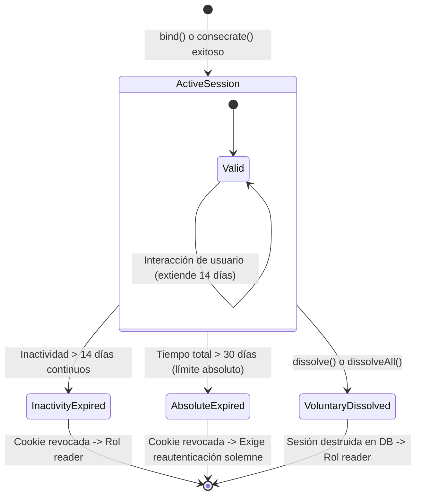

# PLAN-03: Plan Técnico de Implementación — Autenticación, Sesiones y Control de Acceso (RBAC)

> **Especificación Asociada:** [`specs/03-auth-rbac.spec.md`](file:///C:/Users/Friki/.gemini/antigravity/scratch/grimorio-interactivo/specs/03-auth-rbac.spec.md)  
> **Constitución:** [`constitution.md`](file:///C:/Users/Friki/.gemini/antigravity/scratch/grimorio-interactivo/constitution.md) | **Directrices:** [`AGENTS.md`](file:///C:/Users/Friki/.gemini/antigravity/scratch/grimorio-interactivo/AGENTS.md)  
> **Estado:** Listo para Implementación  
> **Restricción Suprema:** Dogma Vanilla (Cero dependencias externas, cero Composer/JWT) y Dualidad Lingüística (Código, tablas, identificadores y roles en inglés `camelCase`, interfaz, motivos y comentarios en noble castellano).

---

## 1. Estructura de Módulos y Ficheros

La arquitectura se organiza en una capa backend en **PHP 8.2+ con tipado estricto** (`declare(strict_types=1);`) y un cliente frontend modular en **Modern Vanilla JS** (ES Modules nativos):

```
grimorio-interactivo/
├── src/                                         # Código fuente Backend privado
│   ├── Core/
│   │   ├── SessionManager.php                   # Gestor de cookies nativas seguras y ciclo de vida de sesión [RF-02]
│   │   └── RateLimiter.php                      # Bloqueo anti-DoS y anti-fuerza bruta por IP en base de datos [RF-03]
│   ├── Middleware/
│   │   ├── AuthMiddleware.php                   # Validación de vínculo activo e inyección de usuario [RF-02]
│   │   └── RbacMiddleware.php                   # Verificación estricta de roles sagrados (reader, editor, master, supremeAdmin) [RF-05]
│   ├── Controllers/
│   │   ├── AuthController.php                   # Endpoints de consagración, vínculo, disolución y recuperación [RF-01 a RF-04]
│   │   └── AuditController.php                  # Endpoint público para consulta de la Bitácora Arcana [RF-08]
│   ├── Services/
│   │   ├── AuthService.php                      # Lógica de registro, hash, verificación y revocación [RF-01, RF-02, RF-04]
│   │   ├── ClanConflictService.php              # Verificación de incompatibilidad histórica de linaje (30 días) [RF-06]
│   │   └── AuditService.php                     # Registro inmutable de acciones solemnes de moderación y gobierno [RF-08]
│   └── Models/
│       ├── User.php                             # Entidad tipada inmutable con rol y clan [RF-01, RF-05]
│       └── AuditEntry.php                       # Entidad inmutable de registro de auditoría [RF-08]
└── public/
    └── assets/
        └── js/
            ├── api/
            │   └── authClient.js                # Cliente fetch para interactuar con la API de autenticación y auditoría [RF-01 a RF-08]
            ├── components/
            │   ├── accessModalComponent.js      # Diálogo «Cruzar el Umbral» (Consagrarse / Renovar Vínculo) [RF-01, RF-02]
            │   ├── recoveryModalComponent.js    # Flujo de «Pergamino de Restablecimiento» [RF-04]
            │   └── userProfileBadge.js          # Indicador visual del avatar, clan y rol activo en cabecera [RF-02]
            └── views/
                └── auditLogView.js              # Vista pública de la Bitácora de Auditoría con filtros cronológicos [RF-08]
```

---

## 2. Esquema de Datos y Contratos de la API REST

### 2.1 Esquema DDL en SQL (Base de Datos Relacional PDO)

Todos los identificadores de columnas y roles se declaran en **inglés y `snake_case`/`camelCase`** cumpliendo el **Artículo V de la Constitución**:

```sql
-- 1. Tabla de Miembros Consagrados [RF-01, RF-05]
CREATE TABLE IF NOT EXISTS users (
    id VARCHAR(36) PRIMARY KEY,                  -- Identificador único uuid (ej. 'usr_8f1a2b3c')
    alias VARCHAR(30) NOT NULL UNIQUE,           -- Nombre de iniciado público (3 a 30 caracteres)
    email VARCHAR(255) NOT NULL UNIQUE,          -- Correo electrónico validado
    password_hash VARCHAR(255) NOT NULL,         -- Frase de paso hasheada con BCRYPT/ARGON2ID
    role VARCHAR(20) NOT NULL DEFAULT 'editor',  -- Roles: 'reader', 'editor', 'master', 'supremeAdmin'
    clan_id VARCHAR(36) NOT NULL,                -- Clave foránea hacia el clan de afiliación
    created_at DATETIME NOT NULL,
    updated_at DATETIME NOT NULL,
    FOREIGN KEY (clan_id) REFERENCES clans(id) ON UPDATE CASCADE
);

-- 2. Registro de Sesiones Activas Multidispositivo [RF-02]
CREATE TABLE IF NOT EXISTS user_sessions (
    id VARCHAR(36) PRIMARY KEY,                  -- ID único de sesión
    session_token_hash VARCHAR(64) NOT NULL UNIQUE, -- SHA-256 del token de sesión almacenado
    user_id VARCHAR(36) NOT NULL,
    ip_address VARCHAR(45) NOT NULL,             -- Soporte para IPv4 e IPv6
    user_agent TEXT,
    created_at DATETIME NOT NULL,
    last_activity_at DATETIME NOT NULL,          -- Renovación continua en cada acción
    expires_at DATETIME NOT NULL,                -- Ventana de 14 días renovables
    absolute_expires_at DATETIME NOT NULL,       -- Límite absoluto inmutable de 30 días
    FOREIGN KEY (user_id) REFERENCES users(id) ON DELETE CASCADE
);

-- 3. Registro de Intentos de Acceso y Defensa Anti-DoS [RF-03]
CREATE TABLE IF NOT EXISTS login_attempts (
    id INT AUTO_INCREMENT PRIMARY KEY,
    ip_address VARCHAR(45) NOT NULL,             -- La procedencia que se congela tras 5 fallos
    attempted_identity VARCHAR(255) NOT NULL,    -- Alias o correo intentado
    attempted_at DATETIME NOT NULL,
    is_success BOOLEAN NOT NULL DEFAULT 0,
    INDEX idx_ip_attempt (ip_address, attempted_at)
);

-- 4. Historial de Linajes para Incompatibilidad Histórica de 30 Días [RF-06, RF-07]
CREATE TABLE IF NOT EXISTS clan_history (
    id INT AUTO_INCREMENT PRIMARY KEY,
    user_id VARCHAR(36) NOT NULL,
    clan_id VARCHAR(36) NOT NULL,
    joined_at DATETIME NOT NULL,
    left_at DATETIME NULL,                       -- NULL indica que es el clan actualmente activo
    FOREIGN KEY (user_id) REFERENCES users(id) ON DELETE CASCADE,
    FOREIGN KEY (clan_id) REFERENCES clans(id) ON UPDATE CASCADE,
    INDEX idx_user_clan_time (user_id, left_at)
);

-- 5. Bitácora Inmutable de Auditoría Arcana [RF-08, RNF-02, Art. III]
CREATE TABLE IF NOT EXISTS audit_log (
    id INT AUTO_INCREMENT PRIMARY KEY,
    actor_user_id VARCHAR(36) NOT NULL,          -- Identidad del moderador o admin actuante
    actor_alias VARCHAR(30) NOT NULL,            -- Alias público en el momento de la acción
    actor_role VARCHAR(20) NOT NULL,             -- Rol técnico activo en ese instante
    action_type VARCHAR(50) NOT NULL,            -- 'SIGN_VALIDATE', 'SIGN_REJECT', 'ADMIN_VETO', 'PROMOTE_MASTER', 'DEMOTE_MASTER', 'CLAN_MODIFY'
    target_entity_type VARCHAR(50) NOT NULL,     -- 'spell', 'clan', 'user'
    target_entity_id VARCHAR(36) NOT NULL,
    justification TEXT NOT NULL,                 -- Motivo solemne obligatorio en castellano
    created_at DATETIME NOT NULL,
    INDEX idx_audit_created (created_at DESC),
    INDEX idx_audit_actor (actor_user_id)
);
```

---

### 2.2 Contratos de la API REST

Base URL: `/api/v1`  
Cabecera Global: `Content-Type: application/json; charset=utf-8`

#### Endpoint 1: Consagración de Nuevo Miembro (Registro)
* **`POST /api/v1/auth/consecrate`**
* **Payload Entrada:**
  ```json
  {
    "alias": "FrierenElf",
    "email": "frieren@sanctuario.arc",
    "passphrase": "palabra-secreta-del-mago",
    "clanId": "cln_astral_scholars"
  }
  ```
* **Respuestas HTTP:**
  * `201 Created`: Cuenta creada exitosamente. Se establece la cookie de sesión `PHPSESSID`.
    ```json
    {
      "success": true,
      "data": {
        "user": {
          "id": "usr_9a8b7c6d",
          "alias": "FrierenElf",
          "role": "editor",
          "clanId": "cln_astral_scholars",
          "clanName": "Eruditos Astrales"
        }
      }
    }
    ```
  * `400 Bad Request`: Datos no válidos (alias fuera de rango o clan inexistente).
  * `409 Conflict`: Identidad ya reclamada (mensaje neutro anti-enumeración).

#### Endpoint 2: Renovación de Vínculo (Inicio de Sesión)
* **`POST /api/v1/auth/bind`**
* **Payload Entrada:**
  ```json
  {
    "identity": "frieren@sanctuario.arc",
    "passphrase": "palabra-secreta-del-mago"
  }
  ```
* **Respuestas HTTP:**
  * `200 OK`: Vínculo renovado. Se emite cookie segura `PHPSESSID` con parámetros: `HttpOnly=true`, `SameSite=Strict`, `Path=/`, `Max-Age=1209600` (14 días).
  * `401 Unauthorized`: Credenciales no coincidentes (`"Las runas no reconocen este vínculo o la palabra secreta es errónea"`).
  * `429 Too Many Requests`: Procedencia congelada tras 5 intentos fallidos (`"El umbral permanecerá cerrado durante 15 minutos"`).

#### Endpoint 3: Disolución de Vínculo (Cierre de Sesión Individual y Global)
* **`POST /api/v1/auth/dissolve`** (Destruye la sesión actual).
* **`POST /api/v1/auth/dissolve-all`** (Destruye todas las sesiones del usuario en todos sus dispositivos).
* **Respuesta HTTP `200 OK`:**
  ```json
  {
    "success": true,
    "data": {
      "message": "El vínculo ha sido disuelto en paz."
    }
  }
  ```

#### Endpoint 4: Verificación de Sesión Activa
* **`GET /api/v1/auth/session`**
* **Respuesta HTTP `200 OK` (Autenticado):**
  ```json
  {
    "success": true,
    "data": {
      "authenticated": true,
      "user": {
        "id": "usr_9a8b7c6d",
        "alias": "FrierenElf",
        "role": "master",
        "clanId": "cln_astral_scholars",
        "clanName": "Eruditos Astrales"
      }
    }
  }
  ```
* **Respuesta HTTP `200 OK` (No autenticado / Lector):**
  ```json
  {
    "success": true,
    "data": {
      "authenticated": false,
      "user": null
    }
  }
  ```

#### Endpoint 5: Recuperación de Acceso («Pergamino de Restablecimiento»)
* **`POST /api/v1/auth/recovery/request`**  
  Payload: `{ "email": "frieren@sanctuario.arc" }`  
  Respuesta `200 OK`: Mensaje neutral de confirmación.
* **`POST /api/v1/auth/recovery/reset`**  
  Payload: `{ "token": "tok_sec_12345", "newPassphrase": "nueva-palabra-arcana-678" }`  
  Respuesta `200 OK`: Frase de paso actualizada y sesiones previas revocadas.

#### Endpoint 6: Consulta Pública de la Bitácora de Auditoría
* **`GET /api/v1/audit/log?page=1&limit=25&clanId=cln_astral_scholars`**
* **Respuesta HTTP `200 OK`:**
  ```json
  {
    "success": true,
    "data": {
      "items": [
        {
          "id": 142,
          "actorAlias": "HeiterElSabio",
          "actorRole": "master",
          "actionType": "SIGN_VALIDATE",
          "targetEntityType": "spell",
          "targetEntityId": "spl_llamas_frieren",
          "targetEntityName": "Llamas de Frieren",
          "justification": "Composición matemática de maná equilibrada y componentes rigurosamente descritos.",
          "createdAt": "2026-09-12T14:22:10Z"
        }
      ],
      "pagination": {
        "page": 1,
        "limit": 25,
        "totalItems": 142,
        "totalPages": 6
      }
    }
  }
  ```

---

## 3. Algoritmos Clave en Pseudocódigo y Máquinas de Estado

### 3.1 Algoritmo de Verificación de Conflicto de Intereses entre Clanes (Artículo III)
```text
FUNCTION canMasterSignSpell(masterUser: User, targetSpell: Spell) -> ValidationResult:
    // Regla 1: No auto-aprobación
    IF masterUser.id == targetSpell.authorId THEN
        RETURN REJECTED("Un erudito no puede emitir firmas sobre sus propias creaciones.")

    // Regla 2: Incompatibilidad con el clan actual
    IF masterUser.clanId == targetSpell.clanId THEN
        RETURN REJECTED("El vínculo de sangre nubla el juicio: un Maestro no puede juzgar el trabajo de su propio linaje actual.")

    // Regla 3: Incompatibilidad histórica de 30 días (Artículo III blindado)
    LET historicalClans = DB.query(
        "SELECT clan_id FROM clan_history 
         WHERE user_id = :userId 
           AND (left_at IS NULL OR left_at >= DATE_SUB(NOW(), INTERVAL 30 DAY))",
        { userId: masterUser.id }
    )
    
    FOR clan IN historicalClans:
        IF clan.clan_id == targetSpell.clanId THEN
            RETURN REJECTED("El Maestro ha pertenecido a este linaje en los últimos 30 días: firma vetada por incompatibilidad histórica.")

    RETURN APPROVED()
```

### 3.2 Máquina de Estados del Ciclo de Vida de la Sesión


### 3.3 Algoritmo de Protección Anti-Fuerza Bruta y Anti-DoS por IP
```text
FUNCTION checkRateLimit(clientIp: String) -> RateLimitResult:
    LET windowMinutes = 15
    LET maxAllowedFailures = 5
    
    LET recentFailures = DB.queryScalar(
        "SELECT COUNT(*) FROM login_attempts 
         WHERE ip_address = :ip 
           AND is_success = 0 
           AND attempted_at >= DATE_SUB(NOW(), INTERVAL :window MINUTE)",
        { ip: clientIp, window: windowMinutes }
    )
    
    IF recentFailures >= maxAllowedFailures THEN
        LET lastFailureTime = DB.queryScalar(
            "SELECT MAX(attempted_at) FROM login_attempts WHERE ip_address = :ip",
            { ip: clientIp }
        )
        LET remainingSeconds = (lastFailureTime + 15 MIN) - NOW()
        RETURN BLOCKED(remainingSeconds)
        
    RETURN ALLOWED()
```

### 3.4 Hashing Criptográfico y Mitigación de Ataques Temporales
```text
FUNCTION verifyCredentialsSafe(identity: String, candidatePassphrase: String) -> Boolean:
    LET user = DB.findUserByEmailOrAlias(identity)
    
    // Hash señuelo en memoria para garantizar tiempo de cómputo constante si el usuario no existe
    LET dummyHash = "$2y$12$e8m4wW9u9Zk7sH1s3gV0I.Q1Q3Q5Q7Q9Q1Q3Q5Q7Q9Q1Q3Q5Q7Q9"
    LET hashToVerify = (user != null) ? user.passwordHash : dummyHash
    
    LET isValid = NATIVE_PASSWORD_VERIFY(candidatePassphrase, hashToVerify)
    
    RETURN (user != null AND isValid)
```

---

## 4. Decisiones Técnicas Justificadas

### Decisión 1: Sesiones Nativas de PHP (`PHPSESSID`) con Cookies Seguras frente a Tokens JWT en LocalStorage
* **Elección:** Utilizar el mecanismo de sesiones nativo de PHP respaldado en base de datos relacional mediante la tabla `user_sessions`, transmitido vía cookie `HttpOnly`, `SameSite=Strict` y `Secure`.
* **Alternativa Descartada:** Tokens JWT almacenados en `localStorage` o `sessionStorage`.
* **Justificación:** Los tokens en `localStorage` son vulnerables a ataques de robo de sesión mediante Cross-Site Scripting (XSS). Las cookies con bandera `HttpOnly` no pueden ser leídas por JavaScript malicioso. Además, las sesiones en base de datos permiten la revocación instantánea (cierre global, degradación de rol en tiempo real o baneo inmediato), capacidad imposible con JWTs sin dependencias externas complejas.

### Decisión 2: Control Anti-Fuerza Bruta Relacional Nativo frente a Servicios Externos (Redis/Memcached)
* **Elección:** Registrar intentos en la tabla `login_attempts` con índices optimizados en `(ip_address, attempted_at)`.
* **Alternativa Descartada:** Depender de un demonio de Redis o librerías de Composer (`predis`, `symfony/rate-limiter`).
* **Justificación Constitucional:** Cumple el **Artículo I (Dogma Vanilla)**. Mantiene la portabilidad del proyecto sin exigir servicios adicionales en el entorno de desarrollo y soporta sin latencia el volumen de peticiones del compendio.

### Decisión 3: Funciones Criptográficas Nativas de PHP (`password_hash` y `password_verify`)
* **Elección:** Utilizar `password_hash($passphrase, PASSWORD_BCRYPT, ['cost' => 12])` nativo del motor de PHP.
* **Alternativa Descartada:** Paquetes externos de cifrado o hashing SHA-256 plano.
* **Justificación:** `password_hash` incorpora de forma transparente salting criptográfico aleatorio, protección contra ataques de tablas arcoíris y ajuste de coste computacional sin requerir librerías de terceros.

---

## 5. Estrategia de Pruebas y Verificación

### 5.1 Script Automatizado de Verificación Integral (`scratch/test_auth_rbac.php`)
Se creará un script de prueba de integración que ejecutará los siguientes escenarios secuenciales:

1. **Prueba de Consagración:** Registra un nuevo usuario con alias, correo y clan, confirmando la asignación del rol técnico `editor`.
2. **Prueba de Autenticación y Cookie:** Valida que `POST /api/v1/auth/bind` responde `200 OK` con las cabeceras `Set-Cookie` configuradas con `HttpOnly` y `SameSite=Strict`.
3. **Prueba de Matriz RBAC (4 Roles):**
   * Usuario `reader` intenta redactar conjuro $\rightarrow$ Código `403 Forbidden`.
   * Usuario `editor` intenta emitir firma sobre conjuro ajeno $\rightarrow$ Código `403 Forbidden`.
   * Usuario `master` firma conjuro experimental ajeno $\rightarrow$ Código `200 OK`.
   * Usuario `supremeAdmin` ejecuta veto directo $\rightarrow$ Código `200 OK`.
4. **Prueba del Conflicto de Intereses (Artículo III):**
   * Usuario `master` intenta firmar un hechizo creado por un miembro de su mismo clan $\rightarrow$ Código `403 Forbidden` con error `CLAN_CONFLICT_OF_INTEREST`.
   * Usuario `master` trasladado hace menos de 30 días intenta firmar un hechizo de su antiguo clan $\rightarrow$ Código `403 Forbidden`.
5. **Prueba de Rate-Limiting Anti-DoS:** Emite 5 peticiones erróneas consecutivas y comprueba que la 6.ª petición es rechazada con código `429 Too Many Requests`.
6. **Prueba de Cierre Global:** Ejecuta `dissolve-all` y comprueba que todos los registros de sesión en `user_sessions` quedan invalidados.

---

## 6. Matriz de Trazabilidad de Requisitos

| Requisito | Descripción | Módulo / Clase Técnica | Endpoint / Método | Verificación |
| :--- | :--- | :--- | :--- | :--- |
| **RF-01.1 a 01.3** | Consagración con clan obligatorio y alias único | `AuthService.php`, `User.php` | `POST /api/v1/auth/consecrate` | Test 1 en `test_auth_rbac.php` |
| **RF-02.1 a 02.3** | Sesión de 14 días y tope de 30 días | `SessionManager.php` | `POST /api/v1/auth/bind` | Test 2 y comprobación de `expires_at` |
| **RF-02.4** | Disolución individual y global | `AuthService.php`, `SessionManager.php` | `POST /api/v1/auth/dissolve[-all]` | Test 6 (revocación en base de datos) |
| **RF-03.1 / 03.2** | Anti-enumeración y bloqueo IP 15 min | `RateLimiter.php`, `AuthService.php` | `POST /api/v1/auth/bind` | Test 5 (429 tras 5 fallos) |
| **RF-04.1 / 04.2** | Pergamino de restablecimiento (1 hora) | `AuthService.php` | `POST /api/v1/auth/recovery/*` | Flujo de token temporal |
| **RF-05.1 / 05.2** | Matriz RBAC para los 4 roles | `RbacMiddleware.php` | Todos los endpoints protegidos | Test 3 (respuestas 200 vs 403) |
| **RF-06.1 / 06.2** | Conflicto de intereses (30 días) | `ClanConflictService.php` | `POST /api/v1/spells/{id}/sign` | Test 4 (rechazo estricto) |
| **RF-07.1 a 07.3** | Lealtad de clan y tregua de 24 horas | `AuthService.php` | Lógica de cambio de linaje | Inspección de fechas y puntos adscritos |
| **RF-08.1 / 08.2** | Bitácora de Auditoría pública | `AuditService.php`, `AuditController.php` | `GET /api/v1/audit/log` | Consulta pública sin credenciales |
| **RF-09.1 / 09.2** | Preservación del legado anónimo | `AuthService.php` | Lógica de baja de usuario | Reasignación a «Erudito Ancestral» |
| **RNF-01 a 05** | Hashing BCRYPT, inmutabilidad y < 50ms | `SessionManager.php`, `AuditService.php` | N/A | Profiling de latencia y análisis de BD |

---

## 7. Cumplimiento Constitucional y de Gobernanza

1. **Artículo I (El Dogma Vanilla):** Cero dependencias añadidas a Composer ni librerías externas de autenticación (nada de Firebase, Auth0, LexikJWT ni paquetes de encriptación); uso exclusivo de APIs nativas de PHP 8.2+ (`session_start`, `password_hash`, `PDO`).
2. **Artículo III (Ética de la Moderación y Conflicto de Intereses):** Implementación estricta en el servicio `ClanConflictService.php` con doble barrera (UI deshabilitada y rechazo 403 invariable en el backend) que cubre tanto el clan presente como los linajes de los últimos 30 días.
3. **Artículo IV (El Velo Arcano):** Todos los mensajes de rechazo, advertencias de bloqueo y términos visuales conservan la solemnidad de alta fantasía en castellano.
4. **Artículo V (Dualidad Lingüística):**
   * Identificadores de roles, tablas, variables y claves JSON en **inglés `camelCase`** (`reader`, `editor`, `master`, `supremeAdmin`, `clanId`, `passwordHash`).
   * Toda la documentación técnica, motivos de auditoría y textos de interfaz en **castellano noble**.
