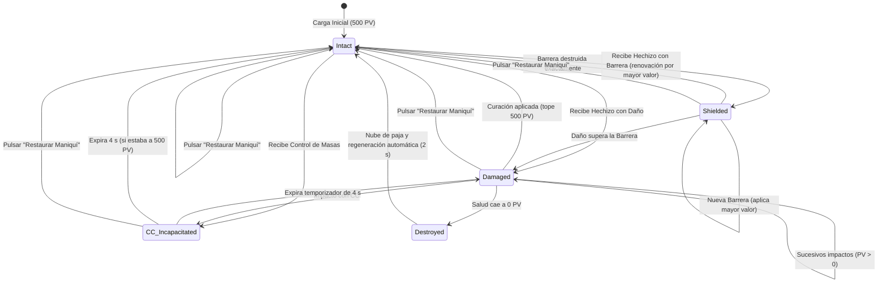

# PLAN-05: Plan Técnico de Implementación — Simulador de Grimorio, Partículas de Maná y Recitado Mágico por Voz

> **Especificación Asociada:** [`specs/05-grimoire-simulator.spec.md`](file:///C:/Users/Friki/.gemini/antigravity/scratch/grimorio-interactivo/specs/05-grimoire-simulator.spec.md)  
> **Constitución:** [`constitution.md`](file:///C:/Users/Friki/.gemini/antigravity/scratch/grimorio-interactivo/constitution.md) | **Directrices:** [`AGENTS.md`](file:///C:/Users/Friki/.gemini/antigravity/scratch/grimorio-interactivo/AGENTS.md)  
> **Estado:** Listo para Implementación  
> **Restricción Suprema:** Dogma Vanilla (Cero librerías gráficas externas, cero frameworks de sonido o física) y Dualidad Lingüística (Código, clases y APIs en inglés `camelCase`; cánticos, interfaz, bitácora y narrativa en noble castellano).

---

## 1. Estructura de Módulos y Ficheros

La arquitectura se organiza en servicios desacoplados backend en **PHP 8.2+ estricto** (`declare(strict_types=1);`) para la entrega de datos litúrgicos y un subsistema frontend en **Modern Vanilla JS (ES Modules nativos)** para la simulación física en Canvas 2D y el manejo vocal por Web Speech API:

```
grimorio-interactivo/
├── src/                                         # Capa Backend privada (PHP 8.2+)
│   ├── Dto/
│   │   └── GrimoirePageDto.php                  # Carga útil optimizada para la doble página del libro [RF-01, RF-03]
│   ├── Services/
│   │   └── GrimoireQueryService.php             # Filtrado, paginación y aislamiento Canónico vs. Ensayos [RF-01.2, RF-01.4]
│   └── Controllers/
│       └── GrimoireController.php               # Endpoints REST para hojear el grimorio y detalle ritual [RF-01]
├── public/                                      # Raíz pública del servidor web
│   └── assets/
│       ├── css/
│       │   └── components/
│       │       └── grimoire-simulator.css       # Maquetación del Tomo (doble página, textura pergamino, panel táctil) [RF-01]
│       └── js/
│           ├── api/
│           │   └── grimoireClient.js            # Cliente HTTP nativo (fetch) con credentials: 'same-origin' [RF-01]
│           ├── components/
│           │   ├── grimoireBookComponent.js     # Hojear tomo, marcapáginas, navegación acotada e índice rúnico [RF-01]
│           │   ├── arcaneCanvasComponent.js     # Contenedor del lienzo Canvas 2D, RAF y gestión de visibilidad [RF-03, RF-06]
│           │   ├── combatDummyComponent.js      # Máquina de estados del maniquí (500 PV, escudos, CC y regeneración) [RF-02]
│           │   └── floatingCombatTextComponent.js # Proyección escalonada en espacio/tiempo de números de impacto [RF-05.2]
│           ├── utils/
│           │   ├── particleEngine.js            # Motor 2D cinemático, perfiles elementales y buffer circular FIFO [RF-03, RNF-01]
│           │   └── speechService.js             # Síntesis vocal ceremonial (es-ES) y reconocimiento con tolerancia [RF-04]
│           └── views/
│               └── grimoireSimulatorView.js     # Orquestador principal de la experiencia y bus de eventos [RF-01 a RF-06]
└── scratch/
    └── test_grimoire_catalog.php                # Script automatizado CLI para verificar el catálogo del grimorio
```

---

## 2. Modelo de Datos y Contratos de la API REST

### 2.1 Contratos de Endpoints REST

#### 1. Consulta del Catálogo de Páginas del Grimorio
* **Ruta:** `GET /api/v1/grimoire/spells`
* **Cabeceras:** `Accept: application/json`
* **Parámetros Query:**
  * `circle` (int, opcional): Filtrar por Círculo Arcano (1 a 5).
  * `element` (string, opcional): Filtrar por afinidad elemental (`fire`, `water`, `lightning`, `earth`, `wind`, `light`, `darkness`, `pureArcane`).
  * `mode` (string, opcional, por defecto `canonical`):
    * `canonical`: Retorna únicamente conjuros sellados (`status = 'validated'`). Accesible para anónimos y autenticados.
    * `essays`: Retorna conjuros propios del autor autenticado (`status IN ('draft', 'experimental')`). Requiere sesión activa; si es anónimo responde `401 Unauthorized`.
  * `page` (int, por defecto 1): Número de hoja de lectura.
  * `limit` (int, por defecto 10, máximo 50).
* **Respuestas:**
  * `200 OK`: Lista paginada de fichas para el grimorio.
  * `401 Unauthorized`: Si se solicita `mode=essays` sin sesión autenticada.

```json
// GET /api/v1/grimoire/spells?circle=2&mode=canonical HTTP/1.1
// Respuesta HTTP/1.1 200 OK
{
  "success": true,
  "data": {
    "totalSpells": 14,
    "currentPage": 1,
    "totalPages": 2,
    "hasPrevious": false,
    "hasNext": true,
    "spells": [
      {
        "id": "spl_8f1a2c3b",
        "slug": "esfera-de-llamas-purificadoras",
        "name": "Esfera de Llamas Purificadoras",
        "magicSchool": "evocation",
        "elementalAffinity": "fire",
        "circle": 2,
        "manaCost": 35,
        "castingTime": "action",
        "incantationFormula": "¡Llamas del alba, descended y consumid la penumbra!",
        "hasVerbal": true,
        "hasSomatic": true,
        "hasMaterial": false,
        "rangeType": "medium",
        "areaType": "sphere",
        "durationType": "instant",
        "effects": {
          "damage": 30,
          "healing": 0,
          "barrier": 0,
          "crowdControlType": "none"
        },
        "description": "Una esfera ígnea condensada que estalla en ascuas voraces al contacto.",
        "authorAlias": "Archimago Ignis",
        "clanName": "Círculo de la Llama Eterna",
        "status": "validated"
      }
    ]
  }
}
```

#### 2. Consulta de Detalle Litúrgico Individual
* **Ruta:** `GET /api/v1/grimoire/spells/{id}`
* **Cabeceras:** `Accept: application/json`
* **Respuestas:**
  * `200 OK`: Ficha litúrgica exhaustiva con todos los metadatos de iluminación.
  * `404 Not Found`: Si el conjuro no existe o no es accesible para el usuario según su estatus.

---

### 2.2 Esquema de Almacenamiento Local (Cliente `localStorage`)

Para cumplir con `RF-05.3` sin sobrecargar el servidor con peticiones de banco de pruebas efímero, la **Bitácora de Pruebas** se retiene localmente en el navegador bajo la clave `grimorio_test_log_v1`:

```json
{
  "sessionId": "ses_9a8b7c6d",
  "maxEntries": 5,
  "logs": [
    {
      "timestamp": "2026-09-13T19:05:12Z",
      "spellName": "Esfera de Llamas Purificadoras",
      "elementalAffinity": "fire",
      "circle": 2,
      "manaCost": 35,
      "damageDealt": 30,
      "barrierAbsorbed": 0,
      "healingApplied": 0,
      "crowdControlApplied": "none",
      "dummyRemainingHealth": 470
    }
  ]
}
```

---

## 3. Algoritmos Clave y Máquinas de Estado

### 3.1 Motor de Partículas en Canvas 2D con Buffer Circular FIFO (`particleEngine.js`)

Para garantizar **60 FPS estables** sin sobrecargar la recolección de basura (*Garbage Collection*) ni exceder el techo de 200 partículas (`RF-03.4`, `RNF-01`):

```typescript
// Pseudocódigo del Ring Buffer (Object Pool FIFO)
class ParticlePool {
  private readonly maxParticles: number = 200;
  private pool: Particle[] = new Array(200);
  private headIndex: number = 0;
  private activeCount: number = 0;

  constructor() {
    for (let i = 0; i < this.maxParticles; i++) {
      this.pool[i] = new Particle(); // Instanciación única en arranque
    }
  }

  public emit(x: number, y: number, vx: number, vy: number, color: string, size: number, life: number): void {
    const particle = this.pool[this.headIndex];
    
    // Si la partícula sobreescrita estaba viva, se fuerza su extinción inmediata (FIFO)
    particle.init(x, y, vx, vy, color, size, life);
    
    this.headIndex = (this.headIndex + 1) % this.maxParticles;
    if (this.activeCount < this.maxParticles) {
      this.activeCount++;
    }
  }

  public updateAndRender(ctx: CanvasRenderingContext2D, dt: number): void {
    for (let i = 0; i < this.maxParticles; i++) {
      const p = this.pool[i];
      if (p.alive) {
        p.update(dt);
        if (!p.alive && this.activeCount > 0) this.activeCount--;
        p.draw(ctx);
      }
    }
  }
}
```

#### Perfiles Cinemáticos por Afinidad Elemental y Geometría (`RF-03.1`, `RF-03.2`)

* **Geometría Cinética:**
  * `singleTarget` / `touch`: Vector dirigido desde el origen hacia las coordenadas del torso del maniquí $(X_{target}, Y_{target})$.
  * `cone`: Dispersión angular cónica $\theta \in [\theta_0 - 25^\circ, \theta_0 + 25^\circ]$ con velocidad radial decreciente.
  * `line`: Emisión de alta velocidad en haz colimado lineal transversal a lo largo del eje horizontal con estela densa.
  * `sphere`: Explosión radial omnidireccional con ángulo aleatorio $\theta \in [0, 2\pi)$ con aceleración hacia el exterior centrada en el maniquí.
* **Paleta y Dinámica Elemental:**
  * `fire`: Gravedad negativa (ascienden), partículas con fricción, colores `#ff4500`, `#ffa500`, `#ffffff`.
  * `water`: Trayectorias fluidas sinusoidales, ondas elípticas, colores `#00bfff`, `#1e90ff`, `#e0ffff`.
  * `lightning`: Desplazamiento por segmentos fractales quebrados (*arcos de plasma*) instantáneos, colores `#9932cc`, `#00ffff`, `#ffffff`.
  * `earth`: Aceleración gravitatoria pronunciada hacia abajo, esquirlas de roca, colores `#8b4513`, `#d2b48c`, `#ffd700`.
  * `wind`: Vórtices con rotación helicoidal angular continua, colores `#2e8b57`, `#66cdaa`, `#e0eee0`.
  * `light`: Trayectorias rectas prismáticas de alta celeridad con destellos estelares, colores `#ffd700`, `#fffaf0`, `#ffffff`.
  * `darkness`: Espirales de absorción centrípeta hacia el núcleo del objetivo, colores `#4b0082`, `#1c1c1c`, `#8a2be2`.
  * `pureArcane`: Glifos geométricos rotatorios con halos de resonancia rúnica, colores `#4169e1`, `#7b68ee`, `#f0f8ff`.

---

### 3.2 Máquina de Estados del Maniquí Arcano (`combatDummyComponent.js`)



#### Algoritmo de Resolución de Impacto Cuantitativo (`RF-02.4`)

```typescript
function applySpellImpact(spell: SpellData, dummyState: DummyState): ImpactResult {
  let damageToApply = spell.effects.damage;
  let barrierAbsorbed = 0;

  // 1. Absorción de barrera
  if (dummyState.barrier > 0 && damageToApply > 0) {
    if (dummyState.barrier >= damageToApply) {
      dummyState.barrier -= damageToApply;
      barrierAbsorbed = damageToApply;
      damageToApply = 0;
    } else {
      barrierAbsorbed = dummyState.barrier;
      damageToApply -= dummyState.barrier;
      dummyState.barrier = 0;
    }
  }

  // 2. Reducción de PV
  dummyState.health = Math.max(0, dummyState.health - damageToApply);

  // 3. Aplicación de curación con techo inmutable de 500 PV
  if (spell.effects.healing > 0) {
    dummyState.health = Math.min(500, dummyState.health + spell.effects.healing);
  }

  // 4. Renovación de barrera por mayor valor dominante
  if (spell.effects.barrier > 0) {
    dummyState.barrier = Math.max(dummyState.barrier, spell.effects.barrier);
  }

  // 5. Aplicación de control de masas por 4 segundos
  if (spell.effects.crowdControlType !== 'none') {
    dummyState.activeCC = spell.effects.crowdControlType;
    dummyState.ccExpiresAt = Date.now() + 4000;
  }

  return { damageToApply, barrierAbsorbed, remainingHealth: dummyState.health };
}
```

---

### 3.3 Algoritmo de Escalonamiento de Textos Flotantes (`floatingCombatTextComponent.js`)

Para prevenir el empaste visual ante impactos híbridos (`RF-05.2`), las coordenadas y tiempos de emisión se diferencian:

1. **Daño:** Origen en el centro del torso del maniquí $(X_0, Y_0)$, ascenso vertical $\Delta Y = -60\text{ px}$, color carmesí (`#e63946`), retardo $0\text{ ms}$.
2. **Curación o Barrera:** Origen desplazado lateralmente $(X_0 + 35\text{ px}, Y_0 - 10\text{ px})$, ascenso diagonal, color esmeralda (`#2a9d8f`) o azul zafiro (`#457b9d`), retardo $50\text{ ms}$.
3. **Control de Masas:** Origen en la corona superior de la cabeza $(X_0, Y_0 - 55\text{ px})$, expansión rúnica horizontal, color oro rúnico (`#d4af37`), retardo $150\text{ ms}$.

---

### 3.4 Reconocimiento y Declamación Litúrgica por Voz (`speechService.js`)

```typescript
// Reconocimiento con tolerancia fonética de palabras clave (RF-04.3)
class SpeechService {
  private recognition: SpeechRecognition | null = null;
  private synth: SpeechSynthesis = window.speechSynthesis;

  public reciteSpell(incantation: string): void {
    if (!this.synth) return;
    this.synth.cancel(); // Cancelar locución anterior
    const utterance = new SpeechSynthesisUtterance(incantation);
    utterance.lang = 'es-ES';
    utterance.rate = 0.85; // Cadencia ceremonial pausada
    utterance.pitch = 0.95; // Tono solemne y profundo
    this.synth.speak(utterance);
  }

  public matchesSpellInvocation(spokenTranscript: string, spell: SpellData): boolean {
    const cleanSpoken = spokenTranscript.toLowerCase().trim();
    const spellName = spell.name.toLowerCase().trim();
    const formula = spell.incantationFormula.toLowerCase().trim();

    // 1. Coincidencia directa con el nombre completo o fórmula
    if (cleanSpoken.includes(spellName) || cleanSpoken.includes(formula)) {
      return true;
    }

    // 2. Tolerancia fonética: coincidencia de al menos 2 palabras clave significativas (> 3 caracteres)
    const keywords = spellName.split(' ').filter(w => w.length > 3);
    const matches = keywords.filter(word => cleanSpoken.includes(word));
    return matches.length >= 2;
  }
}
```

---

## 4. Arquitectura de Eventos y Componentes Frontend Vanilla

### 4.1 Bus de Eventos DOM Desacoplado

La comunicación entre el Tomo, el Lienzo, el Maniquí y los Servicios Vocales se rige por eventos nativos desacoplados:

| Evento Personalizado | Origen | Receptores | Carga Útil (`detail`) |
| :--- | :--- | :--- | :--- |
| `grimoire:page-change` | `grimoireBookComponent` | `arcaneCanvasComponent`, `floatingCombatTextComponent` | `{ spell, pageNumber, totalPages }` |
| `grimoire:cast-spell` | `grimoireSimulatorView` | `arcaneCanvasComponent`, `floatingCombatTextComponent` | `{ spell, triggerMethod: 'click' \| 'voice' }` |
| `grimoire:spell-impact` | `arcaneCanvasComponent` | `combatDummyComponent`, `floatingCombatTextComponent`, `grimoireSimulatorView` | `{ spell, targetCoordinates }` |
| `grimoire:dummy-reset` | `combatDummyComponent` | `floatingCombatTextComponent`, `grimoireSimulatorView` | `{ reason: 'user' \| 'regenerated' }` |
| `grimoire:speech-triggered` | `speechService` | `grimoireSimulatorView` | `{ recognizedPhrase, spellMatched }` |

### 4.2 Autorregulación de Cuadros por Segundo (Auto-Throttle) y Accesibilidad

* **Monitoreo FPS:** Cada segundo se evalúa el promedio de cuadros. Si $\text{FPS} < 30$ durante dos muestras consecutivas, la variable global `--particle-density-scale` pasa de $1.0$ a $0.4$, reduciendo las partículas emitidas en futuras invocaciones.
* **`prefers-reduced-motion`:** Si la media query `(prefers-reduced-motion: reduce)` está activa, el motor suspende la simulación física de proyectiles; en su lugar, se dibuja un círculo estático rúnico durante $400\text{ ms}$ y brota de inmediato el texto flotante de impacto.
* **Suspensión en Segundo Plano:** El evento `document.addEventListener('visibilitychange')` invoca `cancelAnimationFrame` y `speechSynthesis.pause()` si la pestaña queda oculta.

---

## 5. Decisiones Técnicas Justificadas y Alternativas Descartadas

1. **Lienzo en Canvas 2D Nativo vs. WebGL / Three.js:**  
   * *Decisión:* Emplear la API estándar `CanvasRenderingContext2D` del navegador.  
   * *Justificación:* El Dogma Vanilla (Artículo I) y la ligereza del santuario proscriben librerías externas de renderizado 3D (Three.js pesa más de 600 KB minificado). Para un sistema de 200 partículas 2D con trayectorias geométricas simples, Canvas 2D consume menos del 3% de la CPU y garantiza 60 FPS sin tiempo de arranque.
2. **Buffer Circular FIFO (Ring Buffer) vs. Instanciación Libre (`new Particle()`):**  
   * *Decisión:* Instanciar 200 objetos en el arranque y reutilizarlos continuamente.  
   * *Justificación:* Evita las pausas de microsegundos inducidas por el recolector de basura (*Garbage Collection*) de JavaScript, que arruinan la cadencia de 60 FPS ante ráfagas rápidas de conjuros.
3. **Web Speech API Nativa vs. Carga de Archivos de Sonido Externos (MP3/WAV):**  
   * *Decisión:* Utilizar `SpeechSynthesis` y `webkitSpeechRecognition` / `SpeechRecognition` estándar del navegador.  
   * *Justificación:* Elimina megabytes de descarga de audio, permite declamar dinámicamente cualquier fórmula creada por los usuarios en el Taller de Magia y respeta la dualidad lingüística en noble castellano sin coste de almacenamiento en disco.
4. **Persistencia de la Bitácora de Pruebas en `localStorage` vs. Backend REST:**  
   * *Decisión:* Guardar los últimos 5 impactos en el almacenamiento del cliente.  
   * *Justificación:* El banco de pruebas es un entorno de simulación local ilimitado (*sandbox*). Registrar cada impacto de prueba en la base de datos saturaría innecesariamente el servidor con escrituras efímeras que no aportan valor histórico al santuario.

---

## 6. Estrategia de Pruebas y Verificación

### 6.1 Script Automatizado Backend (`scratch/test_grimoire_catalog.php`)

Prueba de integración en PHP 8.2+ para validar los contratos de datos y la seguridad de acceso:
* **Test 1: Catálogo Canónico:** Comprueba que `GET /api/v1/grimoire/spells` responda HTTP 200 con conjuros de estado `validated` exclusivamente.
* **Test 2: Aislamiento de Ensayos:** Comprueba que solicitar `mode=essays` sin sesión de usuario devuelva HTTP 401.
* **Test 3: Filtro por Círculo y Afinidad:** Comprueba que la consulta con `?circle=2&element=fire` filtre con precisión determinista.
* **Test 4: Estructura de DTO Litúrgico:** Valida que cada conjuro entregue su fórmula en castellano, componentes y geometría sin campos nulos.

### 6.2 Protocolo de Verificación en Frontend (Manual y Automatizado)

1. **Prueba de Rendimiento (60 FPS):** Verificar mediante `console.time` y contador de cuadros que la invocación sostenida de hechizos de Círculo V mantenga la tasa entre 55 y 60 FPS en pantalla estándar.
2. **Prueba de Auto-Throttle:** Simular caída de cuadros y verificar que el pool reduzca la emisión sin bloquear la interfaz.
3. **Prueba de Movimiento Reducido:** Activar `prefers-reduced-motion: reduce` en las herramientas de desarrollo y comprobar que el lienzo omite el proyectil cinemático y muestra el destello estático y texto flotante.
4. **Prueba de Degradación Vocal:** Bloquear permisos de micrófono en el navegador y verificar que el sello muestre el glifo inactivo sin arrojar errores en consola, permitiendo invocar por clic.
5. **Prueba de Tolerancia Fonética:** Pronunciar dos palabras clave del hechizo y comprobar que se desencadene la animación sobre el maniquí.

---

## 7. Matriz de Trazabilidad de Requisitos (RF y RNF)

| Requisito | Descripción | Componente Frontend / Servicio Backend | Endpoint / Módulo | Criterio de Verificación |
| :--- | :--- | :--- | :--- | :--- |
| **RF-01.1** | Tomo Arcano a doble página | `grimoireBookComponent.js`, CSS | `grimoireSimulatorView.js` | Inspección visual en navegador |
| **RF-01.2** | Catálogo Canónico vs. Ensayos | `GrimoireQueryService.php` | `GET /api/v1/grimoire/spells` | Test 1 y 2 en `test_grimoire_catalog.php` |
| **RF-01.3 / 01.4** | Navegación acotada y pergamino virgen | `grimoireBookComponent.js` | `grimoireSimulatorView.js` | Comprobación de tope de libro y filtros vacíos |
| **RF-02.1 / 02.2** | Maniquí de 500 PV en Sandbox libre | `combatDummyComponent.js` | Canvas 2D | Visualización de barra de salud fija de 500 PV |
| **RF-02.3** | Persistencia de salud entre páginas | `combatDummyComponent.js` | `grimoireSimulatorView.js` | Cambiar de página y constatar que el daño se conserva |
| **RF-02.4** | Reglas de Daño, Curación (500 máx) y Barrera | `combatDummyComponent.js` | Algoritmo de impacto | Comprobación matemática de renovación por mayor valor |
| **RF-02.5 / 02.6** | Regeneración en 2 s y Restaurar Maniquí | `combatDummyComponent.js` | Botón «Restaurar Maniquí» | Pulsación de botón y comprobación de reseteo |
| **RF-03.1 a 03.3** | 8 Afinidades, 4 Geometrías y Círculos I-V | `particleEngine.js` | `arcaneCanvasComponent.js` | Comprobación de paleta cromática y cinemática |
| **RF-03.4** | Techo de 200 partículas y cola FIFO | `particleEngine.js` | Ring Buffer Pool | Medición de entidades activas $\le 200$ en ráfagas |
| **RF-04.1 / 04.2** | Cánticos en noble castellano (`es-ES`) | `speechService.js` | Web Speech API Synthesis | Declamación solemne en castellano |
| **RF-04.3 / 04.4** | Reconocimiento con tolerancia y degradación | `speechService.js` | Web Speech API Recognition | Invocación vocal y prueba sin micrófono |
| **RF-05.1 / 05.2** | Reacción de maniquí y textos escalonados | `combatDummyComponent.js`, `floatingCombatTextComponent.js` | Canvas 2D | Comprobación de offset espacial/temporal |
| **RF-05.3** | Bitácora de 5 impactos en `localStorage` | `grimoireSimulatorView.js` | `localStorage` nativo | Inspección del almacenamiento tras 5 impactos |
| **RF-06.1 a 06.4** | Accesibilidad, 60 FPS y suspensión de fondo | `arcaneCanvasComponent.js`, `particleEngine.js` | Eventos del DOM | `visibilitychange`, FPS counter y ARIA live |
| **RNF-01 a 05** | Fluidez, latencia <100ms y Dogma Vanilla | Todos los componentes | N/A | Auditoría de dependencias (cero librerías externas) |

---

## 8. Cumplimiento Constitucional y de Gobernanza

1. **Artículo I (El Dogma Vanilla):**  
   * Cero librerías externas de físicas, animación o sonido (sin Three.js, Pixi.js ni Howler.js).
   * Uso estricto de APIs nativas: HTML5 Canvas 2D, Web Speech API (`SpeechSynthesis`, `SpeechRecognition`), y ES Modules nativos.
2. **Artículo IV (El Velo Arcano y la Integridad Temática):**  
   * Toda la experiencia se fundamenta en la metáfora solemne del gran tomo arcano.
   * Los errores de reconocimiento vocal o falta de micrófono se integran armónicamente en el lore (*«El oráculo del sonido reposa en silencio»*).
3. **Artículo V (Dualidad Lingüística):**  
   * Símbolos técnicos, clases, funciones y claves JSON estrictamente en inglés `camelCase` (`particleEngine`, `combatDummyComponent`, `floatingCombatText`, `speechService`, `elementalAffinity`, `incantationFormula`).
   * Toda la liturgia mágica, textos ceremoniales, descripciones, nombres de círculos e interfaz visual formuladas con riqueza en **noble castellano**.
