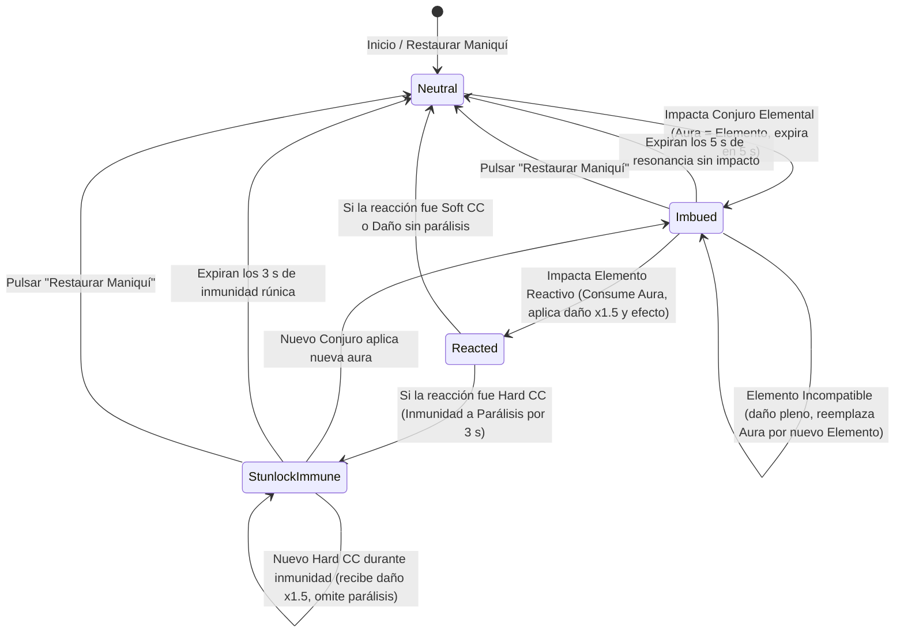

# PLAN-06: Plan Técnico de Implementación — Matriz de Afinidades Elementales y Encadenamiento de Combos

> **Especificación Asociada:** [`specs/06-elemental-affinity-combos.spec.md`](file:///C:/Users/Friki/.gemini/antigravity/scratch/grimorio-interactivo/specs/06-elemental-affinity-combos.spec.md)  
> **Constitución:** [`constitution.md`](file:///C:/Users/Friki/.gemini/antigravity/scratch/grimorio-interactivo/constitution.md) | **Directrices:** [`AGENTS.md`](file:///C:/Users/Friki/.gemini/antigravity/scratch/grimorio-interactivo/AGENTS.md)  
> **Estado:** Listo para Implementación  
> **Restricción Suprema:** Dogma Vanilla (Cero librerías externas de combate o gráficos) y Dualidad Lingüística (Código, clases y APIs en inglés `camelCase`; códice, cánticos, nombres ceremoniales e interfaz en noble castellano).

---

## 1. Estructura de Módulos y Ficheros

La arquitectura se compone de servicios backend desacoplados en **PHP 8.2+ estricto** (`declare(strict_types=1);`) con evaluación determinista autoritativa y componentes reactivos frontend en **Modern Vanilla JS (ES Modules nativos)** integrados armónicamente con el Tomo y el Simulador de SPEC-05:

```
grimorio-interactivo/
├── src/                                         # Código fuente privado Backend (PHP 8.2+)
│   ├── Dto/
│   │   ├── ElementalReactionDto.php             # Definición tipada de una reacción arcana binaria [RF-03, RF-04]
│   │   ├── ElementalMatrixGraphDto.php          # Grafo del Códice con nodos elementales y aristas reactivas [RF-01]
│   │   └── ComboResolutionResultDto.php         # Resultado determinista del impacto de combo calculado en servidor [RF-04]
│   ├── Services/
│   │   └── ElementalMatrixService.php           # Matriz inmutable en memoria, simetría A+B=B+A y cálculo del +50% [RF-03, RF-04]
│   └── Controllers/
│       └── ElementalMatrixController.php        # Endpoints REST del Códice, compatibilidades y resolución autoritativa [RF-01 a RF-04]
├── public/                                      # Raíz pública del servidor web
│   └── assets/
│       ├── css/
│       │   └── components/
│       │       └── elemental-codex.css          # Estilos de la Rueda Rúnica octogonal, filamentos animados y auras [RF-01, RF-02]
│       └── js/
│           ├── api/
│           │   └── elementalMatrixClient.js     # Cliente HTTP fetch nativo para consultas de matriz y compatibilidades [RF-01]
│           ├── components/
│           │   ├── elementalWheelComponent.js   # Renderizado SVG/DOM de la Rueda Rúnica y acordeón táctil en móviles [RF-01]
│           │   └── elementalAuraComponent.js    # Halo circular luminoso del aura y temporizador decreciente de 5 s [RF-02]
│           ├── utils/
│           │   ├── comboResolver.js             # Motor de combos en cliente: detección, factor 1.5, efectos tácticos y cola FIFO [RF-03, RF-04]
│           │   └── stunlockManager.js           # Salvaguarda Anti-Stunlock: control de inmunidad de 3 s para Hard CC [RF-05]
│           └── views/
│               └── elementalCodexView.js        # Vista ceremonial del Códice integrado con el Tomo y el Simulador [RF-01 a RF-06]
└── scratch/
    └── test_elemental_combos.php                # Script CLI automatizado para validar la matriz y matemática de combos
```

---

## 2. Modelo de Datos y Contratos de la API REST

### 2.1 Contratos de Endpoints REST

#### 1. Consulta del Grafo del Códice de Afinidades
* **Ruta:** `GET /api/v1/elements/matrix`
* **Cabeceras:** `Accept: application/json`
* **Respuestas:**
  * `200 OK`: Grafo exhaustivo con los 8 elementos, sus colores heráldicos, glifos y las 7 reacciones duales más la resonancia pura.

```json
// GET /api/v1/elements/matrix HTTP/1.1
// Respuesta HTTP/1.1 200 OK
{
  "success": true,
  "data": {
    "elements": [
      { "id": "fire", "name": "Fuego", "color": "#ff4500", "glyph": "rune-ignis" },
      { "id": "water", "name": "Agua / Escarcha", "color": "#00bfff", "glyph": "rune-aqua" },
      { "id": "lightning", "name": "Rayo", "color": "#9932cc", "glyph": "rune-fulgur" },
      { "id": "earth", "name": "Tierra", "color": "#8b4513", "glyph": "rune-terra" },
      { "id": "wind", "name": "Viento", "color": "#2e8b57", "glyph": "rune-ventus" },
      { "id": "light", "name": "Luz", "color": "#ffd700", "glyph": "rune-lux" },
      { "id": "darkness", "name": "Oscuridad", "color": "#4b0082", "glyph": "rune-tenebrae" },
      { "id": "pureArcane", "name": "Arcano Puro", "color": "#4169e1", "glyph": "rune-arcana" }
    ],
    "reactions": [
      {
        "id": "arcaneVaporization",
        "name": "Vaporización Arcana",
        "elements": ["fire", "water"],
        "damageMultiplier": 1.5,
        "tacticalEffect": "blindnessMist",
        "effectDurationMs": 3000,
        "description": "Emisión de vapor abrasador que reduce la precisión del objetivo durante 3 segundos."
      },
      {
        "id": "fluidElectrocution",
        "name": "Electrocución Fluida",
        "elements": ["water", "lightning"],
        "damageMultiplier": 1.5,
        "tacticalEffect": "hardStun",
        "effectDurationMs": 1500,
        "description": "Descarga en cadena que aturde fulgurantemente al blanco durante 1.5 segundos."
      },
      {
        "id": "vortexDeflagration",
        "name": "Deflagración en Vórtice",
        "elements": ["fire", "wind"],
        "damageMultiplier": 1.5,
        "tacticalEffect": "areaExpansion",
        "effectDurationMs": 0,
        "description": "Combustión violenta alimentada por viento que expande el impacto a radio esférico en área."
      },
      {
        "id": "basalticFracture",
        "name": "Fractura Basáltica",
        "elements": ["earth", "lightning"],
        "damageMultiplier": 1.5,
        "tacticalEffect": "barrierShatter",
        "effectDurationMs": 0,
        "barrierDamage": 50,
        "description": "Descarga de choque que tritura hasta 50 puntos de barrera mágica del objetivo."
      },
      {
        "id": "petrifyingSwamp",
        "name": "Ciénaga Petrificante",
        "elements": ["earth", "water"],
        "damageMultiplier": 1.5,
        "tacticalEffect": "rootAndSlow",
        "effectDurationMs": 3000,
        "slowDurationMs": 4000,
        "description": "Inmovilización por enraizamiento de 3 s y reducción de velocidad al 50% por 4 s."
      },
      {
        "id": "glacialBlizzard",
        "name": "Ventisca Helada",
        "elements": ["wind", "water"],
        "damageMultiplier": 1.5,
        "tacticalEffect": "freezeParalysis",
        "effectDurationMs": 2000,
        "description": "Congelación absoluta de 2 segundos que impone parálisis motora completa."
      },
      {
        "id": "twilightCollapse",
        "name": "Colapso Crepuscular",
        "elements": ["light", "darkness"],
        "damageMultiplier": 1.5,
        "tacticalEffect": "barrierPiercing",
        "effectDurationMs": 0,
        "description": "Daño puro que penetra el 100% de los escudos dañando directamente los puntos de salud."
      },
      {
        "id": "pureArcaneResonance",
        "name": "Resonancia Arcana Pura",
        "elements": ["pureArcane"],
        "isCatalyst": true,
        "amplificationFactor": 1.25,
        "ccExtensionMs": 1000,
        "description": "Catalizador universal que amplifica un 25% la magnitud y añade 1 s a la duración de controles."
      }
    ]
  }
}
```

#### 2. Consulta de Reacciones Compatibles por Elemento
* **Ruta:** `GET /api/v1/elements/reactions/{element}`
* **Parámetros:** `element` (string: `fire`, `water`, etc.).
* **Respuestas:** `200 OK` con la lista de elementos con los que reacciona y las fichas de combo correspondientes.

#### 3. Resolución Autoritativa de Combos (Backend)
* **Ruta:** `POST /api/v1/elements/resolve-combo`
* **Payload de Entrada:**
```json
{
  "activeAura": "fire",
  "incomingSpell": {
    "id": "spl_water_01",
    "element": "water",
    "baseDamage": 40,
    "baseHealing": 0,
    "baseBarrier": 0,
    "crowdControlType": "none"
  },
  "stunlockImmune": false
}
```
* **Respuesta HTTP/1.1 200 OK:**
```json
{
  "success": true,
  "data": {
    "isReaction": true,
    "reactionId": "arcaneVaporization",
    "reactionName": "Vaporización Arcana",
    "effectiveDamage": 60,
    "damageMultiplierApplied": 1.5,
    "tacticalEffectApplied": "blindnessMist",
    "effectDurationMs": 3000,
    "clearedAura": true,
    "resultingAura": null,
    "stunlockTriggered": false,
    "grantStunlockImmunity": false
  }
}
```

---

### 2.2 Modelo del Estado Imbuido del Objetivo (`TargetAuraState`)

Estructura de datos en memoria (cliente y servidor) para gobernar el estado elemental del maniquí:

```typescript
interface TargetAuraState {
  activeElementalAura: string | null;     // 'fire', 'water', etc. o null si neutral
  resonanceExpiresAt: number;             // Timestamp epoch ms (Date.now() + 5000)
  stunlockImmunityActive: boolean;        // true si goza de inmunidad a Hard CC
  stunlockImmunityExpiresAt: number;      // Timestamp epoch ms de finalización de inmunidad
  activeHardCc: string | null;            // 'hardStun', 'freezeParalysis' o null
  activeSoftCc: string | null;            // 'blindnessMist', 'rootAndSlow' o null
}
```

---

## 3. Algoritmos Clave y Máquinas de Estado

### 3.1 Máquina de Estados del Objetivo Imbuido



---

### 3.2 Algoritmo Determinista de Resolución de Combos (`ElementalMatrixService.php` / `comboResolver.js`)

```typescript
// Pseudocódigo canónico de resolución de impacto elemental
function resolveElementalImpact(
  incomingSpell: SpellImpactData,
  targetState: TargetAuraState,
  currentTimeMs: number
): ComboResolutionResult {
  // 1. Comprobar si el aura previa sigue vigente (< 5000 ms)
  const hasValidAura = targetState.activeElementalAura !== null && 
                       currentTimeMs <= targetState.resonanceExpiresAt;

  // Caso A: Blanco Neutral (sin aura)
  if (!hasValidAura) {
    if (incomingSpell.element !== 'pureArcane') {
      targetState.activeElementalAura = incomingSpell.element;
      targetState.resonanceExpiresAt = currentTimeMs + 5000;
    }
    return {
      isReaction: false,
      finalDamage: incomingSpell.baseDamage,
      tacticalEffect: null,
      resultingAura: targetState.activeElementalAura
    };
  }

  const currentAura = targetState.activeElementalAura!;

  // Caso B: Mismo Elemento (Refresco)
  if (currentAura === incomingSpell.element) {
    targetState.resonanceExpiresAt = currentTimeMs + 5000;
    return {
      isReaction: false,
      finalDamage: incomingSpell.baseDamage,
      tacticalEffect: 'auraRefreshed',
      resultingAura: currentAura
    };
  }

  // Caso C: Reacción con Arcano Puro (Catalizador)
  if (incomingSpell.element === 'pureArcane') {
    targetState.activeElementalAura = null; // Consume el aura
    return {
      isReaction: true,
      reactionId: 'pureArcaneResonance',
      reactionName: 'Resonancia Arcana Pura',
      finalDamage: Math.ceil(incomingSpell.baseDamage * 1.25),
      tacticalEffect: 'amplification',
      resultingAura: null
    };
  }

  // Caso D: Búsqueda de Reacción Dual Simétrica (A + B o B + A)
  const reaction = findDualReaction(currentAura, incomingSpell.element);

  if (reaction !== null) {
    targetState.activeElementalAura = null; // Limpieza neutral absoluta [RF-03.4]
    
    // Cálculo cuantitativo (+50% de daño)
    let finalDamage = Math.ceil(incomingSpell.baseDamage * 1.5);
    let barrierShatter = 0;
    let ignoresBarrier = false;

    // Reglas de barreras especializadas
    if (reaction.id === 'basalticFracture') {
      barrierShatter = 50; // Tritura hasta 50 PV de escudo sin transferir a salud
    } else if (reaction.id === 'twilightCollapse') {
      ignoresBarrier = true; // Penetra 100% de escudos dañando directamente la salud
    }

    // Evaluación de Hard CC y salvaguarda Anti-Stunlock
    let applyCrowdControl = true;
    let grantImmunityAfter = false;

    if (reaction.tacticalEffect === 'hardStun' || reaction.tacticalEffect === 'freezeParalysis') {
      const isImmune = targetState.stunlockImmunityActive && 
                       currentTimeMs <= targetState.stunlockImmunityExpiresAt;
      if (isImmune) {
        applyCrowdControl = false; // Se sustituye parálisis por retroceso visual
      } else {
        grantImmunityAfter = true;
      }
    }

    return {
      isReaction: true,
      reactionId: reaction.id,
      reactionName: reaction.name,
      finalDamage,
      barrierShatter,
      ignoresBarrier,
      applyCrowdControl,
      grantImmunityAfter,
      resultingAura: null
    };
  }

  // Caso E: Elemento No Reactivo (Sobreescritura con Daño Pleno) [RF-03.3]
  targetState.activeElementalAura = incomingSpell.element;
  targetState.resonanceExpiresAt = currentTimeMs + 5000;

  return {
    isReaction: false,
    finalDamage: incomingSpell.baseDamage,
    tacticalEffect: 'auraOverwritten',
    resultingAura: incomingSpell.element
  };
}
```

---

### 3.3 Cola Determinista Secuencial FIFO para Ráfagas Simultáneas (`comboResolver.js`)

Si dos o más conjuros colisionan con una diferencia inferior a $100\text{ ms}$:

```typescript
class SpellImpactQueue {
  private queue: QueuedImpact[] = [];
  private isProcessing: boolean = false;

  public enqueue(impact: QueuedImpact): void {
    this.queue.push(impact);
    if (!this.isProcessing) {
      this.processNext();
    }
  }

  private processNext(): void {
    if (this.queue.length === 0) {
      this.isProcessing = false;
      return;
    }
    this.isProcessing = true;
    const current = this.queue.shift()!;
    
    // Resolver impacto atómicamente contra el estado del blanco
    resolveElementalImpact(current.spell, current.targetState, current.timestamp);
    
    // Despachar inmediatamente el siguiente evento en la cola
    requestAnimationFrame(() => this.processNext());
  }
}
```

---

### 3.4 Gestor Anti-Stunlock (`stunlockManager.js`)

* **Hard CC:** `fluidElectrocution` (aturdimiento 1.5 s) y `glacialBlizzard` (congelación 2 s).
* **Soft CC:** `arcaneVaporization` (niebla/ceguera 3 s) y `petrifyingSwamp` (enraizamiento 3 s).
* **Lógica:** Al expirar un Hard CC, se activa `stunlockImmunityActive = true` durante 3000 ms. Durante este intervalo, nuevos Hard CC reciben el $+50\%$ de daño pero sustituyen la animación de parálisis por una onda de choque; los Soft CC se aplican con normalidad.

---

## 4. Arquitectura de Eventos y Componentes Frontend Vanilla

### 4.1 Bus de Eventos DOM Desacoplado

| Evento Personalizado | Emisor | Receptores | Carga Útil (`detail`) |
| :--- | :--- | :--- | :--- |
| `combo:aura-applied` | `comboResolver` | `elementalAuraComponent`, `arcaneCanvasComponent` | `{ element, expiresAt, durationMs: 5000 }` |
| `combo:aura-refreshed` | `comboResolver` | `elementalAuraComponent` | `{ element, expiresAt }` |
| `combo:aura-expired` | `elementalAuraComponent` | `combatDummyComponent`, `comboResolver` | `{ element }` |
| `combo:reaction-triggered` | `comboResolver` | `arcaneCanvasComponent`, `floatingCombatTextComponent`, `combatDummyComponent` | `{ reactionId, reactionName, damage, tacticalEffect, elements }` |
| `combo:stunlock-immunity-started` | `stunlockManager` | `combatDummyComponent`, `arcaneCanvasComponent` | `{ durationMs: 3000 }` |
| `combo:stunlock-immunity-ended` | `stunlockManager` | `combatDummyComponent` | `{}` |

### 4.2 Sincronización con la Cámara de Conjuración (SPEC-05)

1. **Persistencia de Auras entre Páginas:** El objeto `TargetAuraState` reside en el contexto del simulador (dentro de `combatDummyComponent`), manteniéndose inalterado cuando `grimoireBookComponent` despacha el evento `grimoire:page-change`.
2. **Deflagración de Partículas Fusionadas:** Al detonar el combo, `arcaneCanvasComponent` invoca a `particleEngine.js` pasando los dos colores elementales simultáneos (`colorA` y `colorB`), desatando una explosión radial con estelas bicromáticas.
3. **Texto Flotante Monumental:** `floatingCombatTextComponent` proyecta el rótulo en la cúspide con tipografía ceremonial dorada (ej. `¡VAPORIZACIÓN ARCANA! -68 PV`) con una escala $\times 1.3$ respecto a los impactos convencionales.

---

## 5. Decisiones Técnicas Justificadas y Alternativas Descartadas

1. **Matriz Inmutable Estática en Memoria vs. Consultas SQL Relacionales:**  
   * *Decisión:* Definir las 7 reacciones y sus reglas en una matriz inmutable en PHP y JS.  
   * *Justificación:* Las leyes de la naturaleza mágica son universales y canónicas; no cambian dinámicamente por petición. Consultar la base de datos para cada impacto elemental en el simulador añadiría latencia HTTP/SQL innecesaria violando el requisito de inmediatez ($< 50\text{ ms}$).
2. **Simetría Binaria ($A + B = B + A$) vs. Asimetría Direccional ($A \rightarrow B \neq B \rightarrow A$):**  
   * *Decisión:* Vaporización ocurre tanto si Fuego impacta sobre Agua como si Agua impacta sobre Fuego.  
   * *Justificación:* Evita sobrecarga cognitiva innecesaria en los aprendices y hace el sistema 100% intuitivo, permitiendo al mago concentrarse en el timing de 5 segundos.
3. **Persistencia de Auras entre Páginas vs. Purga al Hojear:**  
   * *Decisión:* Conservar el aura elemental activa y sus 5 segundos al cambiar de página.  
   * *Justificación:* Obligar a probar combos solo con hechizos adyacentes mutilaría la utilidad del simulador de grimorio; permitir hojear fomenta el dominio ágil de la navegación en el tomo.
4. **Anti-Stunlock Específico para Hard CC vs. Enfriamiento Global de Reacciones:**  
   * *Decisión:* Conceder inmunidad temporal únicamente contra parálisis total, permitiendo seguir encadenando daño y controles blandos.  
   * *Justificación:* Un enfriamiento global de 6 segundos bloquearía la diversión del encadenamiento de daño; el filtro selectivo de Hard CC castiga el abuso sin cortar el dinamismo ofensivo.

---

## 6. Estrategia de Pruebas y Verificación

### 6.1 Script Automatizado Backend (`scratch/test_elemental_combos.php`)

Pruebas unitarias y de integración ejecutables por CLI en PHP 8.2+:
* **Test 1: Simetría de las 7 Reacciones:** Verificar que `resolve("fire", "water")` y `resolve("water", "fire")` devuelvan `arcaneVaporization`.
* **Test 2: Catalizador Arcano Puro:** Comprobar que Arcano Puro sobre cualquier aura devuelva `pureArcaneResonance` con amplificación del $+25\%$.
* **Test 3: Sobreescritura No Reactiva:** Comprobar que Luz sobre Fuego aplique daño íntegro y sobreescriba el aura a Luz.
* **Test 4: Cálculo del $+50\%$ de Daño:** Validar que un conjuro de 40 de daño inflija exactamente $\lceil 40 \times 1.5 \rceil = 60$.
* **Test 5: Fractura Basáltica y Barreras:** Validar que 20 PV de barrera se destruyan por completo sin transferir excedente a la salud.
* **Test 6: Colapso Crepuscular:** Validar que el daño penetre la barrera reduciendo la salud y dejando la barrera intacta.

### 6.2 Protocolo de Verificación en Frontend

1. **Prueba de Persistencia entre Páginas:** Lanzar conjuro de Agua en página 1, hojear a página 3 antes de 5 s, lanzar Rayo y comprobar que se detone *Electrocución Fluida*.
2. **Prueba Anti-Stunlock:** Detonar Electrocución (aturdimiento de 1.5 s), esperar 1.5 s para que inicie la inmunidad de 3 s, detonar Ventisca inmediatamente y comprobar que aplica el $+50\%$ de daño pero no congela al maniquí.
3. **Prueba de Cola FIFO:** Disparar dos conjuros con menos de 50 ms de separación y comprobar que el primero aplica aura y el segundo detona el combo sin errores.
4. **Prueba de Adaptabilidad Móvil:** Emular pantalla de 375 px y constatar que el Códice se despliega como selector radial con acordeón rúnico táctil accesible.

---

## 7. Matriz de Trazabilidad de Requisitos (RF y RNF)

| Requisito | Descripción | Componente Frontend / Servicio Backend | Endpoint / Módulo | Criterio de Verificación |
| :--- | :--- | :--- | :--- | :--- |
| **RF-01.1 / 01.2** | Códice Rueda Rúnica y Acordeón Móvil | `elementalWheelComponent.js`, CSS | `GET /api/v1/elements/matrix` | Inspección visual en escritorio y móvil |
| **RF-01.3** | Enlaces de afinidad en fichas de conjuro | `grimoireBookComponent.js` | `GET /api/v1/elements/reactions/{element}` | Clic en icono de afinidad de la ficha |
| **RF-02.1 / 02.2** | Imbuición de aura por 5 segundos | `elementalAuraComponent.js` | Canvas 2D / Temporizador | Visualización del halo con cuenta atrás |
| **RF-02.3** | Persistencia de aura entre páginas | `combatDummyComponent.js` | Estado en memoria | Hojear página y comprobar retención del halo |
| **RF-02.4 / 02.5** | Refresco homogéneo y disipación natural | `elementalAuraComponent.js`, `comboResolver.js` | Temporizador de 5 s | Refresco a 5 s y extinción suave |
| **RF-03.1** | 7 Reacciones Duales simétricas ($A+B$) | `ElementalMatrixService.php`, `comboResolver.js` | Matriz inmutable | Test 1 en `test_elemental_combos.php` |
| **RF-03.2** | Arcano Puro Catalizador (+25% / +1s) | `ElementalMatrixService.php`, `comboResolver.js` | `pureArcaneResonance` | Test 2 en `test_elemental_combos.php` |
| **RF-03.3** | Sobreescritura no reactiva con daño pleno | `comboResolver.js` | `combo:aura-applied` | Test 3 en `test_elemental_combos.php` |
| **RF-03.4** | Limpieza neutral absoluta tras detonar | `comboResolver.js` | `activeElementalAura = null` | Inspección del estado tras la explosión |
| **RF-04.1** | Bonificación del $+50\%$ de daño ($\times 1.5$) | `ElementalMatrixService.php`, `comboResolver.js` | `comboDamageMultiplier = 1.5` | Test 4 en `test_elemental_combos.php` |
| **RF-04.2** | Efectos tácticos canónicos de cada combo | `comboResolver.js`, `combatDummyComponent.js` | 8 efectos específicos | Tests 5 y 6 en `test_elemental_combos.php` |
| **RF-05.1 a 05.3** | Encadenamiento y Anti-Stunlock (3 s) | `stunlockManager.js` | `stunlockImmunityActive` | Protocolo frontend (inmunidad a Hard CC) |
| **RF-05.4** | Cola determinista FIFO ante ráfagas | `comboResolver.js` | `SpellImpactQueue` | Emisión de impactos con $\Delta t < 50\text{ ms}$ |
| **RF-06.1 / 06.2** | Partículas fusionadas y Texto Monumental | `arcaneCanvasComponent.js`, `floatingCombatTextComponent.js` | Canvas 2D | Visualización del texto en oro rúnico |
| **RF-06.3 / 06.4** | Bitácora de pruebas y región viva ARIA | `combatDummyComponent.js`, `grimoireSimulatorView.js` | `localStorage`, ARIA live | Comprobación de registro y lectores |
| **RNF-01 a 05** | Determinismo, latencia <50ms y bilingüismo | Todos los módulos | N/A | Auditoría de código y pruebas automatizadas |

---

## 8. Cumplimiento Constitucional y de Gobernanza

1. **Artículo I (El Dogma Vanilla):** Cero dependencias externas para cálculo de físicas, simulación de combos o renderizado; uso estricto de Canvas 2D, SVG nativo, ES Modules y PHP 8.2+.
2. **Artículo II (La Ley Universal del Maná: Determinismo & Anti-Power-Creep):**
   * Las reacciones se resuelven mediante tablas de búsqueda simétricas matemáticas deterministas, sin probabilidad ni tiradas de dados.
   * La bonificación fija del $+50\%$ recompensa la sincronización táctica sin desbordar el techo de contención del plano mortal.
3. **Artículo IV (El Velo Arcano y la Integridad Temática):**
   * Toda la experiencia de alquimia arcana se expresa con solemnidad mitológica: *Vaporización Arcana*, *Colapso Crepuscular*, *Fractura Basáltica*, etc.
4. **Artículo V (Dualidad Lingüística):**
   * Identificadores de código, bases de datos, APIs y clases estrictamente en inglés `camelCase` (`arcaneVaporization`, `fluidElectrocution`, `vortexDeflagration`, `basalticFracture`, `petrifyingSwamp`, `glacialBlizzard`, `twilightCollapse`, `pureArcaneResonance`, `activeElementalAura`, `stunlockImmunityActive`, `comboDamageMultiplier`).
   * Toda la narrativa, lore del códice, nombres de reacciones y anuncios de usuario expresados con riqueza y solemnidad en **noble castellano**.
