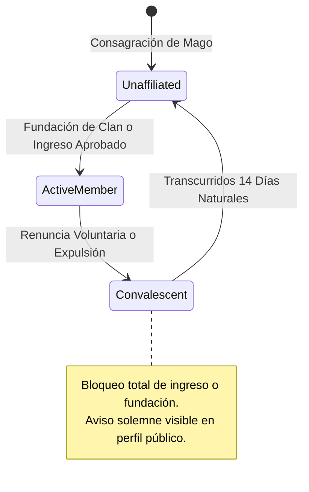
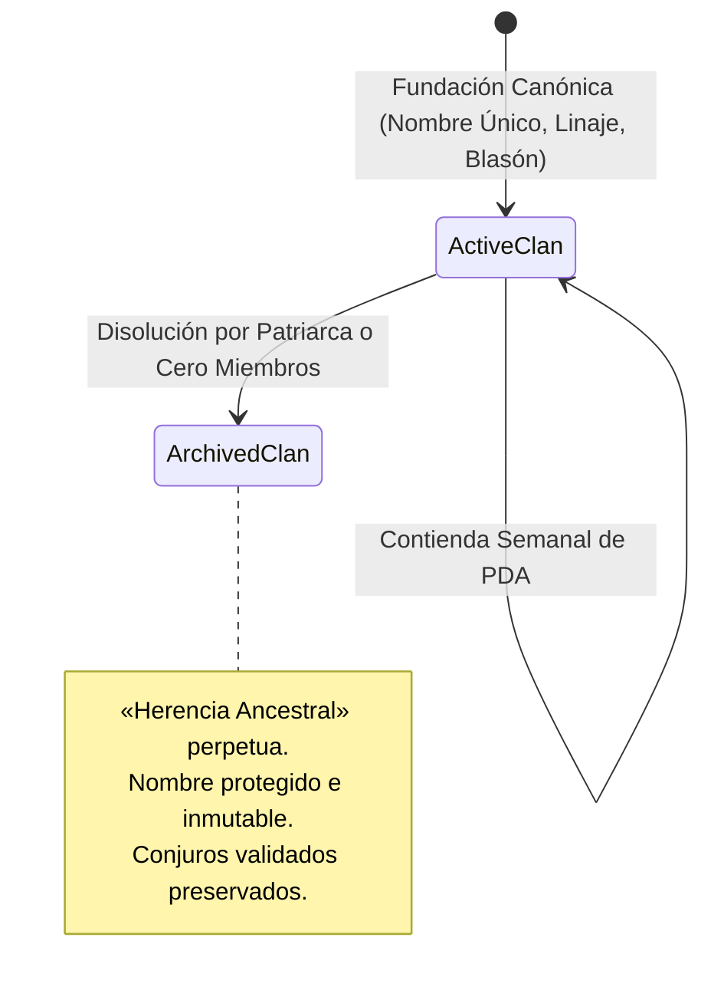

# PLAN-07: Plan Técnico de Implementación — Sistema de Clanes, Linajes y Dominio Semanal del Grimorio

> **Especificación Asociada:** [`specs/07-clans-lineages.spec.md`](file:///C:/Users/Friki/.gemini/antigravity/scratch/grimorio-interactivo/specs/07-clans-lineages.spec.md)  
> **Constitución:** [`constitution.md`](file:///C:/Users/Friki/.gemini/antigravity/scratch/grimorio-interactivo/constitution.md) | **Directrices:** [`AGENTS.md`](file:///C:/Users/Friki/.gemini/antigravity/scratch/grimorio-interactivo/AGENTS.md)  
> **Estado:** Listo para Implementación  
> **Restricción Suprema:** Dogma Vanilla (Cero librerías npm, frameworks externos o CDNs) y Dualismo Lingüístico (Código, variables, clases y APIs en inglés `camelCase`/`snake_case`; narrativa, cánticos ceremoniales e interfaz en noble castellano).

---

## 1. Estructura de Módulos y Ficheros

La arquitectura se articula en el backend mediante servicios puros desacoplados en **PHP 8.2+ estricto** (`declare(strict_types=1);`), persistencia relacional transaccional en **SQLite PDO**, y componentes reactivos en el frontend en **Modern Vanilla JS (ES Modules nativos)** sin dependencias:

```
grimorio-interactivo/
├── src/                                         # Backend MVC en PHP 8.2+
│   ├── Dto/
│   │   ├── ClanDto.php                          # Objeto inmutable de datos del clan [RF-01, RF-02]
│   │   ├── ClanMemberDto.php                    # Afiliación de miembro, rol y convalecencia [RF-01]
│   │   ├── LineageDto.php                       # Definición de los 8 linajes canónicos y afinidades [RF-02]
│   │   ├── ClanApplicationDto.php               # Solicitud de ingreso con estado [RF-01.5]
│   │   ├── WeeklyCycleDto.php                   # Registro histórico de cortes semanales y campeón [RF-04]
│   │   └── DominionAwardDto.php                 # Desglose tipado de puntos otorgados y sinergia [RF-03]
│   ├── Repositories/
│   │   ├── ClanRepository.php                   # Consultas y mutaciones PDO sobre `clans` [RF-01, RF-05]
│   │   ├── ClanMemberRepository.php             # Historial de membresías y convalecencia [RF-01]
│   │   ├── ClanApplicationRepository.php        # Gestión de peticiones de ingreso [RF-01.5]
│   │   └── WeeklyCycleRepository.php            # Ciclos de corte dominical y registro perpetuo [RF-04]
│   ├── Services/
│   │   ├── ClanService.php                      # Fundación, gobernanza, cupo de 30 y sucesión de 45 días [RF-01]
│   │   ├── LineageSynergyService.php            # Regla de +25% de sinergia con redondeo `round()` [RF-03]
│   │   ├── WeeklyDominionService.php            # Cierre dominical 23:59:59 UTC, desempate y reseteo [RF-04]
│   │   └── ClanEthicsValidator.php              # Veto constitucional de 30 días a Maestros (Art. III) [RF-01.8]
│   └── Controllers/
│       ├── ClanController.php                   # Endpoints REST de clanes, gobernanza y solicitudes [RF-01, RF-05]
│       ├── LineageController.php                # Endpoints REST de linajes canónicos [RF-02]
│       └── DominionController.php               # Clasificación en vivo, histórico y cierre semanal [RF-03, RF-04, RF-06]
├── public/                                      # Raíz pública del servidor web
│   └── assets/
│       ├── css/
│       │   └── components/
│       │       ├── clan-heraldry.css            # Estandartes heráldicos, blasones y ribete ceremonial dorado [RF-02, RF-04]
│       │       └── lineage-hall.css             # Estilos solemnes del Salón de los Linajes y podio de honor [RF-06]
│       └── js/
│           ├── api/
│           │   ├── clanClient.js                # Cliente HTTP fetch para fundación, miembros y gestión [RF-01]
│           │   └── dominionClient.js            # Cliente HTTP fetch para rankings del Dominio y linajes [RF-03, RF-06]
│           ├── components/
│           │   ├── clanBannerComponent.js       # Estandarte con corona dorada del Clan Regente en Portal [RF-04]
│           │   ├── lineageHallComponent.js      # Cuadro de honor en vivo, filtros elementales e histórico [RF-06]
│           │   ├── clanManagementComponent.js   # Panel del Patriarca: solicitudes, cupo (30) y lema [RF-01]
│           │   └── convalescenceBannerComponent.js # Aviso solemne de 14 días de meditación en perfil [RF-01.7]
│           └── views/
│               ├── clanView.js                  # Vista detallada del clan y legado de conjuros [RF-01, RF-05]
│               └── lineageHallView.js           # Vista general del Salón de los Linajes [RF-06]
└── scratch/
    └── test_clans_dominion.php                  # Suite de pruebas automatizadas CLI de dominio y cálculo matemático
```

---

## 2. Modelo de Datos Relacional y Contratos de la API REST

### 2.1 Esquema DDL en SQLite (Cumplimiento del Artículo V)

```sql
-- 1. Tabla de Clanes e Identidad Heráldica [RF-01, RF-02, RF-05]
CREATE TABLE IF NOT EXISTS clans (
    id VARCHAR(36) PRIMARY KEY,                             -- UUID v4 (ej. 'cln_01928a3b-4c5d')
    name VARCHAR(50) NOT NULL UNIQUE,                       -- Nombre canónico único (reservado a perpetuidad)
    motto VARCHAR(255) NOT NULL,                            -- Lema heráldico solemne en castellano
    coat_of_arms VARCHAR(100) NOT NULL,                     -- Identificador de blasón rúnico/icono SVG
    lineage_type VARCHAR(30) NOT NULL,                      -- Uno de los 8 linajes canónicos
    admission_mode VARCHAR(20) NOT NULL DEFAULT 'open',     -- 'open' | 'byApplication'
    status VARCHAR(20) NOT NULL DEFAULT 'active',           -- 'active' | 'archived' (Herencia Ancestral)
    patriarch_id VARCHAR(36) NOT NULL,                      -- Clave foránea al usuario líder fundador
    weekly_points INT NOT NULL DEFAULT 0,                   -- Puntos de Dominio Arcano de la semana en curso
    historical_points INT NOT NULL DEFAULT 0,               -- Acumulado histórico perpetuo de todos los tiempos
    last_activity_at DATETIME NOT NULL,                     -- Marca temporal de última actividad del patriarca
    created_at DATETIME NOT NULL,
    updated_at DATETIME NOT NULL,
    FOREIGN KEY (patriarch_id) REFERENCES users(id) ON UPDATE CASCADE
);

-- 2. Tabla de Membresías y Convalecencia Arcana [RF-01, RF-01.6, RF-01.8]
CREATE TABLE IF NOT EXISTS clan_members (
    id VARCHAR(36) PRIMARY KEY,                             -- UUID v4
    clan_id VARCHAR(36) NOT NULL,                           -- Clan de vinculación
    user_id VARCHAR(36) NOT NULL,                           -- Usuario adepto
    role VARCHAR(20) NOT NULL DEFAULT 'adept',              -- 'patriarch' | 'adept'
    joined_at DATETIME NOT NULL,                            -- Fecha y hora de ingreso formal
    left_at DATETIME NULL,                                  -- Fecha de partida voluntaria o expulsión
    convalescence_expires_at DATETIME NULL,                 -- Marca de fin de los 14 días naturales
    FOREIGN KEY (clan_id) REFERENCES clans(id) ON DELETE CASCADE,
    FOREIGN KEY (user_id) REFERENCES users(id) ON DELETE CASCADE
);

-- 3. Tabla de Solicitudes de Ingreso [RF-01.5]
CREATE TABLE IF NOT EXISTS clan_applications (
    id VARCHAR(36) PRIMARY KEY,                             -- UUID v4
    clan_id VARCHAR(36) NOT NULL,                           -- Clan al que se postula
    user_id VARCHAR(36) NOT NULL,                           -- Usuario postulante
    status VARCHAR(20) NOT NULL DEFAULT 'pending',          -- 'pending' | 'approved' | 'rejected' | 'cancelled'
    created_at DATETIME NOT NULL,
    resolved_at DATETIME NULL,
    FOREIGN KEY (clan_id) REFERENCES clans(id) ON DELETE CASCADE,
    FOREIGN KEY (user_id) REFERENCES users(id) ON DELETE CASCADE
);

-- 4. Registro Histórico de Ciclos Semanales y Clanes Regentes [RF-04]
CREATE TABLE IF NOT EXISTS weekly_cycles (
    id VARCHAR(36) PRIMARY KEY,                             -- UUID v4
    week_number INT NOT NULL,                               -- Número ISO de semana (1 a 53)
    cycle_year INT NOT NULL,                                -- Año del ciclo (ej. 2026)
    regent_clan_id VARCHAR(36) NOT NULL,                    -- Clan proclamado soberano
    winning_points INT NOT NULL,                            -- PDA semanales con los que se alzó con la corona
    winner_spell_count INT NOT NULL,                        -- Conjuros validados aportados en la semana
    closed_at DATETIME NOT NULL,                            -- Fecha del corte (domingo 23:59:59 UTC)
    FOREIGN KEY (regent_clan_id) REFERENCES clans(id) ON UPDATE CASCADE
);

-- 5. Registro Diario del Simulador para Tope de 50 PDA [RF-03.2]
CREATE TABLE IF NOT EXISTS daily_simulator_tracker (
    id VARCHAR(36) PRIMARY KEY,                             -- UUID v4
    user_id VARCHAR(36) NOT NULL,                           -- Adepto que practicó
    clan_id VARCHAR(36) NOT NULL,                           -- Clan beneficiario
    cycle_date DATE NOT NULL,                               -- Fecha UTC (YYYY-MM-DD)
    points_awarded INT NOT NULL DEFAULT 0,                  -- Acumulado diario (tope 50)
    FOREIGN KEY (user_id) REFERENCES users(id) ON DELETE CASCADE,
    FOREIGN KEY (clan_id) REFERENCES clans(id) ON DELETE CASCADE,
    UNIQUE (user_id, clan_id, cycle_date)
);

-- Índices de Rendimiento y Coherencia Transaccional
CREATE UNIQUE INDEX IF NOT EXISTS idx_active_member ON clan_members(user_id) WHERE left_at IS NULL;
CREATE INDEX IF NOT EXISTS idx_clans_leaderboard ON clans(status, weekly_points DESC);
CREATE INDEX IF NOT EXISTS idx_clans_historical ON clans(status, historical_points DESC);
CREATE INDEX IF NOT EXISTS idx_applications_user ON clan_applications(user_id, status);
CREATE INDEX IF NOT EXISTS idx_member_history_ethics ON clan_members(user_id, clan_id, left_at);
```

---

### 2.2 Contratos de la API REST

#### 1. Fundación de un Clan
* **Ruta:** `POST /api/v1/clans`
* **Cabeceras:** `Content-Type: application/json`, `Authorization: Bearer <token>`
* **Entrada:**
```json
{
  "name": "Custodios del Fuego Sagrado",
  "motto": "En la ceniza renace la llama inmortal",
  "coatOfArms": "rune_flame_shield",
  "lineageType": "primordialFlame"
}
```
* **Respuestas:**
  * `201 Created`: Clan fundado, asignando rol `patriarch` al usuario.
  * `400 Bad Request`: Parámetros inválidos o linaje inexistente.
  * `403 Forbidden`: Usuario con rol `reader` o en convalecencia activa.
  * `409 Conflict`: El nombre canónico ya existe (incluso si está archivado) o el usuario ya pertenece a un clan.

#### 2. Catálogo y Filtro de Clanes
* **Ruta:** `GET /api/v1/clans?lineage={lineageType}&status={active|archived}`
* **Respuestas:**
  * `200 OK`: Lista paginada de clanes con metadata, linaje, recuento de miembros y estado.

#### 3. Ficha Detallada de un Clan
* **Ruta:** `GET /api/v1/clans/{id}`
* **Respuestas:**
  * `200 OK`: Datos completos del clan, lista de adeptos, Patriarca, régimen de admisión y resumen de PDA.
  * `404 Not Found`: Clan inexistente.

#### 4. Actualización de Hermandad por el Patriarca
* **Ruta:** `PATCH /api/v1/clans/{id}`
* **Entrada:**
```json
{
  "motto": "Herederos del fulgor que nunca muere",
  "coatOfArms": "rune_solar_crest",
  "admissionMode": "byApplication"
}
```
* **Respuestas:**
  * `200 OK`: Modificación consolidada.
  * `403 Forbidden`: El usuario autenticado no es el Patriarca del clan.

#### 5. Solicitud de Ingreso
* **Ruta:** `POST /api/v1/clans/{id}/applications`
* **Respuestas:**
  * `201 Created`: Si el régimen es `byApplication` queda en estado `pending`. Si el régimen es `open` y hay cupo (<30), se admite de inmediato devolviendo membresía activa.
  * `400 Bad Request`: Si el usuario ya tiene 3 solicitudes pendientes activas.
  * `403 Forbidden`: Usuario en periodo de convalecencia de 14 días.
  * `409 Conflict`: Clan al cupo máximo de 30 adeptos o usuario ya afiliado.

#### 6. Resolución de Solicitud por el Patriarca
* **Ruta:** `POST /api/v1/clans/{id}/applications/{appId}/resolve`
* **Entrada:**
```json
{
  "action": "approve" // o "reject"
}
```
* **Respuestas:**
  * `200 OK`: Solicitud resuelta; si fue aprobada, se incorpora como adepto y se cancelan sus otras solicitudes pendientes.
  * `403 Forbidden`: No autorizado (solo el Patriarca).
  * `409 Conflict`: Clan ya ha alcanzado los 30 miembros antes de resolver la petición.

#### 7. Renuncia Voluntaria
* **Ruta:** `POST /api/v1/clans/{id}/leave`
* **Respuestas:**
  * `200 OK`: Salida registrada; se activa la convalecencia de 14 días naturales.
  * `400 Bad Request`: El Patriarca no puede marcharse sin transferir previamente el liderazgo (a menos que sea el único miembro, en cuyo caso disuelve el clan pasando a `archived`).

#### 8. Expulsión por el Patriarca
* **Ruta:** `POST /api/v1/clans/{id}/expel/{userId}`
* **Respuestas:**
  * `200 OK`: Adepto expulsado; se le activan sus 14 días de convalecencia.
  * `403 Forbidden`: Solo el Patriarca puede expulsar (y no puede expulsarse a sí mismo).

#### 9. Traspaso de la Corona de Patriarca
* **Ruta:** `POST /api/v1/clans/{id}/transfer-leadership`
* **Entrada:** `{ "newPatriarchId": "usr_adept_uuid" }`
* **Respuestas:**
  * `200 OK`: La corona se transfiere al adepto indicado; el anterior líder pasa a rol `adept`.

#### 10. Catálogo de los 8 Linajes Canónicos
* **Ruta:** `GET /api/v1/lineages`
* **Respuestas:**
  * `200 OK`: Array inmutable de los 8 Linajes, clave canónica en inglés, nombre en castellano, elemento rector y glifo rúnico.

#### 11. Salón de los Linajes y Clasificación Semanal / Histórica
* **Ruta:** `GET /api/v1/dominion/leaderboard`
* **Respuestas:**
  * `200 OK`: Contiene `weeklyRanking` (en vivo), `historicalRanking` (prestigio perpetuo), `currentRegentClan` y `hallOfFameWeeks` (historial cronológico de campeones).

#### 12. Cierre y Proclamación Dominical Determinista
* **Ruta:** `POST /api/v1/dominion/cron-cycle-close`
* **Cabeceras:** `X-Arcane-Cron-Secret: <systemSecret>`
* **Respuestas:**
  * `200 OK`: Ciclo dominical cerrado formalmente; desempate resuelto, nuevo Clan Regente coronado, puntos reiniciados a 0 y sumados a histórico.

---

## 3. Algoritmos Clave en Pseudocódigo y Máquinas de Estado

### 3.1 Máquinas de Estado





---

### 3.2 Algoritmo de Cálculo de PDA y Sinergia de Linaje (+25% con `round`)

```
ALGORITMO computeDominionPoints(actionType, spellCircle, spellElement, clanLineage, memberId, clanId):
    CONST LINEAGE_ELEMENT_MAP = {
        'primordialFlame': 'fire',
        'celestialTides': 'water',
        'eternalTempest': 'lightning',
        'worldRoots': 'earth',
        'dawnWinds': 'wind',
        'solarCrown': 'light',
        'abyssalShadows': 'darkness',
        'aetherWeavers': 'pureArcane'
    }

    basePoints = 0
    IF actionType == 'spellValidated':
        basePoints = 100 + (spellCircle * 20)
    ELSE IF actionType == 'simulatorCombo':
        // Comprobar techo de 50 PDA diarios a 00:00:00 UTC
        todayUtc = getCurrentDateUtc()
        currentAwarded = dailyTrackerRepository.getTodayPoints(memberId, clanId, todayUtc)
        IF currentAwarded >= 50:
            RETURN { awardedPoints: 0, reason: "DAILY_SIMULATOR_CAP_REACHED" }
        availableQuota = 50 - currentAwarded
        basePoints = MIN(10, availableQuota)
    ELSE IF actionType == 'communityFavorite':
        basePoints = 5

    // Evaluación de Sinergia Temática de Linaje (+25%)
    lineageElement = LINEAGE_ELEMENT_MAP[clanLineage]
    isSynergistic = (spellElement != NULL AND spellElement == lineageElement)

    finalPoints = basePoints
    IF isSynergistic:
        // Redondeo aritmético estándar al entero más próximo (>= 0.5 redondea hacia arriba)
        finalPoints = ROUND(basePoints * 1.25)

    // Si es del simulador, asegurar no exceder el cupo restante con la bonificación
    IF actionType == 'simulatorCombo':
        finalPoints = MIN(finalPoints, availableQuota)
        dailyTrackerRepository.incrementPoints(memberId, clanId, todayUtc, finalPoints)

    clanRepository.addWeeklyAndHistoricalPoints(clanId, finalPoints)

    RETURN {
        basePoints: basePoints,
        finalPoints: finalPoints,
        hasSynergy: isSynergistic,
        awardedAt: getCurrentTimestampUtc()
    }
```

---

### 3.3 Algoritmo de Cierre Semanal Dominical y Desempate Determinista

```
ALGORITMO executeWeeklyCycleClose():
    lockAcquired = acquireDistributedLock("weekly_dominion_close")
    IF NOT lockAcquired:
        RETURN // Evitar ejecuciones duplicadas en concurrencia

    currentUtc = getCurrentTimestampUtc()
    activeClans = clanRepository.findAllActiveOrderedByWeeklyPointsDesc()

    IF activeClans IS EMPTY:
        releaseDistributedLock("weekly_dominion_close")
        RETURN

    highestPoints = activeClans[0].weeklyPoints
    topClans = FILTER activeClans WHERE weeklyPoints == highestPoints

    winningClan = NULL
    IF LENGTH(topClans) == 1:
        winningClan = topClans[0]
    ELSE:
        // Criterio 1 de Desempate: Mayor número de conjuros validados en la semana
        FOR clan IN topClans:
            clan.validatedSpellsCount = spellRepository.countValidatedSpellsInCurrentWeek(clan.id)

        SORT topClans BY validatedSpellsCount DESC

        highestSpellCount = topClans[0].validatedSpellsCount
        spellTiedClans = FILTER topClans WHERE validatedSpellsCount == highestSpellCount

        IF LENGTH(spellTiedClans) == 1:
            winningClan = spellTiedClans[0]
        ELSE:
            // Criterio 2 de Desempate: Timestamp más antiguo en alcanzar la puntuación
            SORT spellTiedClans BY firstReachingTimestampUtc ASC
            winningClan = spellTiedClans[0]

    // Inscribir ciclo histórico
    isoWeek = getIsoWeek(currentUtc)
    isoYear = getIsoYear(currentUtc)
    weeklyCycleRepository.recordCycle(isoWeek, isoYear, winningClan.id, winningClan.weeklyPoints, winningClan.validatedSpellsCount, currentUtc)

    // Sumar puntos a histórico y reiniciar contadores semanales a 0
    clanRepository.resetAllWeeklyPointsToZero()

    // Registrar en Bitácora de Auditoría
    auditRepository.log("DOMINION_WEEK_CONCLUDED", {
        regentClanId: winningClan.id,
        regentClanName: winningClan.name,
        winningPoints: winningClan.weeklyPoints
    })

    releaseDistributedLock("weekly_dominion_close")
```

---

### 3.4 Algoritmo de Sucesión Dinástica por Inactividad del Patriarca (45 Días)

```
ALGORITMO evaluatePatriarchSuccession(clanId):
    clan = clanRepository.findById(clanId)
    IF clan.status != 'active':
        RETURN

    inactivityDays = daysBetween(clan.lastActivityAt, getCurrentTimestampUtc())
    IF inactivityDays >= 45:
        // Obtener miembros activos ordenados por mayor antigüedad (joined_at ASC), desempate por puntos aportados
        candidates = clanMemberRepository.findActiveMembersExcluding(clan.patriarchId, clanId)
        SORT candidates BY (joinedAt ASC, allTimePointsContributed DESC)

        IF LENGTH(candidates) > 0:
            newLeader = candidates[0]
            // Transición de corona
            clanMemberRepository.setRole(clan.patriarchId, 'adept')
            clanMemberRepository.setRole(newLeader.userId, 'patriarch')
            clanRepository.updatePatriarch(clanId, newLeader.userId)

            auditRepository.log("PATRIARCH_INACTIVITY_SUCCESSION", {
                clanId: clanId,
                previousPatriarch: clan.patriarchId,
                newPatriarch: newLeader.userId,
                inactivityDays: inactivityDays
            })
        ELSE:
            // Sin adeptos restantes: disolución y archivo del clan
            clanRepository.setStatus(clanId, 'archived')
            auditRepository.log("CLAN_ARCHIVED_EMPTY_SUCCESSION", { clanId: clanId })
```

---

### 3.5 Algoritmo del Veto Ético Constitucional a Maestros (Artículo III)

```
ALGORITMO canMasterEvaluateSpell(masterUserId, spellId):
    spell = spellRepository.findById(spellId)
    IF spell.clanId IS NULL:
        RETURN TRUE // Mago ermitaño sin conflicto de clan

    // 1. Verificar clan actual del Maestro
    currentMembership = clanMemberRepository.findActiveMembership(masterUserId)
    IF currentMembership != NULL AND currentMembership.clanId == spell.clanId:
        RETURN FALSE // Veto estricto: pertenece al mismo clan del conjuro

    // 2. Verificar afiliaciones pasadas en los últimos 30 días naturales
    cutoffDate = getCurrentTimestampUtc() - DURATION(30, DAYS)
    pastMemberships = clanMemberRepository.findPastMembershipsSince(masterUserId, cutoffDate)
    FOR membership IN pastMemberships:
        IF membership.clanId == spell.clanId:
            RETURN FALSE // Veto ético de 30 días por pertenencia reciente

    RETURN TRUE // Apto para emitir firma deliberativa
```

---

## 4. Arquitectura de Eventos y Componentes Frontend Vanilla

### 4.1 Bus de Eventos Desacoplado (`window.addEventListener`)
* `clan:created` $\rightarrow$ Actualiza el encabezado del usuario y refresca el catálogo.
* `clan:member-joined` $\rightarrow$ Actualiza el recuento de vacantes del clan (x/30).
* `clan:convalescence-started` $\rightarrow$ Muestra el distintivo solemne en el perfil público (*«En Convalecencia Arcana: restan X días»*).
* `dominion:points-awarded` $\rightarrow$ Efecto visual de partículas rúnicas en el Tomo y actualización de la clasificación en vivo.
* `dominion:week-closed` $\rightarrow$ Proclamación modal solemne y coronación dorada del Clan Regente en el Gran Portal.

### 4.2 Jerarquía de Componentes UI
1. **`clanBannerComponent.js`:**  
   Renderiza en la cabecera del Gran Portal (SPEC-01) el blasón del Clan Regente semanal, con filamentos dorados animados mediante CSS puro, lema solemne y linaje rector.
2. **`lineageHallComponent.js`:**  
   Pabellón ceremonial con pestañas para alternar entre la *Clasificación Semanal en Vivo*, el *Prestigio Histórico Perpetuo* y el *Libro Mayor de Campeones Pasados*. Incluye barra de filtros con los glifos de los 8 linajes elementales.
3. **`clanManagementComponent.js`:**  
   Panel exclusivo del Patriarca para cambiar lema, blasón, alternar entre `open` y `byApplication`, gestionar la cola de solicitudes pendientes y expulsar adeptos.
4. **`convalescenceBannerComponent.js`:**  
   Indicador ceremonial en la libreta del mago con barra de progreso decreciente que cuenta los 14 días naturales restantes de meditación y bloqueo de afiliación.

---

## 5. Decisiones Técnicas Justificadas y Alternativas Descartadas

| Decisión Técnica Adoptada | Justificación Canónica | Alternativas Descartadas |
| :--- | :--- | :--- |
| **Corte Dominical: Cron CLI + Lazy Evaluation** | Garantiza la exactitud a las 23:59:59 UTC si existe un programador de tareas del servidor, pero incorpora como salvaguarda una evaluación perezosa determinista (*lazy check*) ante la primera petición HTTP del lunes por si el cron sufriera un retraso. | **Cron exclusivo sin salvaguarda:** Riesgo de congelación de semanas si el cron falla.<br>**Polling continuo en JavaScript:** Prohibido por Dogma Vanilla y consumo innecesario de recursos. |
| **Redondeo Aritmético Estándar (`round`)** | Cumple con la equidad matemática en las bonificaciones del $+25\%$ ($5 \times 1.25 = 6.25 \rightarrow 6$; $10 \times 1.25 = 12.5 \rightarrow 13$), premiando el esfuerzo sin inflar artificialmente los puntos. | **Truncamiento directo (`floor`):** Perjudica sistemáticamente las acciones menores.<br>**Ascenso forzoso (`ceil`):** Facilita la explotación de favoritos. |
| **Reserva Inmutable de Nombres Disueltos** | Honra el lore y la memoria histórica de las hermandades consagradas bajo la distinción de «Herencia Ancestral», evitando la usurpación de nombres célebres. | **Liberación tras 90 días:** Genera confusión histórica y diluye el valor de las obras pasadas conservadas en el Tomo. |
| **Sucesión de Patriarca a los 45 Días** | Evita que un clan quede acéfalo de forma permanente si el fundador abandona el santuario, promoviendo al adepto más leal y antiguo. | **Destitución por voto democrático constante:** Provoca inestabilidad y conflictos internos.<br>**Intervención manual de administradores:** Viola el principio de autogobierno determinista del grimorio. |
| **Un Solo Contador de Gloria: `domain_points` Retirada** | `domain_points` (SPEC-01) medía EXACTAMENTE lo mismo que `weekly_points`: el catálogo público rotula su valor como «Dominio semanal» y SPEC-01 declara fuera de alcance «el cómputo semanal de puntos de Dominio (SPEC-07)». Era, por tanto, un tercer contador del mismo concepto y además SIN ESCRITOR —ningún servicio de SPEC-07 lo acreditaba—, de modo que toda casa fundada tras la Tarea 1.1 nacía con él a cero y solo podía divergir en silencio. Se ratifican DOS contadores, uno por concepto: `weekly_points` (la contienda en curso, RF-03/RF-04.3) y `historical_points` (la gloria perpetua). El contrato público de SPEC-01 CONSERVA su clave `domainPoints`, ahora servida desde el contador semanal canónico: la interfaz no cambia, la autoridad sí. La migración `sql/07_retire_domain_points.sql` pliega la gloria legada al contador semanal antes de retirar la columna. | **Mantener ambos contadores:** Dos fuentes para la misma magnitud divergen en cuanto una de ellas deja de escribirse, que es justo lo que ocurría.<br>**Espejo mantenido por disparador:** Conserva el número duplicado en el plano; el vestigio seguiría leyéndose como si fuera autoridad.<br>**Renombrar `weeklyPoints` en el contrato:** Rompe SPEC-01 y su vista pública sin ganar claridad: el nombre no era el problema, la duplicación sí. |
| **Sello del Cron en el Entorno (`GRIMORIO_CRON_SECRET`)** | El Endpoint 12 exige la cabecera `X-Arcane-Cron-Secret: <systemSecret>` sin decir dónde vive el secreto. Se deposita en la variable de entorno `GRIMORIO_CRON_SECRET` —la misma vía que ya emplea `Connection` para el DSN: configuración por entorno, sin librerías ni archivos de configuración— y el controlador lo compara con `hash_equals` en tiempo constante. La ruta FALLA CERRADA: si el santuario no declaró sello alguno, rechaza a todos con 403 y jamás se inventa una clave por defecto. La respuesta no distingue entre «sello ajeno» y «sello no declarado», para no delatar el estado de la configuración. | **Clave literal en el código:** quedaría en el historial de Git e idéntica en todos los despliegues.<br>**Archivo de configuración propio:** introduce un dialecto de configuración para un solo valor.<br>**Clave por defecto de desarrollo:** convertiría el corte dominical en una ruta pública de facto.<br>**Distinguir 503 (no configurado) de 403 (ajeno):** revela al atacante si el santuario tiene sello. |
| **El Blasón no Exhibe el Contador Semanal (Tarea 5.2)** | El corte dominical REINICIA a cero el marcador semanal de TODAS las casas, incluida la recién coronada (RF-04.3). Exhibir «PDA de la semana» en el blasón del Clan Regente mostraría, por tanto, un cero durante los siete días de su mandato. El blasón proclama el reinado —escudo, lema, linaje elemental rector y corona dorada (RF-04.4)— y deja la gloria alcanzada en el acta del Salón, donde sí perdura. El componente `clanBannerComponent.js` consulta `data.currentRegentClan` del Endpoint 11 y el catálogo del Endpoint 10 para el nombre ceremonial del linaje, su elemento y su tinte heráldico; su vestidura vive en `components.css` (la hoja que audita `verify_design_tokens.php`) y se pinta con tokens de diseño, sin literales de color. | **Mostrar `weeklyPoints` del regente:** cifra siempre nula tras el corte, y una corona con «0 PDA» desmiente la proclamación.<br>**Mostrar `historicalPoints`:** mide la gloria de todos los tiempos, no el mandato en curso: confundiría ambos conceptos (el único contador por concepto que rige la Decisión 5).<br>**Guardar el acta en el DTO del clan:** duplicaría en la ficha lo que el Libro Mayor ya inmortaliza. |
| **Credencial Bearer Opcional y Aditiva en los Clientes (Tarea 5.1)** | La Tarea 5.1 reclama que los clientes gestionen «tokens Bearer», pero la autoridad de sesión del santuario es la cookie `HttpOnly` `grimorio_session` (SPEC-03), con `SameSite=Strict` como blindaje CSRF, y ninguna ruta del backend exige cabecera `Authorization`. Se resuelve sin inventar un segundo esquema de autenticación: los clientes `clanClient.js` y `dominionClient.js` aceptan un token OPCIONAL que, si se inyecta, viaja como `Authorization: Bearer <token>`, mientras la cookie sigue siendo la autoridad ordinaria y obligatoria. La cabecera es ADITIVA —el backend la ignora si no la exige— y sirve a custodios y arneses que operan sin navegador, sin tocar el modelo de sesiones ni abrir una puerta nueva en el servidor. Jamás se deduce de la cookie ni se inventa un token por defecto: sin token, la petición sale solo con la sesión. | **Imponer Bearer como esquema principal:** exigiría reescribir SPEC-03 y el middleware de sesión, y expondría el token a JavaScript (justo lo que `HttpOnly` evita).<br>**Ignorar el requisito:** la Tarea 5.1 quedaría incumplida en su letra.<br>**Leer el token de la cookie:** invertiría la jerarquía de credenciales y rompería el blindaje `HttpOnly`. |
| **El Aviso de Convalecencia se Alimenta por Inyección (Tarea 5.3)** | El componente `convalescenceBannerComponent.js` pinta el contador de los catorce días y veta las acciones de afiliación (RF-01.6/RF-01.7), pero el plan no declara de dónde toma el estado ni dónde se incrusta. Se resuelve sin abrir contrato nuevo: el sobre que lo alimenta es el `ClanMemberDto` que YA devuelven los Endpoints 7 (renuncia) y 8 (expulsión) en `data.convalescenceExpiresAt`, y su vía dirigida por eventos es `clan:convalescence-started` (plan 4.1), con `clan:member-joined` / `clan:created` retirándolo porque quien vuelve a militar ya no purga. El orquestador lo monta en la franja del perfil del mago de la cabecera (`#arcaneNoticeSlot`, junto al distintivo de sesión de SPEC-03) y lo alimenta además con el sobre de sesión cuando este porta la marca, de modo que el día que SPEC-03 añada `convalescenceExpiresAt` a `data.user` el aviso se encienda en cada recarga sin tocar el componente. Su aritmética replica EXACTAMENTE `ClanMemberDto::convalescenceDaysRemaining` (alza al día entero superior, frontera inclusiva) para que cliente y backend jamás disientan. La ficha pública del mago de la Fase 6 montará el mismo componente con su propio veto. | **Crear un endpoint de perfil (13º) que sirva los días restantes:** añade contrato fuera del canon del plan y dos fuentes del mismo número expuestas a divergir por latencia.<br>**Sondear el reloj con `setInterval`:** prohibido por el propio plan (polling continuo, RNF-02).<br>**Duplicar el cómputo con `floor`:** mostraría un día de menos desde la primera hora y contradiría al DTO.<br>**Persistir la marca en `localStorage`:** la intención vive en memoria volátil (RF-05.4 de SPEC-03).<br>**Vetar solo en el backend:** dejaría los botones de ingreso y fundación pulsables hasta el 403, contra el criterio «Hecho cuando». |
| **`clan_members` como Autoridad Única de la Afiliación** | Antes convivían tres fuentes sobre «el clan actual de un mago»: `users.clan_id` (nota denormalizada, `NOT NULL`), `clan_history` (historial que ninguna clase de `src/` escribía) y `clan_members` (el historial de esta spec, con escritor real). El Artículo III y RF-01.2 exigen datos VIVOS: un mago debe poder nacer sin linaje para fundar su propia casa, y el veto de 30 días debe leer una memoria que alguien escriba de verdad. Se declara `clan_members` autoridad única; `users.clan_id` pasa a ser un **espejo anulable** mantenido por su único escritor (`ClanMemberRepository`, dentro de la misma transacción que la membresía), y `clan_history` queda como legado retirado del camino crítico. La migración `sql/07_membership_single_source.sql` asciende las bases existentes sin perder memoria. | **Mantener `users.clan_id` como autoridad:** Bloquea RF-01.2 (`NOT NULL` impide fundar sin pertenecer antes a otro linaje) y deja el veto histórico inerte.<br>**Sembrar `clan_history` desde un servicio nuevo:** Conserva la duplicación y crea dos escritores que pueden divergir.<br>**Retirar `users.clan_id` del plano:** Rompe consultas de SPEC-01/03 y no aporta nada que el espejo no resuelva. |

---

## 6. Estrategia de Pruebas

### 6.1 Pruebas Automatizadas en CLI (`scratch/test_clans_dominion.php`)
1. **Cálculo Matemático de PDA:**  
   Verificar la escala $100 + (\text{Círculo} \times 20)$ para Círculos I al V (120, 140, 160, 180, 200 PDA).
2. **Sinergia Temática del $+25\%$ con Redondeo:**  
   Validar que un favorito con sinergia otorga exactamente 6 PDA ($5 \times 1.25 = 6.25 \rightarrow 6$) y un combo elemental otorga 13 PDA ($10 \times 1.25 = 12.5 \rightarrow 13$).
3. **Cupo Máximo de 30 Adeptos:**  
   Simular la inserción de 30 miembros y verificar el bloqueo estricto ante el intento número 31.
4. **Límite de 3 Solicitudes Pendientes:**  
   Verificar que un usuario sin clan no puede cursar una 4ª solicitud simultánea.
5. **Periodo de Convalecencia de 14 Días:**  
   Comprobar que tras abandonar o ser expulsado, el usuario no puede fundar ni solicitar ingreso durante 14 días naturales exactos.
6. **Reinicio a las 00:00:00 UTC de los 50 PDA del Simulador:**  
   Comprobar que los puntos del simulador no superan 50 en un mismo día UTC y se reinician en la siguiente fecha.
7. **Resolución de Desempates Semanales:**  
   Crear dos clanes con idéntica puntuación; validar que desempata primero el clan con más conjuros validados en la semana y, en segundo lugar, el de timestamp anterior.
8. **Sucesión tras 45 Días de Inactividad:**  
   Simular una marca temporal de 46 días en el Patriarca y verificar que el adepto más antiguo asume la corona.
9. **Veto Constitucional de 30 Días (Artículo III):**  
   Verificar que un Maestro de la Torre es bloqueado éticamente al intentar firmar conjuros de su clan actual o de su clan previo si transcurrieron menos de 30 días desde su salida.
10. **Inviolabilidad de Nombre Ancestral:**  
    Verificar que fundar un clan con el nombre de un clan en estado `archived` es rechazado con error de conflicto.

### 6.2 Pruebas de Integración REST
* Envío de payloads maliciosos o incompletos contra `/api/v1/clans` esperando códigos `400` y `422`.
* Intentos concurrentes de solicitud sobre un clan con 29 miembros resolviendo de forma atómica para no exceder 30.

---

## 7. Mapeo Estricto de Trazabilidad

| Requisito de la Spec | Módulo / Clase de Implementación | Prueba Automatizada Asociada |
| :--- | :--- | :--- |
| **RF-01.1** (Afiliación única) | `ClanMemberRepository`, `ClanService` | `testSingleMembershipEnforcement()` |
| **RF-01.2** (Fundación canónica) | `ClanController`, `ClanRepository` | `testClanFoundationValidation()` |
| **RF-01.3** (Roles `patriarch` y `adept`) | `ClanMemberDto`, `ClanService` | `testClanRolesAndPermissions()` |
| **RF-01.4** (Cupo máx. 30 miembros) | `ClanService::admitMember` | `testMaxThirtyMembersLimit()` |
| **RF-01.5** (Régimen `open`/`byApplication` y 3 solicitudes) | `ClanApplicationRepository`, `ClanService` | `testApplicationLimitAndModes()` |
| **RF-01.6** (14 días de convalecencia) | `ClanMemberRepository::checkConvalescence` | `testFourteenDaysConvalescence()` |
| **RF-01.7** (Visibilidad de convalecencia) | `convalescenceBannerComponent.js` | Verificación UI / Endpoint Profile |
| **RF-01.8** (Veto de 30 días a Maestros) | `ClanEthicsValidator::canMasterEvaluateSpell` | `testMasterThirtyDaysEthicalVeto()` |
| **RF-01.9** (Sucesión tras 45 días) | `ClanService::evaluatePatriarchSuccession` | `testPatriarchFortyFiveDaysSuccession()` |
| **RF-02.1 - RF-02.3** (8 Linajes Canónicos) | `LineageDto`, `LineageController` | `testEightCanonicalLineages()` |
| **RF-03.1** (PDA por Círculo: $100 + C \times 20$) | `WeeklyDominionService`, `DominionAwardDto` | `testCirclePointsCalculation()` |
| **RF-03.2** (Tope 50 PDA simulador y reinicio UTC) | `daily_simulator_tracker`, `WeeklyDominionService` | `testSimulatorCapFiftyAndUtcReset()` |
| **RF-03.3** (Favoritos +5 PDA anti-granja) | `DominionController::favoriteSpell` | `testCommunityFavoritePoints()` |
| **RF-03.4** (+25% sinergia con `round()`) | `LineageSynergyService::applySynergy` | `testLineageSynergyArithmeticRounding()` |
| **RF-03.5** (Atribución a clan originario) | `WeeklyDominionService::creditValidatedSpell` | `testModerationAttributionToOriginClan()` |
| **RF-04.1 - RF-04.4** (Corte dominical y honores) | `WeeklyDominionService::executeWeeklyCycleClose` | `testWeeklyCloseAndResetToZero()` |
| **RF-04.5** (Criterios de desempate) | `WeeklyDominionService::resolveTieBreaker` | `testWeeklyTieBreakerResolution()` |
| **RF-05.1 - RF-05.3** (Patrimonio inviolable) | `ClanRepository`, `SpellRepository` | `testLegacyInviolabilityOnDeparture()` |
| **RF-05.4** (Protección de nombres disueltos) | `ClanRepository::isNameAvailable` | `testArchivedClanNameProtection()` |
| **RF-06.1 - RF-06.2** (Salón de los Linajes) | `DominionController`, `lineageHallComponent.js` | `testLineageHallEndpoints()` |
| **RNF-01 - RNF-05** (Dogma Vanilla, Determinismo, Dualismo) | Todo el codebase, `declare(strict_types=1);` | `testStrictTypingAndVanillaDogma()` |

---

## 8. Garantía de Dogma Vanilla y Dualismo Lingüístico

* **Dogma Vanilla Inviolable (Artículo I):**  
  Cero frameworks JS, cero dependencias `composer` externas, cero paquetes npm. Toda la reactividad se apoya en `CustomEvent`, manipulación directa del DOM y fetch nativo. La persistencia utiliza PDO/SQLite nativo con transacciones atómicas.
* **Dualismo Lingüístico (Artículo V):**  
  Nombres de clases, métodos, variables y columnas en inglés (`ClanMemberDto`, `weeklyPoints`, `convalescenceExpiresAt`, `admissionMode`). Todos los textos de interfaz, avisos ceremoniales, mensajes de convalecencia, comentarios en el código y documentación redactados con dignidad literaria en solemne castellano.
