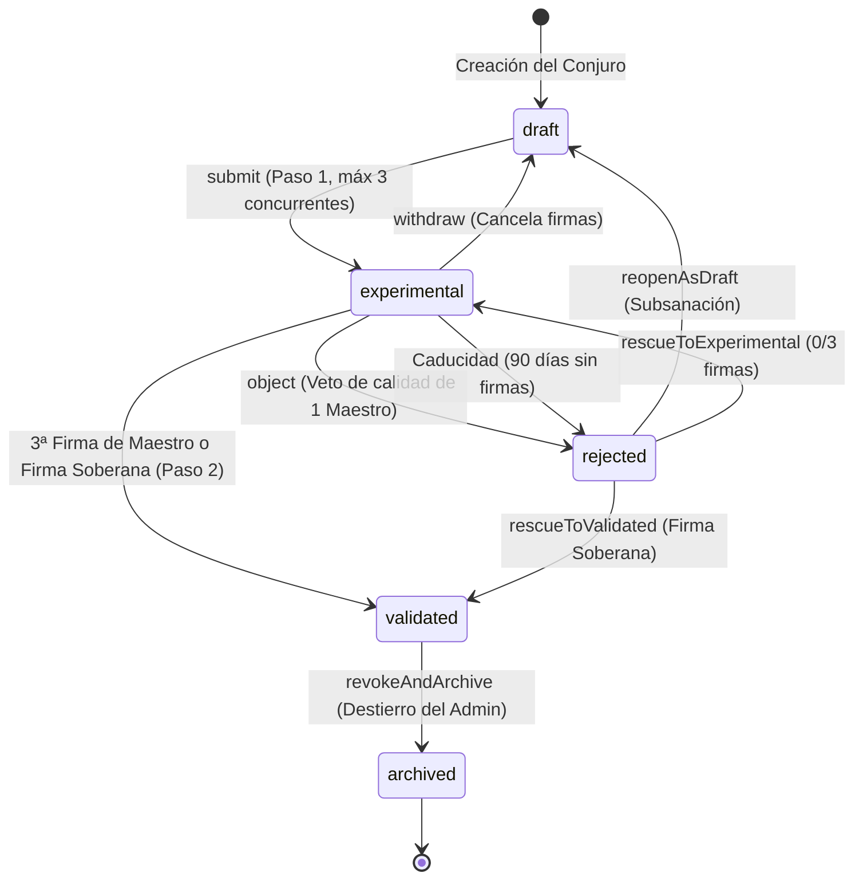

# PLAN-08: Plan Técnico de Implementación — Sistema de Moderación Solemne en Dos Pasos y Consecución de Firmas

> **Especificación Asociada:** [`specs/08-moderation-two-step.spec.md`](file:///C:/Users/Friki/.gemini/antigravity/scratch/grimorio-interactivo/specs/08-moderation-two-step.spec.md)  
> **Constitución:** [`constitution.md`](file:///C:/Users/Friki/.gemini/antigravity/scratch/grimorio-interactivo/constitution.md) | **Directrices:** [`AGENTS.md`](file:///C:/Users/Friki/.gemini/antigravity/scratch/grimorio-interactivo/AGENTS.md)  
> **Estado:** Listo para Implementación  
> **Restricción Suprema:** Dogma Vanilla (Cero librerías npm, frameworks externos o Composer) y Dualismo Lingüístico (Código, variables, clases y APIs en inglés `camelCase`/`snake_case`; narrativa, cánticos litúrgicos e interfaz en noble castellano).

---

## 1. Estructura de Módulos y Ficheros

La arquitectura se compone de servicios backend desacoplados en **PHP 8.2+ estricto** (`declare(strict_types=1);`), persistencia relacional transaccional en **SQLite PDO**, y componentes reactivos frontend en **Modern Vanilla JS (ES Modules nativos)** sin dependencias:

```
grimorio-interactivo/
├── src/                                         # Backend MVC en PHP 8.2+
│   ├── Dto/
│   │   ├── SpellReviewDto.php                   # Datos consolidados del estado de revisión de un conjuro [RF-01]
│   │   ├── MasterSignatureDto.php               # Firma emitida por un Maestro con glosa ceremonial [RF-02]
│   │   ├── ObjectionVerdictDto.php              # Dictamen de objeción con fundamentación litúrgica [RF-02.5]
│   │   ├── ImperialDecreeDto.php                # Decreto soberano del Administrador Supremo [RF-04]
│   │   └── ModerationQueueItemDto.php           # Elemento resumido para la Torre de Deliberación [RF-05.4]
│   ├── Repositories/
│   │   ├── SpellReviewRepository.php            # Mutaciones de estado, cupos y transiciones en `spell_reviews` [RF-01]
│   │   ├── MasterSignatureRepository.php        # Persistencia de firmas activas y revocadas [RF-02, RF-03]
│   │   ├── ObjectionVerdictRepository.php        # Dictámenes de objeción fundamentada y su memoria [RF-02.5, RF-06.2]
│   │   └── ImperialDecreeRepository.php         # Decretos soberanos con su edicto y su memoria en la bitácora [RF-04.5, RF-06.1]
│   ├── Services/
│   │   ├── ModerationWorkflowService.php        # Gestión de estados (draft/experimental/rejected), cupo de 3 y caducidad de 90 días [RF-01]
│   │   ├── MasterDeliberationService.php        # Firmas de Maestros, glosas (máx. 250 car.), retractación y consagración atómica en 3ª firma [RF-02]
│   │   ├── ConstitutionalEthicsValidator.php    # Veto ético de clan, veto de 30 días, pluralidad y anulación de firmas sobrevenidas [RF-03]
│   │   ├── SovereignAdminService.php            # Firma Soberana (solo experimental), rescate limpio a 0/3, degradación póstuma y veto a clan propio [RF-04]
│   │   ├── SignatureAnnulment.php               # Registro inmutable de UNA firma caída de oficio, con su motivo canónico [RF-03.4, RF-03.5]
│   │   └── SignatureAnnulmentResult.php         # Censo de las firmas anuladas en un mismo gesto: obras y autores a notificar [RF-03.4]
│   └── Controllers/
│       ├── ModerationController.php             # Endpoints para envíos, retiros, reaperturas y catálogo experimental [RF-01, RF-05]
│       ├── MasterDeliberationController.php     # Endpoints de la Torre: cola, firmas, objeciones y retractaciones [RF-02, RF-03]
│       └── SovereignAdminController.php         # Endpoints de intervención soberana, decretos y caducidad [RF-04]
├── public/                                      # Raíz pública del servidor web
│   └── assets/
│       ├── css/
│       │   └── components/
│       │       └── moderation.css               # Estilos solemnes del Atrio de Pruebas, Torre de Deliberación y modales [RF-05]
│       └── js/
│           ├── api/
│           │   └── moderationClient.js          # Cliente HTTP fetch para envíos, firmas, objeciones y decretos [RF-01 a RF-06]
│           ├── components/
│           │   ├── experimentalHallComponent.js # Catálogo público del Atrio de Pruebas con insignia ceremonial y contador [RF-05.1]
│           │   ├── mastersTowerComponent.js     # Panel de la Torre para Maestros con filtros, alertas éticas y acciones [RF-05.4]
│           │   ├── objectionModalComponent.js   # Diálogo modal de objeción fundamentada (mín. 20 car. en castellano) [RF-02.5]
│           │   ├── imperialDecreeModalComponent.js # Diálogo modal de edicto imperial para el Administrador Supremo [RF-04.5]
│           │   └── spellCorrectionComponent.js  # Panel del autor con 'reopenAsDraft' y visualización de objeciones previas [RF-01.4, RF-06.2]
│           └── views/
│               ├── experimentalHallView.js      # Vista general comunitaria del Atrio de los Arcanos Experimentales [RF-05.1]
│               └── mastersTowerView.js          # Vista restringida de la Torre de Deliberación para Maestros y Admin [RF-05.4]
└── scratch/
    └── test_moderation_workflow.php             # Suite de pruebas automatizadas CLI de gobernanza, ética y concurrencia
```

---

## 2. Modelo de Datos Relacional y Contratos de la API REST

### 2.1 Esquema DDL en SQLite (Cumplimiento del Artículo V)

> **Nota de dialecto y tipos estrictos (Tarea 1.1):** el bloque siguiente es el contrato canónico de columnas, claves e índices. En la implementación, `VARCHAR(n)` viaja como `TEXT` —dialecto consistente con `database/schema.sql`, donde SQLite no aplica longitudes—, `INT` como `INTEGER`, `BOOLEAN` como `INTEGER` 0/1 y `DATETIME` como `TEXT` en ISO 8601 UTC; la acotación que el tipo declara se impone con `CHECK`, que sí se aplica en SQLite y en MySQL. Los `CHECK` del dominio cerrado por la especificación —los cinco estados de RF-01.1, el techo de tres firmas de RF-02.1, la huella de 64 caracteres del Artículo II, la glosa de 250 de RF-02.2, la justificación de 20 de RF-02.5 y RF-04.5 y los cuatro decretos de RF-04— hacen de la base la última muralla de la Constitución. La enumeración de `revocation_reason` NO se cierra: la especificación nombra retractación, conflicto sobrevenido, pérdida de rango, retirada del autor y degradación póstuma, y admite motivos ceremoniales nuevos.
>
> **Dos moradas, un solo DDL:** las cuatro tablas viven en `database/schema.sql` (canónico: toda base nueva nace con ellas) y en `sql/08_moderation_schema.sql` (vía de ascensión idempotente para bases legadas). `scratch/test_moderation_schema.php` comprueba que ambas copias no divergen.

```sql
-- 1. Tabla de Seguimiento del Estado de Moderación [RF-01, RF-04, RF-05]
CREATE TABLE IF NOT EXISTS spell_reviews (
    id TEXT PRIMARY KEY,                                    -- UUID v4 de la revisión
    spell_id TEXT NOT NULL UNIQUE,                          -- Clave foránea 1:1 a la tabla `spells`
    author_id TEXT NOT NULL,                                -- Mago creador
    origin_clan_id TEXT NULL,                               -- Clan patrimonial de concepción (o null si ermitaño)
    status TEXT NOT NULL DEFAULT 'draft'                    -- 'draft' | 'experimental' | 'validated' | 'rejected' | 'archived'
           CHECK (status IN ('draft', 'experimental', 'validated', 'rejected', 'archived')),
    signatures_count INTEGER NOT NULL DEFAULT 0             -- Conteo activo de firmas válidas
                     CHECK (signatures_count >= 0 AND signatures_count <= 3),
    math_fingerprint TEXT NOT NULL                          -- Hash SHA-256 inmutable del balance sellado (Art. II)
                     CHECK (length(math_fingerprint) = 64),
    submitted_at TEXT NULL,                                 -- Fecha de entrada a la Torre de Moderación (ISO 8601 UTC)
    validated_at TEXT NULL,                                 -- Fecha de consagración solemne
    rejected_at TEXT NULL,                                  -- Fecha de objeción o caducidad
    reopened_at TEXT NULL,                                  -- Fecha de re-apertura como borrador
    archived_at TEXT NULL,                                  -- Fecha de degradación o destierro póstumo
    FOREIGN KEY (spell_id) REFERENCES spells (id) ON DELETE CASCADE,
    FOREIGN KEY (author_id) REFERENCES users (id) ON DELETE CASCADE,
    FOREIGN KEY (origin_clan_id) REFERENCES clans (id) ON UPDATE CASCADE
);

-- 2. Tabla de Firmas de Maestros y Glosas Litúrgicas [RF-02, RF-03]
CREATE TABLE IF NOT EXISTS master_signatures (
    id TEXT PRIMARY KEY,                                    -- UUID v4 de la firma
    spell_id TEXT NOT NULL,                                 -- Conjuro avalado
    master_id TEXT NOT NULL,                                -- Maestro firmante
    master_clan_id TEXT NULL,                               -- Clan al que pertenecía al firmar (o null si ermitaño)
    ceremonial_gloss TEXT NULL
                     CHECK (ceremonial_gloss IS NULL OR length(ceremonial_gloss) <= 250),  -- Glosa litúrgica opcional (máx. 250 car.)
    signed_at TEXT NOT NULL,                                -- Marca temporal de la firma
    is_revoked INTEGER NOT NULL DEFAULT 0                   -- 1 si fue retractada, anulada por conflicto ético o degradación
               CHECK (is_revoked IN (0, 1)),
    revoked_at TEXT NULL,                                   -- Fecha de revocación
    revocation_reason TEXT NULL,                            -- 'retracted' | 'clan_conflict_arisen' | 'rank_lost' | 'author_withdrawn' | 'sovereign_archive' | 'review_expired' (letargo de RF-01.6)
    FOREIGN KEY (spell_id) REFERENCES spells (id) ON DELETE CASCADE,
    FOREIGN KEY (master_id) REFERENCES users (id) ON DELETE CASCADE,
    FOREIGN KEY (master_clan_id) REFERENCES clans (id) ON UPDATE CASCADE
);

-- 3. Tabla de Dictámenes de Objeción Fundamentada [RF-02.5, RF-06.2]
CREATE TABLE IF NOT EXISTS objection_verdicts (
    id TEXT PRIMARY KEY,                                    -- UUID v4 del dictamen
    spell_id TEXT NOT NULL,                                 -- Conjuro objetado
    master_id TEXT NOT NULL,                                -- Maestro que emitió el veto
    objection_reason TEXT NOT NULL
                     CHECK (length(objection_reason) >= 20),  -- Motivo solemne obligatorio en castellano (mín. 20 car.)
    objected_at TEXT NOT NULL,                              -- Marca temporal del dictamen
    FOREIGN KEY (spell_id) REFERENCES spells (id) ON DELETE CASCADE,
    FOREIGN KEY (master_id) REFERENCES users(id) ON DELETE CASCADE
);

-- 4. Tabla de Decretos del Administrador Supremo [RF-04]
CREATE TABLE IF NOT EXISTS sovereign_decrees (
    id TEXT PRIMARY KEY,                                    -- UUID v4 del decreto
    spell_id TEXT NOT NULL,                                 -- Conjuro sobre el que se decretó
    admin_id TEXT NOT NULL,                                 -- Administrador Supremo actuante
    decree_type TEXT NOT NULL                               -- 'sovereignValidation' | 'rescueToExperimental' | 'rescueToValidated' | 'revokeAndArchive'
                CHECK (decree_type IN ('sovereignValidation', 'rescueToExperimental', 'rescueToValidated', 'revokeAndArchive')),
    imperial_decree_text TEXT NOT NULL
                         CHECK (length(imperial_decree_text) >= 20),  -- Edicto imperial obligatorio en castellano (mín. 20 car.)
    decreed_at TEXT NOT NULL,                               -- Marca temporal del decreto
    FOREIGN KEY (spell_id) REFERENCES spells (id) ON DELETE CASCADE,
    FOREIGN KEY (admin_id) REFERENCES users (id) ON DELETE CASCADE
);

-- Índices de Rendimiento, Pluralidad e Integridad Concurrente
CREATE UNIQUE INDEX IF NOT EXISTS idx_active_master_signature ON master_signatures(spell_id, master_id) WHERE is_revoked = 0;
CREATE INDEX IF NOT EXISTS idx_reviews_queue ON spell_reviews(status, submitted_at ASC);
CREATE INDEX IF NOT EXISTS idx_reviews_author_active ON spell_reviews(author_id, status);
CREATE INDEX IF NOT EXISTS idx_signatures_spell_active ON master_signatures(spell_id, is_revoked);
```

---

### 2.2 Contratos de la API REST

#### 1. Enviar Conjuro a Moderación (Paso 1)
* **Ruta:** `POST /api/v1/moderation/spells/{id}/submit`
* **Cabeceras:** `Authorization: Bearer <token>`
* **Respuestas:**
  * `200 OK`: Transicionado de `draft` a `experimental`, huella matemática sellada y firmas iniciadas en 0.
  * `400 Bad Request`: El conjuro no se encuentra en estado `draft` o carece de balance matemático válido.
  * `403 Forbidden`: Usuario con rol `reader` o en convalecencia arcana.
  * `409 Conflict`: El autor ya tiene tres (3) conjuros en estado `experimental`.

#### 2. Retirar Conjuro a Borrador Privado
* **Ruta:** `POST /api/v1/moderation/spells/{id}/withdraw`
* **Respuestas:**
  * `200 OK`: Transicionado a `draft`. Todas las firmas previas se marcan como revocadas con motivo `author_withdrawn`.
  * `403 Forbidden`: Solo el autor del conjuro puede retirarlo.
  * `409 Conflict`: No se puede retirar un conjuro que ya está `validated` o `archived`.

#### 3. Reabrir Conjuro Rechazado como Borrador (`reopenAsDraft`)
* **Ruta:** `POST /api/v1/moderation/spells/{id}/reopen`
* **Respuestas:**
  * `200 OK`: Transicionado de `rejected` a `draft`, habilitando la edición y manteniendo visible la última objeción.
  * `400 Bad Request`: El conjuro no se encuentra en estado `rejected`.

#### 4. Catálogo del Atrio de Pruebas (Público)
* **Ruta:** `GET /api/v1/moderation/experimental?element={element}&school={school}`
* **Respuestas:**
  * `200 OK`: Lista paginada de conjuros en deliberación con metadata, autor, clan originario, insignias de advertencia y conteo de firmas ($0/3$, $1/3$, $2/3$).

#### 5. Cola de la Torre de Deliberación (Exclusivo Maestros / Admin)
* **Ruta:** `GET /api/v1/moderation/queue`
* **Respuestas:**
  * `200 OK`: Conjuros en cola con indicador booleano `hasEthicalConflict` para el Maestro autenticado (calculado en servidor en base a clan propio y últimos 30 días).

#### 6. Estampar Firma de Consagración
* **Ruta:** `POST /api/v1/moderation/spells/{id}/sign`
* **Entrada:** `{ "ceremonialGloss": "Por la pureza del fulgor solar y la armonía de su invocación." }` (opcional, máx. 250 car.)
* **Respuestas:**
  * `200 OK`: Firma estampada. Si era la 3ª firma, devuelve `{ "status": "validated", "signaturesCount": 3, "consecrated": true }`.
  * `400 Bad Request`: El conjuro no está en `experimental` o la glosa supera 250 caracteres.
  * `403 Forbidden`: Conflicto ético de clan (Art. III), el usuario es el propio autor (auto-firma prohibida) o no ostenta rol `master`.
  * `409 Conflict`: Ya existe una firma activa de la misma hermandad en el conjuro o el usuario ya firmó.

#### 7. Retractar Firma de Maestro
* **Ruta:** `POST /api/v1/moderation/spells/{id}/retract`
* **Entrada:** `{ "reason": "Duda razonable sobre la resonancia elemental." }`
* **Respuestas:**
  * `200 OK`: Firma revocada, contador descendido a $N-1$.
  * `400 Bad Request`: No existe firma activa del usuario sobre el conjuro.
  * `409 Conflict`: El conjuro ya alcanzó `validated`, siendo la consagración irrevocable.

#### 8. Emitir Dictamen de Objeción (Veto de Calidad)
* **Ruta:** `POST /api/v1/moderation/spells/{id}/object`
* **Entrada:** `{ "objectionReason": "La descripción lírica presenta anacronismos manifiestos que vulneran el Velo Arcano (Art. IV)." }`
* **Respuestas:**
  * `200 OK`: Conjuro transicionado de inmediato a `rejected`, retirado del Atrio y devuelto a la libreta del autor.
  * `422 Unprocessable Entity`: La justificación tiene menos de 20 caracteres en castellano.
  * `403 Forbidden`: Conflicto ético o autor intentando objetar su propia obra.

#### 9. Firma Soberana Instantánea (`supremeAdmin`)
* **Ruta:** `POST /api/v1/moderation/sovereign/validate`
* **Entrada:** `{ "imperialDecreeText": "Por mandato del Cónclave Supremo, esta obra es consagrada de oficio por su excepcional belleza y equilibrio." }`
* **Respuestas:**
  * `200 OK`: Conjuro elevado inmediatamente a `validated` y acreditación de PDA ejecutada.
  * `400 Bad Request`: El conjuro no está en estado `experimental` (prohibida la validación de `draft` bajo Art. II).
  * `403 Forbidden`: El conjuro fue forjado por adeptos del clan del Administrador Supremo (Art. III.2) o es de su propia autoría.

#### 10. Rescate de Conjuro Rechazado (`supremeAdmin`)
* **Ruta:** `POST /api/v1/moderation/sovereign/rescue`
* **Entrada:** 
```json
{ 
  "targetStatus": "experimental", // o "validated"
  "imperialDecreeText": "Se determina que la objeción previa carecía de fundamento litúrgico objetivo; se reabre la deliberación colegiada." 
}
```
* **Respuestas:**
  * `200 OK`: Si `targetStatus == 'experimental'`, se reinicia con $0/3$ firmas. Si `targetStatus == 'validated'`, se consagra directamente (siempre que el autor no pertenezca a su propio clan).

#### 11. Revocación y Archivo Póstumo (`supremeAdmin`)
* **Ruta:** `POST /api/v1/moderation/sovereign/archive`
* **Entrada:** `{ "imperialDecreeText": "Se constata fraude en la composición del conjuro; queda desterrado del Gran Tomo.", "deductPoints": true }`
* **Respuestas:**
  * `200 OK`: Conjuro transicionado a `archived`, restando retroactivamente los PDA del clan originario si `deductPoints == true`.

#### 12. Tarea Programada de Caducidad por Letargo (Cron)
* **Ruta:** `POST /api/v1/moderation/cron-check-expiry`
* **Cabeceras:** `X-Arcane-Cron-Secret: <secret>`
* **Respuestas:**
  * `200 OK`: Transiciona a `rejected` todos los conjuros experimentales con más de 90 días naturales sin firmas activas.

> **Notas de implementación (Tarea 3.1).** Los Endpoints 1 a 4 se sirven por la pila real de producción (`buildRouter()`), y el controlador se limita a traducir los veredictos del dominio: el rango, la convalecencia, el cupo y la titularidad los dicta `ModerationWorkflowService` (Art. III). Tres precisiones ratificadas al escribirlo:
>
> 1. **El conjuro ajeno responde 404, no 403.** Este contrato anotaba 403 para la retirada de una obra ajena, pero el servicio de la Fase 2 —ya verificado— distingue una sola cosa: la obra no habita el grimorio del invocante (`SpellNotFoundException`, 404, con el código `SPELL_NOT_FOUND` de SPEC-04). El controlador respeta ese veredicto en lugar de re-implementar una titularidad paralela, y el 404 no delata si la obra ajena existe (misma doctrina que la inviolabilidad de la libreta privada, spec §7.5). El 403 del contrato queda cubierto por las causas que SÍ le corresponden: el rango insuficiente del lector y la convalecencia arcana.
> 2. **La cola devuelve el retrato de la obra en la MISMA fila.** `SpellReviewRepository::findQueueItems()` resuelve ahora por `JOIN` el nombre, el `slug`, la afinidad elemental, la escuela, el alias del autor y el nombre del linaje patrimonial —las claves exactas que `ModerationQueueItemDto::fromDatabaseRow()` consume—, y estrena `countQueueItems()`, que comparte con ella el constructor de condiciones (`buildQueueConditions()`) para que la página y su censo jamás describan conjuntos distintos. Sin ese retrato, el Atrio habría compuesto cada tarjeta con una consulta propia: un `N+1` que la doctrina del proyecto no admite. El linaje se une con `LEFT JOIN` porque la obra de un ermitaño no tiene estandarte, y un `INNER JOIN` la habría borrado del Atrio —justo la obra que ningún veto de clan alcanza—.
> 3. **La insignia del Atrio es del Atrio.** La leyenda «En Deliberación Arcana — Obra en Fase de Prueba» (RF-05.1), su código `UNDER_ARCANE_DELIBERATION` y el bloqueo de PDA (`pointsBlocked: true`, RF-05.3) viajan UNA vez en `hallWarning`, no repetidos en cada tarjeta: el marco rúnico es idéntico en todas las obras y una copia por elemento sería una mentira a punto de divergir. El indicador `0/3`, en cambio, sí es de cada obra y lo aporta el DTO canónico. `hasEthicalConflict` viaja en `false` porque el Atrio es público: quien no milita en hermandad alguna no puede tener conflicto, y la memoria de clanes jamás se filtra al navegador (Art. III).

> **Notas de implementación (Tarea 3.2).** Los Endpoints 5 a 8 se sirven por la misma pila real, y el controlador no aritmetiza nada: la firma, la retractación y el dictamen los dicta `MasterDeliberationService`, y el veto del Artículo III lo RESPONDE `ConstitutionalEthicsValidator`. Cuatro precisiones ratificadas al escribirlo:
>
> 1. **El veredicto ético se pregunta a su autoridad, fila a fila.** Este contrato exige un `hasEthicalConflict` calculado «en base a clan propio y últimos 30 días», y esa aritmética —con su ventana inclusiva de treinta días naturales y la composición del historial de membresía de SPEC-07— ya vive en `ConstitutionalEthicsValidator::evaluationVetoCode()`. La cola se la PREGUNTA por cada obra en lugar de reimplementarla, porque una segunda copia de la ley podría discrepar de la primera; y se le pregunta también por la propia pluma (RF-03.2), de modo que la Torre inhabilita el sello del autor-Maestro por la misma vía que le responde 403 al firmar. La Torre es un recinto acotado —una página de cola, exclusiva de Maestros— y ese es el precio de tener una sola ley.
> 2. **La Torre declara la CAUSA del veto, no solo el booleano.** El contrato nombraba un indicador booleano; cada elemento viaja además con `ethicalVeto: {code, legend}` —`ownAuthorship` o `clanIncompatibility`, con la leyenda ceremonial que el Artículo IV prescribe— porque el componente de la Torre (Tarea 5.3) debe rotular el bloqueo *«Veto Constitucional: Hermandad Incompatible»* sin deducir la ley de un `true`. La leyenda NO se inventa aquí: se toma de `ConstitutionalEthicsValidator::CONFLICT_OF_INTEREST_MESSAGE`, su fuente única.
> 3. **El techo de tres firmas acota también el filtro.** `minSignatures` viaja al repositorio, que rechaza con excepción cualquier umbral fuera de 0..3 (su `assertSignaturesCount`); dejarlo pasar convertiría una errata del cliente en una interrupción del santuario. El controlador lo acota contra `SIGNATURES_REQUIRED` —la constante del servicio, no un tres escrito a mano— y responde 400.
> 4. **La cola admite dos rangos; la firma, uno.** `CANONICAL_JUDGE_ROLES` da acceso a la Torre al `master` y al `supremeAdmin` (RF-03.5: la potestad suprema conserva potestad judicial), mientras que firmar, retractarse y objetar exigen el rango `master` exacto (`JUDGE_ROLE`): la potestad suprema no pluma por esta vía, porque su intervención es un decreto con Edicto Imperial (RF-04.1) y cae bajo otro veto. La asimetría es deliberada y el arnés la prueba con las dos cuentas.

> **Notas de implementación (Tarea 3.3).** Los Endpoints 9 a 12 se sirven por la misma pila real, y el controlador no aritmetiza ni abre conexión alguna: el rango lo dicta `SovereignAdminService::SOVEREIGN_ROLE`, los dos vetos constitucionales y la deducción retroactiva los dicta `SovereignAdminService` (Tarea 2.5), y el letargo con la liberación del cupo los dicta `ModerationWorkflowService` (Tarea 2.3). Cuatro precisiones ratificadas al escribirlo:
>
> 1. **El objetivo del decreto viaja en el CUERPO, no en la ruta.** Este contrato declaró los tres decretos como rutas literales y puso en su `Entrada` el edicto, el destino y la orden de deducción: nombra todo salvo aquello sobre lo que se dicta. Añadir `{id}` a la ruta habría sido una enmienda del contrato ratificado sin acuerdo previo; el controlador exige por tanto `spellId` en el cuerpo y responde 400 `INVALID_REQUEST_BODY` si falta, de modo que ningún decreto cae sobre una obra adivinada. El rescate y el destierro siguen el mismo contrato, y el arnés cubre el 400 en los tres.
> 2. **El letargo lo invoca un planificador, no un mago.** Exigir vínculo arcano al barrido lo haría inejecutable, así que se sella con la cabecera `X-Arcane-Cron-Secret` —mismo protocolo que el corte dominical de SPEC-07—, con `hash_equals` en tiempo constante y NEGATIVA EN SECO: sin sello declarado en el entorno NADIE invoca el letargo, y el 403 no delata cuál de las dos causas —sello ajeno o sello ausente— lo motivó (RNF-01). Y el reloj lo pone el SANTUARIO: el barrido no acepta instante alguno del exterior, porque aceptarlo permitiría a cualquiera caducar obras ajenas a voluntad.
> 3. **La orden de deducción es una LEY, no una preferencia.** Un `deductPoints` que no sea booleano explícito responde 400 en lugar de coaccionarse a falso en silencio: una deducción que no ocurre es tan grave como una que ocurre sin orden, y el silencio jamás debe decidir sobre el patrimonio de una casa (Art. III.3). El booleano efectivo vuelve además en la respuesta (`gloryDeductionOrdered`), para que el custodio vea lo que de verdad ordenó.
> 4. **El barrido rinde su ACTA.** Este contrato declaraba la transición y callaba el cuerpo de la respuesta; el acta declara `legend` —la leyenda ceremonial, tomada de `ModerationWorkflowService::EXPIRY_LEGEND`, su fuente única—, `staleDays` —los noventa naturales de `STALE_REVIEW_DAYS`, la constante del servicio y no un noventa escrito a mano—, `expiredCount` y el detalle de las obras caducadas. Sin acta, el custodio tendría que leer la base para saber qué hizo su propio planificador.

---

## 3. Algoritmos Clave en Pseudocódigo y Máquinas de Estado

### 3.1 Máquina de Estados Canónica del Conjuro



> **Notas de implementación (Tarea 2.3).** El gobierno de estos ocho arcos vive en
> `ModerationWorkflowService`, que escribe SIEMPRE el expediente `spell_reviews` —la
> autoridad— y deja que este arrastre el espejo `spells` dentro de la misma
> transacción (Tarea 1.5). El CUPO no se comprueba antes de elevar: se eleva dentro
> de un solo gesto que abre transacción, TOCA la fila del autor en `users` —primer
> enunciado de escritura, que adquiere el bloqueo del motor— y solo entonces CUENTA,
> eleva y memoriza, de modo que dos peticiones simultáneas del mismo autor se
> serializan y la cuarta obra es imposible, no improbable (RNF-04). La elevación
> reutiliza el núcleo sin transacción de `SpellManagementService`
> (`publishDraftWithinTransaction`), así que existe un único flujo de publicación y
> un único coste publicado (Art. II). La caducidad por letargo revoca los avales
> viejos con el motivo ceremonial `review_expired`, estrenado aquí: un aval solo vive
> sobre una obra en deliberación, y el contador del expediente debe seguir contando
> firmas VIVAS.
> **Deuda declarada (RF-01.3):** el guardián de edición
> (`assertSpellIsEditableInDraft`) devuelve el veredicto de los cinco estados, pero
> su CABLEADO a la ruta de edición pertenece a la Fase 3: hoy SPEC-04 permite
> enmendar la descripción de una obra experimental con la huella intacta
> (`UPDATE_DESCRIPTION_INTACT_SIGNATURES`), mientras RF-01.3 bloquea toda edición de
> lo evaluado. Es una colisión entre especificaciones que exige enmienda ratificada
> de SPEC-04 antes de cerrar el camino viejo.

---

### 3.2 Algoritmo de Firma de Consagración y Consagración Atómica en 3ª Firma

```
ALGORITMO signSpellByMaster(spellId, masterUserId, ceremonialGloss):
    INICIAR_TRANSACCION_ATOMICA()

    // 1. Bloqueo de fila del conjuro (SELECT ... FOR UPDATE)
    review = spellReviewRepository.findAndLockById(spellId)
    IF review == NULL OR review.status != 'experimental':
        CANCELAR_TRANSACCION()
        RETURN { success: FALSE, error: "SPELL_NOT_IN_REVIEW" }

    // 2. Bloqueo de Auto-Firma
    IF review.authorId == masterUserId:
        CANCELAR_TRANSACCION()
        RETURN { success: FALSE, error: "SELF_SIGNING_PROHIBITED" }

    // 3. Verificación de Veto Constitucional (Artículo III)
    isAllowed = constitutionalEthicsValidator.canMasterEvaluateSpell(masterUserId, review.originClanId)
    IF NOT isAllowed:
        CANCELAR_TRANSACCION()
        RETURN { success: FALSE, error: "CONSTITUTIONAL_ETHICS_VETO" }

    // 4. Verificación de Pluralidad de Clanes entre Firmantes Activos
    masterClanId = clanMemberRepository.findActiveClanId(masterUserId) // null si ermitaño
    activeSignatures = masterSignatureRepository.findActiveSignatures(spellId)

    FOR sig IN activeSignatures:
        IF sig.masterId == masterUserId:
            CANCELAR_TRANSACCION()
            RETURN { success: FALSE, error: "ALREADY_SIGNED" }
        // Si el firmante no es ermitaño, no puede coincidir con otro clan firmante
        IF masterClanId != NULL AND sig.masterClanId != NULL AND masterClanId == sig.masterClanId:
            CANCELAR_TRANSACCION()
            RETURN { success: FALSE, error: "CLAN_PLURALITY_VIOLATION" }

    // 5. Estampar Firma
    masterSignatureRepository.insertSignature(spellId, masterUserId, masterClanId, ceremonialGloss, getCurrentTimestampUtc())
    newCount = review.signaturesCount + 1
    spellReviewRepository.updateSignaturesCount(spellId, newCount)

    // Registrar en Bitácora de Auditoría
    auditLogRepository.log("MASTER_SIGNATURE_APPLIED", {
        spellId: spellId,
        masterId: masterUserId,
        clanId: masterClanId,
        signaturesCount: newCount,
        gloss: ceremonialGloss
    })

    // 6. Evaluación de Consagración (3ª Firma)
    IF newCount >= 3:
        nowUtc = getCurrentTimestampUtc()
        spellReviewRepository.setStatus(spellId, 'validated', nowUtc)
        spellRepository.setStatus(spellId, 'validated', nowUtc)

        // Acreditación de Puntos de Dominio Arcano (PDA) al Clan Originario (SPEC-07)
        IF review.originClanId != NULL:
            spellCircle = spellRepository.getCircle(spellId)
            spellElement = spellRepository.getElement(spellId)
            weeklyDominionService.awardPointsForValidatedSpell(review.originClanId, spellCircle, spellElement)

        auditLogRepository.log("SPELL_CONSECRATED_CANONICAL", {
            spellId: spellId,
            originClanId: review.originClanId,
            consecratedAt: nowUtc
        })

    CONSOLIDAR_TRANSACCION()
    RETURN { success: TRUE, status: (newCount >= 3 ? 'validated' : 'experimental'), signaturesCount: newCount }
```

> **Notas de implementación (Tarea 2.4).** El pseudocódigo se respeta en sus seis pasos, con cuatro precisiones ratificadas al escribirlo:
>
> 1. **El contador se CUENTA, no se suma.** `newCount = review.signaturesCount + 1` heredaría la divergencia de un espejo inflado y no sobreviviría a una retractación simultánea; el servicio recuenta las firmas VIVAS (`countActiveSignatures()`) tras estampar y fija ese resultado. La consagración se decide sobre el conteo RECIÉN MEDIDO.
> 2. **El estado se eleva por el ÚNICO escritor del espejo.** `spellReviewRepository.setStatus()` + `spellRepository.setStatus()` son dos escrituras que la Tarea 1.5 fundió en una: `SpellReviewRepository::updateStatus()` transiciona la autoridad y arrastra `spells` —estado y fecha— dentro de la misma transacción.
> 3. **La gloria se acredita con el motor ya construido y probado.** `awardPointsForValidatedSpell(originClanId, circle, element)` no existe: SPEC-07 entregó `WeeklyDominionService::awardValidatedSpell(spellId, now)`, que resuelve el linaje destino desde `spells.clan_id` —la autoridad del linaje de la obra—, aplica su escala y su sinergia, y es idempotente por `(action_type, source_id)`. Se invoca DENTRO de la transacción: su `runAtomically()` se pliega a la abierta en lugar de anidar otra.
> 4. **El acto de la bitácora lo dicta el evento y la entidad, no el llamante.** `MASTER_SIGNATURE_APPLIED` y `SPELL_CONSECRATED_CANONICAL` se inscriben con los nombres que el catálogo cerrado de `AuditEntry` admite —`SIGN_VALIDATE` y `SPELL_CONSECRATED`—, por el canal único de SPEC-03 (`AuditService::recordAction`) que la Tarea 1.4 ratificó frente al `AuditLogRepository` que este plan nombraba.
>
> La retractación se comprueba ADEMÁS contra el sello: el pseudocódigo no la cubría, y RF-02.4 exige que deje de ser posible una vez alcanzada la tercera rúbrica (`SIGNATURE_IRREVOCABLE`, 409).

---

### 3.3 Algoritmo de Anulación Automática por Conflicto Ético Sobrevenido o Pérdida de Rango

```
ALGORITMO onUserMembershipOrRankChanged(userId, eventType, newClanId, newRole):
    // Ejecutado como suscriptor de eventos cuando un usuario cambia de clan o pierde rango
    activeSignatures = masterSignatureRepository.findActiveSignaturesByMaster(userId)

    FOR sig IN activeSignatures:
        review = spellReviewRepository.findById(sig.spellId)
        // Solo aplica a conjuros que aún no alcanzaron la consagración
        IF review.status == 'experimental':
            mustRevoke = FALSE
            reason = ""

            // Caso A: Pérdida del rango de Maestro
            IF newRole != NULL AND newRole != 'master' AND newRole != 'supremeAdmin':
                mustRevoke = TRUE
                reason = "rank_lost"

            // Caso B: Conflicto sobrevenido por cambio de hermandad
            IF NOT mustRevoke AND review.originClanId != NULL:
                IF newClanId == review.originClanId:
                    mustRevoke = TRUE
                    reason = "clan_conflict_arisen"

            IF mustRevoke:
                INICIAR_TRANSACCION_ATOMICA()
                masterSignatureRepository.revokeSignature(sig.id, reason, getCurrentTimestampUtc())
                // El contador se CUENTA desde las firmas VIVAS, no se resta del
                // valor almacenado: así la anulación SANA un espejo divergente
                // en vez de heredar su error (lección de la Tarea 1.5).
                newCount = masterSignatureRepository.countActiveSignatures(sig.spellId)
                spellReviewRepository.updateSignaturesCount(sig.spellId, newCount)

                // Canal único de SPEC-03, con el acto CANÓNICO del catálogo de
                // AuditEntry. La identidad del actuante —alias y rol— se
                // resuelve en `users` dentro de la MISMA transacción.
                auditService.recordAction(
                    actionType: "SIGNATURE_ANNULMENT",
                    targetEntityType: "spell", targetEntityId: sig.spellId,
                    justification: anulacion solemne en castellano con la causa y el alias
                )
                CONSOLIDAR_TRANSACCION()
```

> **Notas de implementación (Tarea 2.2).** El pseudocódigo nombraba el acto como `SIGNATURE_AUTOMATICALLY_ANNULLED`; el catálogo CERRADO que SPEC-03 ratificó en la Tarea 1.4 lo inscribe como **`SIGNATURE_ANNULMENT`**, y esa es la forma que la Bitácora pública rotula. La anulación se ejecuta en `ConstitutionalEthicsValidator::revokeConflictedSignatures()`, que **COMPONE** la autoridad del Artículo III ya construida en SPEC-07 (`ClanEthicsValidator`, sobre el historial de membresía `clan_members`) en lugar de reimplementar la ventana de treinta días —dos copias de esa aritmética podrían divergir, que es el defecto que este proyecto ya cerró dos veces—. El rango se juzga PRIMERO (una degradación arrastra toda la obra, y el motivo que la memoria debe conservar es la pérdida del rango), y solo caen firmas sobre obras en `experimental`: una obra consagrada es irrevocable (RF-02.7) y una retirada a la libreta ya anuló sus avales con el motivo `author_withdrawn`.

---

### 3.4 Algoritmo de Firma Soberana del Administrador Supremo

```
ALGORITMO executeSovereignValidation(spellId, adminUserId, imperialDecreeText):
    INICIAR_TRANSACCION_ATOMICA()

    review = spellReviewRepository.findAndLockById(spellId)
    // 1. Prohibido validar borradores bajo el Artículo II
    IF review.status != 'experimental':
        CANCELAR_TRANSACCION()
        RETURN { success: FALSE, error: "CANNOT_SOVEREIGN_VALIDATE_NON_EXPERIMENTAL" }

    // 2. Prohibido validar obras de propia autoría
    IF review.authorId == adminUserId:
        CANCELAR_TRANSACCION()
        RETURN { success: FALSE, error: "SELF_VALIDATION_PROHIBITED" }

    // 3. Veto al propio clan bajo el Artículo III.2
    adminClanId = clanMemberRepository.findActiveClanId(adminUserId)
    IF adminClanId != NULL AND review.originClanId != NULL AND adminClanId == review.originClanId:
        CANCELAR_TRANSACCION()
        RETURN { success: FALSE, error: "SOVEREIGN_OWN_CLAN_VETO" }

    // 4. Validación de longitud del Edicto Imperial
    IF LENGTH(TRIM(imperialDecreeText)) < 20:
        CANCELAR_TRANSACCION()
        RETURN { success: FALSE, error: "IMPERIAL_DECREE_TOO_SHORT" }

    nowUtc = getCurrentTimestampUtc()
    sovereignDecreeRepository.insertDecree(spellId, adminUserId, 'sovereignValidation', imperialDecreeText, nowUtc)
    spellReviewRepository.setStatus(spellId, 'validated', nowUtc)
    spellRepository.setStatus(spellId, 'validated', nowUtc)

    // Acreditación de PDA al clan originario
    IF review.originClanId != NULL:
        spellCircle = spellRepository.getCircle(spellId)
        spellElement = spellRepository.getElement(spellId)
        weeklyDominionService.awardPointsForValidatedSpell(review.originClanId, spellCircle, spellElement)

    auditLogRepository.log("SOVEREIGN_VALIDATION_DECREED", {
        spellId: spellId,
        adminId: adminUserId,
        decreeText: imperialDecreeText,
        consecratedAt: nowUtc
    })

    CONSOLIDAR_TRANSACCION()
    RETURN { success: TRUE, status: 'validated' }
```

> **Notas de implementación (Tarea 2.5).** El pseudocódigo se respeta paso a paso, con seis precisiones ratificadas al escribirlo:
>
> 1. **El contador de firmas NO se inventa.** Una Firma Soberana sobre una obra avalada por dos Maestros conserva el 2/3: los avales son un hecho y la Bitácora ha de poder contarlo tal cual. Escribirlos como tres sería inscribir una mentira en el registro público, y el indicador `2/3` de una obra consagrada de oficio es la verdad de su historia.
> 2. **El estado se eleva por el ÚNICO escritor del espejo** (Tarea 1.5), como en la consagración colegiada: `spellReviewRepository.setStatus()` + `spellRepository.setStatus()` son una sola escritura.
> 3. **El decreto se inscribe por el canal de la Tarea 1.4.** `sovereignDecreeRepository.insertDecree()` recibe el `AuditService` como colaborador obligatorio y escribe la fila y su memoria en la misma transacción: no hay `auditLogRepository.log()` propio, y el acto canónico lo elige el mapa cerrado del repositorio.
> 4. **La gloria se acredita con el motor ya probado** (`awardValidatedSpell`) y con el estado YA transicionado, porque el motor lee `spells.status` para verificar que la obra fue ratificada (RF-05.3).
> 5. **El veto del Artículo III alcanza los TRES actos**, no solo la validación: RF-04.2 remite las obras del propio estandarte al «juicio imparcial de 3 Maestros independientes de clanes ajenos», y la potestad soberana es discrecional también en su OMISIÓN —perdonar la obra de la propia casa o archivar la del rival es exactamente el abuso que el artículo previene—. Igual suerte corre la PLUMA PROPIA, que RF-03.2 prohíbe «independientemente de que ostente el rango de `master` o `supremeAdmin`».
> 6. **La deducción retroactiva vive en `WeeklyDominionService`**, junto al otorgamiento: es el mismo contador y el mismo libro, y una segunda aritmética de la gloria podría divergir de la primera. Su fórmula y su reparto se documentan en §5.

---

## 4. Arquitectura de Eventos y Componentes Frontend Vanilla

### 4.1 Bus de Eventos Desacoplado (`window.addEventListener`)
* `moderation:submitted` $\rightarrow$ Actualiza el contador de cupo del autor y notifica a la Torre de Moderación.
* `moderation:signed` $\rightarrow$ Actualiza en vivo el progreso de firmas ($N/3$) en el Atrio y la Torre.
* `moderation:retracted` $\rightarrow$ Desciende el contador de firmas y reactiva el botón de firma para otros Maestros.
* `moderation:rejected` $\rightarrow$ Retira la tarjeta del Atrio de Pruebas y notifica privadamente al autor.
* `moderation:consecrated` $\rightarrow$ Efecto rúnico dorado triunfal, traslado del conjuro al Gran Tomo y emisión de puntos al clan.
* `moderation:decreed` $\rightarrow$ Despliegue del Edicto Imperial en la Bitácora de Auditoría pública.

### 4.2 Jerarquía de Componentes UI
1. **`experimentalHallComponent.js`:**  
   Pabellón público que renderiza los conjuros en deliberación con marco rúnico de advertencia (*«En Deliberación Arcana»*), medidor circular de firmas ($0/3, 1/3, 2/3$) y botón de prueba rápida en la Cámara de Conjuración (Canvas + Web Speech).
2. **`mastersTowerComponent.js`:**  
   Panel exclusivo de los Maestros de la Torre con filtros por círculo y elemento. Cada tarjeta evalúa en tiempo real si el Maestro tiene conflicto de hermandad; si existe incompatibilidad ética, el botón de firma se muestra inhabilitado con el distintivo: *«Veto Constitucional: Hermandad Incompatible (Art. III)»*.
3. **`objectionModalComponent.js`:**  
   Modal solemne que intercepta el veto de un Maestro, con contador decreciente de caracteres para asegurar un motivo en castellano $\ge 20$ caracteres.
4. **`spellCorrectionComponent.js`:**  
   Componente en la libreta del autor para conjuros en estado `rejected`, mostrando en un pergamino ámbar las notas litúrgicas del rechazo y el botón ceremonial **«Reabrir como Borrador»** (`reopenAsDraft`).

---

## 5. Decisiones Técnicas Justificadas y Alternativas Descartadas

| Decisión Técnica Adoptada | Justificación Canónica | Alternativas Descartadas |
| :--- | :--- | :--- |
| **Bloqueo Pesimista en Consagración (`SELECT ... FOR UPDATE`)** | Garantiza de forma estricta e inviolable la atomicidad de la 3ª firma frente a retractaciones simultáneas en la misma milésima de segundo (RNF-02). | **Bloqueo optimista por versión:** Riesgo de fallos silenciados y condiciones de carrera en ráfagas de firmas simultáneas.<br>**Polling en cliente:** Prohibido por Dogma Vanilla. |
| **Exclusión de `draft` de Facultades Soberanas** | Cumple de forma inquebrantable el Artículo II.3 (Ley del Maná), asegurando que ninguna obra sea validada sin haber sellado su huella matemática determinista en el servidor. | **Permitir validar borradores con auto-cálculo:** Viola la privacidad de la libreta personal del autor y fomenta abusos discrecionales. |
| **Reinicio Limpio a Cero Firmas ($0/3$) ante Rescate** | Si un conjuro rechazado es rescatado para volver a deliberación, reiniciar con $0/3$ garantiza un juicio fresco e imparcial de nuevos evaluadores. | **Restaurar firmas previas:** Puede arrastrar firmas de evaluadores que desconocían los defectos señalados en la objeción. |
| **Liberación Instantánea de Cupo al Rechazar** | Fomenta la creación activa permitiendo al autor postular otra obra de inmediato sin quedar bloqueado por un rechazo. | **Retener cupo hasta borrar el conjuro:** Frustra al creador y entorpece el flujo de aportaciones al santuario. |
| **La Firma Soberana CONSERVA el contador de firmas (Tarea 2.5)** | RF-04.1 eleva la obra «sin requerir firmas colegiadas adicionales», pero eso NO autoriza a escribir que tres Maestros la avalaron: los avales son un hecho verificable y la Bitácora es pública. El servicio conserva el contador real —la obra consagrada de oficio declara sus `2/3`— y la justificación de su consagración es el Edicto Imperial, no un aval inventado. La doctrina es la misma que la Tarea 2.2 aplicó al contador: se CUENTA lo que hay, jamás se declara lo que no. | **Fijar el contador en 3:** Inscribiría en el Tomo Canónico una deliberación colegiada que nunca ocurrió.<br>**Fijarlo en 0:** Borraría los avales reales que la obra ya tenía, y el indicador perdería su memoria.<br>**Un estado `validated` sin firmas y sin rastro:** Dejaría la consagración de oficio indistinguible de una consagración colegiada. |
| **El veto del Artículo III alcanza los TRES decretos (Tarea 2.5)** | RF-04.2 no veta un acto: veta un LINAJE. «Tales obras deberán someterse obligatoriamente al juicio imparcial de 3 Maestros independientes de clanes ajenos» es la regla para toda obra forjada bajo el estandarte del Administrador, y el veto cubre por tanto la validación, el rescate y el destierro. El motivo es que la potestad es discrecional también en su OMISIÓN: un soberano que archiva la obra fraudulenta del clan rival y perdona la de su propia casa ejerce exactamente el favor que el artículo prohíbe. La PLUMA PROPIA (RF-03.2) cae bajo la misma regla, y no deja sin salida al Administrador que además es autor: dispone de la re-apertura como borrador, que es la vía de todo autor (Tarea 2.3). El linaje se lee del HISTORIAL DE MEMBRESÍA, no del espejo `users.clan_id`: el arnés amañana el espejo para probar que la autoridad es una sola. | **Limitar el veto a la validación, como el pseudocódigo:** Deja abierta la puerta a favorecer a la propia casa por la vía del rescate o a castigar a la ajena por la del archivo.<br>**Leer el linaje de `users.clan_id`:** Es el espejo denormalizado que SPEC-07 ya declaró no-autoridad.<br>**Permitir al soberano-autor consagrar su propia obra:** RF-03.2 es explícito: «independientemente de que ostente el rango de `master` o `supremeAdmin`». |
| **La deducción retroactiva NO es un asiento del libro de méritos (Tarea 2.5)** | `dominion_awards` es un diario de MÉRITOS: su `CHECK` exige importes positivos y su `UNIQUE (action_type, source_id)` impide pagar dos veces el mismo mérito. Una sentencia no es un mérito, y para inscribirla como asiento negativo habría que torcer el `CHECK`, añadir un tercer tipo de acción y reconstruir la tabla en sus dos moradas y en un guion de ascensión —todo ello en el esquema de OTRA especificación—. El veredicto vive donde el Artículo III.3 manda que vivan los veredictos: en `sovereign_decrees` con su Edicto Imperial y en la Bitácora inmutable, que estrena el acto `SOVEREIGN_POINTS_DEDUCTED` con la aritmética exacta de la deducción —cuánto se descontó, de qué contador y de qué hermandad—. El diario conserva su mérito original, y la memoria explica por qué la casa ya no lo tiene. | **Un asiento negativo en `dominion_awards`:** Obliga a tocar el esquema de SPEC-07 en sus dos moradas, a un guion de reconstrucción de tabla y a un tercer tipo de acción, y convierte un diario de méritos en un libro de sentencias.<br>**Deducir sin dejar memoria del importe:** El efecto de un veredicto quedaría sin auditar, contra el Artículo III.3.<br>**Deducir sólo de la Bitácora sin tocar los contadores:** El veredicto no tendría efecto alguno sobre la contienda. |
| **La deducción sale del contador que REALMENTE sostiene la gloria (Tarea 2.5)** | La gloria acreditada en el marcador semanal es plegada sobre el haber perpetuo por el cierre dominical, y una casa disuelta la recibe directamente como Herencia Ancestral: deducirla siempre del mismo contador haría que el marcador de la semana y el haber perpetuo mintieran a la vez. El contador se designa por dos reglas deterministas —hay un cierre dominical posterior a la acreditación, o la casa estaba ya disuelta— y los contadores reales tienen la última palabra: se drena primero el designado y después el otro, y la casa NUNCA queda en números rojos, porque la gloria no se debe. La parte que ningún contador alcanza a cubrir viaja en el recibo y en la justificación de la Bitácora. El arnés lo prueba con el cierre dominical de VERDAD (`closeWeeklyCycle`), no simulando el pliegue a mano. | **Deducir siempre del marcador semanal:** Una casa con el marcador ya plegado quedaría con él en números rojos y con su haber perpetuo intacto.<br>**Deducir siempre del haber perpetuo:** Castigaría a la casa que aún disputa la semana en curso, que es justo la que compite.<br>**Resta simple sin guarda:** `weekly_points` es `INTEGER` sin `CHECK`: la casa quedaría debiendo gloria. |
| **El destierro anula los avales con el motivo `sovereign_archive` (Tarea 2.5)** | Los avales de una obra desterrada juzgaron una versión que el Cónclave Supremo declara fraudulenta, y la doctrina del proyecto es uniforme desde RF-02.6: ningún aval sobrevive a la versión declarada inadmisible. El motivo canónico existía desde la Tarea 1.3 —`REVOCATION_SOVEREIGN_ARCHIVE`, declarado «destierro póstumo por decreto soberano (RF-04.4)»— esperando exactamente a este acto, y su anulación usa la sentencia única del repositorio, no un bucle de revocaciones. El contador sigue al censo: se recalcula desde las firmas vivas, que tras el destierro son ninguna. | **Conservar los avales:** Dejaría firmas vivas avalando una obra expulsada del canon.<br>**Revocar con `review_rejected` o `author_withdrawn`:** Mentiría sobre la causa: nadie objetó y nadie retiró la obra.<br>**Borrar las firmas:** Perdería la memoria de quién las estampó, contra el Artículo III.3. |
| **El rescate a `experimental` recalcula el contador desde el censo vacío (Tarea 2.5)** | El rescate restituye la obra a una deliberación LIMPIA, y la doctrina de la Tarea 2.4 manda contar las firmas vivas en lugar de fijar el contador a ciegas: tras anular lo que quedara, el recuento da cero por sí solo. Se anula con el motivo `review_rejected` —la firma colada juzgaba la versión vetada— de modo que el estado y el censo vuelven a coincidir sin que nadie tenga que creérselo. | **Fijar el contador a cero sin anular las firmas:** Dejaría firmas vivas sobre una obra reiniciada, capaces de contarse en la próxima deliberación.<br>**Conservar las firmas previas:** RF-04.3 exige una evaluación colegiada limpia e imparcial. |
| **La consagración acredita la gloria con el `WeeklyDominionService` ya probado (Tarea 2.4)** | RF-02.3 exige que la 3ª firma «acredite los PDA a su clan originario», y SPEC-07 ya construyó ese motor con su escala (100 + Círculo × 20), su sinergia del +25 %, su idempotencia por `(action_type, source_id)` y su ramal de Herencia Ancestral para la casa disuelta. Reimplementar aquí la aritmética crearía un SEGUNDO contador de gloria capaz de divergir del primero —el defecto que este proyecto ya cerró dos veces—, así que el servicio compone el motor y lo invoca DENTRO de la misma transacción que eleva el estado: `awardValidatedSpell()` lee `spells.status = 'validated'` porque el espejo acaba de transicionar, y su `runAtomically()` se pliega a la transacción abierta en vez de anidar otra. El arnés mide que el marcador semanal crece exactamente en lo acreditado y que el haber perpetuo no se toca. | **Duplicar la escala y el destino en el servicio de deliberación:** Dos fuentes de la gloria, capaces de discrepar sin que nadie lo note.<br>**Acreditar la gloria fuera de la transacción de la consagración:** Una obra consagrada sin gloria —o con gloria de una consagración que luego se deshizo— si algo falla entre ambos gestos.<br>**Leer el clan destino de `users.clan_id`:** Es el espejo denormalizado; la autoridad del linaje de la obra es `spells.clan_id`, como decidió SPEC-07 al cerrar el contador de gloria. |
| **El contador de firmas se CUENTA, jamás se incrementa (Tarea 2.4)** | `signSpell()` no hace `N + 1` sobre el valor almacenado: cuenta las firmas VIVAS con `countActiveSignatures()` y fija ese resultado en el expediente, que arrastra el espejo. La consecuencia es la misma que en la anulación de oficio: si el espejo venía divergente, la firma lo SANA en lugar de heredar el error, y una retractación simultánea no puede dejar la obra consagrada con dos avales. La consagración se decide sobre ese conteo RECIÉN MEDIDO, no sobre una suposición del llamante. | **`signatures_count = signatures_count + 1`:** Deja de medir firmas vivas y no puede sobrevivir a la retractación de RF-02.4.<br>**Confiar en el `CHECK` de 3 de la base:** La base acota el rango, no corrige un valor equivocado. |
| **La glosa se NORMALIZA antes de medirse (Tarea 2.4)** | Una glosa de espacios no es una glosa: el servicio recorta el valor y trata la cadena vacía como AUSENCIA (`null`), de modo que el canon de 250 caracteres se mide sobre lo que el Maestro realmente pronunció y no sobre su relleno. Es la misma doctrina que el repositorio escribió en la Tarea 1.3 —«el silencio del Maestro no es una glosa»— y la que evita que la Bitácora publique comillas con nada dentro. El texto íntegro de la glosa viaja a la justificación del acto `SIGN_VALIDATE`, para que la memoria pública pueda leerse sin consultar la base. | **Guardar la glosa sin normalizar:** Ensancha el contador de glosas vacías y ensucia la memoria pública.<br>**Medir sobre la cadena recortada del llamante:** Deja la glosa fuera del contrato sellado. |
| **El dictamen de objeción CANCELA en bloque, no firma a firma (Tarea 2.4)** | RF-02.6 dice que la objeción «cancela cualquier firma previa», y la Tarea 1.3 ya escribió el gesto en el repositorio: `revokeActiveSignaturesForSpell()` anula todas las vivas con UNA sentencia, fechadas y con el motivo `review_rejected`. El servicio lo invoca dentro de la transacción del dictamen y fija el contador en CERO, en vez de recorrer el censo revocando de una en una —un fallo a mitad de camino dejaría la mitad de los avales en pie sobre una obra ya vetada—. | **Recorrer el censo revocando aval por aval:** Un fallo intermedio deja avales vivos sobre una obra `rejected`, contra RF-02.6.<br>**Dejar el contador a lo que el recuento posterior dé:** El veto deja la obra en CERO por definición, y fijarlo explícitamente hace el invariante legible y comprobable. |
| **El cupo se gobierna con un CERROJO sobre la fila del autor (Tarea 2.3)** | Contar y luego insertar en gestos separados deja una rendija por la que dos elevaciones simultáneas del mismo autor podrían consumar una cuarta obra. La elevación abre UNA transacción, TOCA la fila del autor en `users` con una escritura idempotente (`updated_at = updated_at`) —primer enunciado de escritura, que adquiere el bloqueo del motor— y solo entonces cuenta, eleva y memoriza. Así el cupo es INFRANQUEABLE, no meramente frecuente, y el arnés lo prueba con un segundo escritor que retiene el bloqueo: el servicio no se cuela y, al liberarse, cuenta las plazas reales. | **Comprobar el cupo antes de la transacción:** Es la rendija clásica del *time-of-check to time-of-use*.<br>**Confiar en el `COUNT` sin cerrojo:** Dos peticiones leen 2 y ambas elevan: la Torre custodia cuatro.<br>**Un disparador del esquema:** No puede contar filas por autor con la portabilidad exigida. |
| **La publicación se delega en un núcleo sin transacción (Tarea 2.3)** | La elevación con cupo necesita estar dentro de UNA transacción, pero `publishToExperimental` (SPEC-04) abría la suya —y PDO no anida transacciones—. Se extrae su cuerpo a `publishDraftWithinTransaction()`, sin control transaccional, y la puerta histórica pasa a ser un envoltorio que abre y cierra la transacción. Resultado: un solo flujo de publicación, un solo coste publicado (Art. II) y ninguna copia de la revalidación ciega; los siete arneses de SPEC-04 siguen verdes sin un cambio de contrato. | **Duplicar la revalidación en el servicio nuevo:** Dos fuentes del maná publicado, capaces de divergir.<br>**Llamar a la puerta histórica desde el servicio nuevo:** Transacción anidada imposible: la elevación con cupo no podría ser atómica. |
| **El letargo estrena el motivo `review_expired` (Tarea 2.3)** | RF-01.6 caduca la obra inactiva y el contador del expediente debe seguir contando firmas VIVAS: dejar los avales viejos en pie rompería el invariante de un solo contador (Tarea 1.5). El esquema dejó la enumeración de `revocation_reason` ABIERTA —sin `CHECK`— precisamente para admitir motivos ceremoniales nuevos, y este es el primero: el repositorio y el DTO lo declaran juntos, y un aserto vigila que los dos catálogos —y el del servicio— no diverjan. | **Revocar con `author_withdrawn`:** Mentiría sobre la causa: nadie retiró la obra, se durmió.<br>**Dejar los avales vivos en una obra vetada:** Un aval solo vive sobre una obra en deliberación, y el contador dejaría de corresponder con el censo.<br>**Cerrar el `CHECK` de la base a los seis:** Un motivo nuevo es una decisión de gobierno, no una corrupción de los datos. |
| **El veto de linaje se COMPONE, jamás se reimplementa (Tarea 2.2)** | SPEC-07 ya construyó `ClanEthicsValidator` sobre el HISTORIAL DE MEMBRESÍA (`clan_members`) —la única autoridad con escritor real— y su ventana de treinta días está probada. `ConstitutionalEthicsValidator` la instancia y compone, igual que hizo `ClanConflictService` en SPEC-03, y añade lo que es genuinamente suyo: la prohibición de auto-firma (RF-03.2), la pluralidad de hermandades (RF-02.1) y la anulación de oficio con su memoria. Una segunda aritmética del veto podría divergir de la primera sin que nadie lo note; el arnés vigila incluso que el fichero NO contenga un `new PDO` ni escrituras propias al censo. | **Copiar la ventana de treinta días en este servicio:** Dos veredictos del mismo Artículo III, capaces de discrepar.<br>**Hacer que el validador consulte `users.clan_id`:** Es el espejo denormalizado, no la autoridad del historial; la reconciliación de SPEC-07 ya decidió esto. |
| **El contador de firmas se CUENTA desde las firmas vivas al anular (Tarea 2.2)** | La anulación no resta uno del valor almacenado: cuenta las firmas VIVAS con `countActiveSignatures()` y fija ese resultado en el expediente —que a su vez arrastra el espejo de `spells`—. Es exactamente la doctrina que la Tarea 1.5 dejó escrita en el repositorio, y tiene una consecuencia real: si el espejo venía divergente, la anulación lo SANA en lugar de heredar el error. El arnés siembra un contador inflado a 3 con una sola firma viva y comprueba que el resultado es 0, no 2. | **`MAX(0, review.signaturesCount - 1)`:** Hereda la divergencia y la propaga a `spells`; con un espejo inflado, una obra con una firma quedaría contando dos.<br>**Confiar en el `CHECK` de la base:** La base acota 0..3, no corrige un valor equivocado. |
| **El actuante de la anulación es el Maestro cuya situación cambió (Tarea 2.2)** | `audit_log.actor_user_id` es `NOT NULL` con clave foránea a `users`, y el acto no lo ejecuta una persona: lo dispara el cambio de situación del propio Maestro (su degradación o su mudanza de linaje). La memoria inscribe por tanto a ese Maestro, con su alias público y su rol técnico **resueltos en `users` dentro de la misma transacción**, nunca recibidos del llamante, y con una justificación que nombra la causa en castellano. El reparto queda explícito en el contrato: el llamante debe haber inscrito antes el cambio en `users` cuando quiera que la bitácora lo retrate. | **Nombrar como actuante al Administrador Supremo:** Mentiría sobre quién actuó y atribuiría al soberano una intervención que no ordenó.<br>**Aceptar alias y rol desde el llamante:** Abre la puerta a que la Bitácora pública mienta sobre quién y con qué rango. |
| **El canon de los DTOs se cruza a TRES bandas (Tarea 2.1)** | Los umbrales y enumeraciones del dominio viven en la base (`CHECK`), en los repositorios (constantes de servicio) y ahora en los DTOs (contrato público), y en un santuario sin ORM esas tres copias pueden separarse sin que nadie lo note. El arnés de la Tarea 2.1 extrae la lista cerrada de cada `CHECK` del DDL y la compara con `SpellReviewDto::CANONICAL_STATUSES`, `ImperialDecreeDto::CANONICAL_DECREE_TYPES`, `MasterSignatureDto::CEREMONIAL_GLOSS_MAX_LENGTH`, `ObjectionVerdictDto::OBJECTION_REASON_MIN_LENGTH` y `SpellReviewDto::SIGNATURES_REQUIRED` —y con el canon de los repositorios—, de modo que mover un umbral en un solo sitio pone la batería en rojo. | **Confiar en la lectura humana del DDL:** Es exactamente la deriva que costó la divergencia de `spells.status` frente a `spell_reviews.status`.<br>**Centralizar el canon en una sola clase de constantes:** Ataría el dominio de SPEC-04 al de SPEC-08 y obligaría a tocar la spec ajena en cada ampliación. |
| **El DTO RETRATA; no juzga ni toca la base (Tarea 2.1)** | Los cinco DTOs son entidades `readonly` que serializan, hidratan desde una fila y publican sus consultas canónicas (`signaturesIndicator()`, `isActive()`, `isEligibleForSignature()`); ninguno abre una conexión, ninguno consulta el reloj del sistema y ninguno dicta un estado HTTP. `ModerationQueueItemDto` recibe el veredicto ético YA RESUELTO (`hasEthicalConflict`) porque el cliente no conoce el clan del Maestro ni su historia de los últimos treinta días: deducirlo en el navegador obligaría a enviarle la memoria de hermandad (Art. III). La antigüedad se mide contra un instante inyectado, jamás contra `time()` (RNF-01: memoria determinista). | **Calcular `hasEthicalConflict` en el cliente:** Filtraría al navegador el historial de clanes que el Artículo III debe custodiar.<br>**Un DTO que consulte el clan por su cuenta:** El retrato dejaría de ser puro y no podría probarse sin base.<br>**`time()` dentro del DTO:** Dos ejecuciones distintas darían dos verdades distintas de la misma fila. |
| **El ciclo de vida tiene UN contador: `spell_reviews` manda y `spells` la espeja (Tarea 1.5)** | `spell_reviews` es la única autoridad del estado, del contador de firmas, de las marcas de cada transición y de la huella sellada; `spells.status` y `spells.signatures_count` son ESPEJO denormalizado —con el `CHECK` de estado ensanchado a los cinco valores canónicos— y su ÚNICO escritor es `SpellReviewRepository`, dentro de la MISMA transacción que el expediente. Un conjuro que nunca entró a moderación no tiene expediente, y entonces el espejo sostiene su estado embrionario `draft`; en cuanto la autoridad habla, el espejo la sigue sin voz propia. Es la misma forma que resolvió la afiliación de SPEC-07: autoridad con escritor único, espejo declarado y guion de reconciliación para las bases legadas. | **Retirar `spells.status` y servir todo por `JOIN`:** Invasivo —el Tomo, el Atrio y la libreta del autor consultan el estado en cada página— y obligaría a un `COALESCE` de tres tablas en SPEC-01 y SPEC-04.<br>**Dejar el espejo con TRES estados y derivar los otros dos del expediente:** Un conjuro desterrado volvería a `draft`, y el autor podría publicarlo de nuevo: el destierro soberano dejaría de existir.<br>**Un disparador del esquema que sincronice el espejo:** Silenciaría al segundo escritor en vez de impedirlo, y su cuerpo diverge entre SQLite (`BEGIN ... END`) y MySQL (una sola sentencia sin bloque).<br>**`?AuditService`-style opcionalidad en el escritor del espejo:** Abre un camino silencioso a la divergencia. |
| **El guion de ascensión ensancha el `CHECK` reconstruyendo la tabla (Tarea 1.5)** | SQLite no permite tocar un `CHECK` con `ALTER TABLE`, así que `sql/08_spell_status_single_source.sql` sigue el procedimiento canónico: `PRAGMA foreign_keys = OFF`, creación de la tabla nueva con los cinco estados, copia íntegra, `DROP`, `RENAME`, recreación de los seis índices, `PRAGMA foreign_key_check` y `ON`. El guion se declara SECUENCIAL y exclusivo de bases de esta generación, y documenta el dialecto alternativo de MySQL/MariaDB (`ALTER TABLE ... DROP CHECK` + `ADD CONSTRAINT`), que no necesita reconstrucción. | **Dejar la base legada con el `CHECK` estrecho y confiar en el espejo:** El primer veto que intente escribir `rejected` estallaría contra la base, con el expediente ya mutado y el espejo atrás.<br>**Aceptar un `CHECK` sin los dos estados nuevos y confiar en el servicio:** La base dejaría de ser la última muralla, contra el criterio de la Tarea 1.1. |
| **No se crea un `AuditLogRepository`: la bitácora se escribe por su canal único (Tarea 1.4)** | Este plan nombraba un `AuditLogRepository.php` como «conexión con la Bitácora», pero SPEC-03 ya construyó el canal: `AuditService::recordAction()` es el ÚNICO escritor de `audit_log`, y lo es por diseño —el catálogo cerrado de actos vive en `AuditEntry` y los disparadores del esquema prohíben enmendar o purgar la tabla—. Un repositorio intermedio hacia `audit_log` sería una segunda puerta al mismo recinto y, peor, invertiría las capas (un repositorio delegando en un servicio). Se sigue, por tanto, el precedente de todo el santuario: `ClanService`, `SpellManagementService` y `WeeklyDominionService` inscriben sus actos llamando a `AuditService` directamente. | **Crear `AuditLogRepository` que envuelva `AuditService`:** Duplica el catálogo de actos, invierte las capas y esquiva la validación de la entidad.<br>**Escribir en `audit_log` con un `INSERT` propio del repositorio:** Rompe el canal único de SPEC-03 y deja fuera el catálogo de acciones y de objetivos. |
| **El decreto y su memoria son un solo gesto (Tarea 1.4)** | `ImperialDecreeRepository` recibe `AuditService` como colaborador OBLIGATORIO y escribe la fila de `sovereign_decrees` y la entrada de `audit_log` dentro de la MISMA transacción: o el decreto queda inscrito con su edicto público, o nada de él se observa. Un decreto que no ha sido inscrito en la bitácora no ha ocurrido (RF-04.5), y admitir una construcción sin auditoría permitiría precisamente eso; la atomicidad no se afirma, se prueba con un disparador temporal que hace fracasar la bitácora y comprueba que el decreto se desvanece con ella. | **Inscribir la bitácora desde el servicio (Tarea 2.5):** El criterio de la Tarea 1.4 quedaría sin verificar hasta la Fase 2 y el invariante «no hay decreto sin edicto público» dependería de que cada llamante lo recuerde.<br>**Auditoría opcional (`?AuditService = null`):** Un camino silencioso hacia decretos sin memoria. |
| **El acto de la bitácora lo elige el repositorio, no el llamante (Tarea 1.4)** | El mapa cerrado decreto → acto canónico (`sovereignValidation` → `SOVEREIGN_VALIDATION`, ambos rescates → `SOVEREIGN_RESCUE`, `revokeAndArchive` → `SOVEREIGN_ARCHIVE`) impide que el llamante nombre el acto a su antojo: la bitácora siempre dice con precisión qué ocurrió. La identidad del actuante —alias público y rol técnico— se resuelve en `users` dentro de la misma transacción, para que la firma del llamante no arrastre datos de presentación falseables. | **Recibir el `actionType` por parámetro:** Un llamante podría inscribir un archivo soberano como una validación, y la bitácora dejaría de ser prueba.<br>**Aceptar alias y rol desde el llamante:** Abre la puerta a que la bitácora mienta sobre quién actuó. |
| **La unicidad se reconoce por su leyenda, no por su SQLSTATE (Tarea 1.3)** | `insertSignature()` traduce a `null` —«el Maestro ya avaló esta obra», 409— solo cuando el motor nombra la UNICIDAD. No basta mirar el SQLSTATE: SQLite y MySQL responden `23000` tanto a la violación de unicidad como a la de clave foránea, de modo que confiar en el código haría pasar una firma contra un conjuro inexistente o un clan fantasma por un aval duplicado, silenciando una corrupción real. Se reconoce por su nombre («UNIQUE constraint failed», «Duplicate entry», `23505` de PostgreSQL) y cualquier otro error de integridad se propaga intacto. | **Traducir por SQLSTATE 23000:** Convierte una clave foránea rota en un conflicto de negocio y la esconde del llamante.<br>**Dejar que reviente la excepción de unicidad:** El servicio tendría que inspeccionar excepciones del motor para dictar 409, contra el reparto de la Tarea 1.2. |
| **El aval vivo es la firma no revocada (Tarea 1.3)** | El índice único PARCIAL sobre `(spell_id, master_id) WHERE is_revoked = 0` grabado en la Tarea 1.1 convierte «un solo aval vivo por Maestro y conjuro» en una ley de la base, no en una comprobación del servicio: dos firmas simultáneas del mismo Maestro no pueden coexistir ni en una carrera. Revocar JAMÁS borra la fila —fija `is_revoked`, su instante y su motivo canónico—, de modo que RF-02.4 permite al Maestro volver a avalar y la bitácora conserva cuántas anulaciones de oficio hubo y por qué. | **Borrar la firma al retractarse:** Pierde el rastro que RF-03.4 y RF-03.5 necesitan para distinguir una anulación de oficio de una retractación.<br>**Un `UNIQUE (spell_id, master_id)` sin condición:** Impediría de por vida que un Maestro vuelva a avalar una obra tras retractarse (RF-02.4).<br>**Guardar una glosa en blanco como cadena vacía:** El silencio del Maestro no es una glosa, y ensuciaría el censo de firmas glosadas. |
| **El dictamen de objeción es INMUTABLE (Tarea 1.3)** | `ObjectionVerdictRepository` no ofrece método alguno de edición ni de borrado, y su tabla no tiene columnas de mutación: el texto que el autor lee en su libreta es el que el Maestro pronunció, carácter por carácter, con su puntuación y sus tildes (RF-06.2, Art. IV). La enmienda de RF-01.4 se logra con una nueva deliberación, jamás reescribiendo la anterior. | **Permitir editar el dictamen:** Haría desaparecer la prueba del veto justo cuando el autor la necesita para subsanar.<br>**Guardar la objeción como metadato resumido:** Convierte la subsanación en adivinación y vacía el Artículo IV de contenido. |
| **El repositorio MIDE; los servicios JUZGAN (Tarea 1.2)** | `SpellReviewRepository` no decide si el autor agotó su cupo, si un Maestro está vetado por el Artículo III ni si la obra alcanzó la consagración: expone los hechos —`countActiveReviewsByAuthor()`, la cola, el letargo— para que `ModerationWorkflowService` (Tarea 2.3) y `MasterDeliberationService` (Tarea 2.4) dicten 409 Conflict o 403 Forbidden sin inspeccionar excepciones del motor de datos. Una regla de negocio en el repositorio obligaría a duplicarla en cada consumidor y a re-descubrirla en cada prueba. | **Validar el cupo dentro del repositorio:** Convierte un contador en un veredicto y ata la capa de datos a un estado HTTP.<br>**Leer el cupo con `SELECT COUNT(*) FROM spells`:** Duplica la fuente de verdad del estado, que es precisamente el defecto que se cerró con la autoridad única de `spell_reviews`. |
| **Bloqueo de escritura por toque idempotente en SQLite (Tarea 1.2)** | `findAndLockById()` abre la transacción y TOUCA la fila con `UPDATE ... SET status = status`: el primer enunciado de escritura adquiere el bloqueo RESERVED del motor, de modo que la lectura y la escritura que le siguen quedan serializadas frente a cualquier otro escritor (RNF-02), y la transacción queda ABIERTA porque el bloqueo solo sirve si cubre la firma que lo sigue. Sobre MySQL y PostgreSQL se añade además `FOR UPDATE` a la consulta. (`BEGIN IMMEDIATE` se descartó: PDO no lo contabiliza y `commit()` fallaría con `inTransaction()` en falso.) | **Confiar en el bloqueo diferido de SQLite:** Dos Maestros podrían leer `2/3` a la vez antes de que ninguno escribiera, y la consagración de la 3ª firma dejaría de ser atómica.<br>**Bloqueo optimista por versión:** Fallos silenciados y reintentos en ráfaga, contra RNF-02.<br>**Fijar el conteo con un `UPDATE ... SET signatures_count = signatures_count + 1`:** Deja de medir firmas VIVAS y no puede reflejar la retractación de RF-02.4. |
| **El veto ético se pregunta, jamás se reimplementa (Tarea 3.2)** | El `hasEthicalConflict` de la cola exige la ventana inclusiva de treinta días naturales y el historial de membresía que SPEC-07 ya construyó en `ClanEthicsValidator`, y que `ConstitutionalEthicsValidator` compone desde la Tarea 2.2. La Torre se lo PREGUNTA (`evaluationVetoCode()`) por cada obra en lugar de copiar la aritmética, y con ello cubre de un solo gesto las tres causas del Artículo III: la propia pluma, el linaje actual y el habitado hace menos de treinta días. La cola es un recinto acotado y exclusivo de Maestros, de modo que preguntar fila a fila es el precio de tener una sola ley. | **Copiar la ventana de treinta días en el controlador:** Dos veredictos del mismo artículo, capaces de discrepar sin que nadie lo note.<br>**Calcular el conflicto en el navegador:** Obligaría a enviarle el historial de clanes del Maestro, contra el Art. III.<br>**Un `JOIN` que precalcule el veto en una sola consulta:** Duplicaría la ley en SQL, justo lo que la Tarea 2.2 evitó en PHP. |
| **La Torre declara la CAUSA del veto, no solo el booleano (Tarea 3.2)** | El contrato de la cola nombraba un indicador booleano, y con él el componente de la Torre (Tarea 5.3) no podría distinguir un veto de linaje de la propia pluma ni rotular el bloqueo con la leyenda que el Artículo IV prescribe. Cada elemento viaja por tanto con `ethicalVeto: {code, legend}` —`ownAuthorship` o `clanIncompatibility`— tomando la leyenda de `CONFLICT_OF_INTEREST_MESSAGE`, su fuente única, en lugar de inventar un texto nuevo. El booleano se conserva: es el contrato que la especificación fija. | **Un booleano y nada más:** El usuario sabría que no puede firmar sin saber por qué, y el Artículo IV quedaría sin cumplir en esa pantalla.<br>**Una leyenda nueva escrita en el controlador:** Una segunda copia del texto canónico.<br>**Sustituir el booleano por el objeto:** Rompería el contrato de RF-05.4 que la spec fija. |
| **El techo de firmas acota el filtro de la cola (Tarea 3.2)** | `minSignatures` llega al repositorio, que rechaza con `InvalidArgumentException` cualquier umbral fuera de 0..3 (su `assertSignaturesCount`). Sin guarda en el controlador, una errata del cliente —o una consulta hostil— se convertiría en un 500 de la Torre. El umbral se acota contra `SIGNATURES_REQUIRED`, la constante del servicio que custodia el canon, y responde 400 `INVALID_QUERY_PARAMS`: la frontera vive donde vive la ley, no en un tres escrito a mano. | **Dejar que el repositorio reviente:** Un 500 donde corresponde un 400.<br>**Fijar el techo con un `3` literal en el controlador:** Una segunda copia del canon, capaz de separarse de la constante.<br>**Ignorar el filtro fuera de rango:** Una cola que devuelve de más es tan peligrosa como una que devuelve de menos. |
| **La cola admite dos rangos; la firma, uno (Tarea 3.2)** | RF-03.5 conserva la potestad judicial del Administrador Supremo, así que la Torre admite a ambos rangos (`CANONICAL_JUDGE_ROLES`) y el arnés prueba las dos cuentas. Pero firmar, retractarse y objetar exigen el rango `master` exacto (`JUDGE_ROLE`): la intervención del soberano es un decreto con Edicto Imperial (RF-04.1), sujeto a otro protocolo y a otro veto, y su firma colegiada sería una voz con potestad suprema camuflada de par. La asimetría es deliberada y está probada por partida doble. | **Un solo rango para todo:** El soberano quedaría fuera de la Torre y no podría ver la cola que gobierna.<br>**Admitirle también la firma colegiada:** Su voto valdría como el de un Maestro, y el Artículo III dejaría de distinguir potestades.<br>**Un booleano `isMaster` en el cliente:** La pantalla no decide permisos. |
| **El conjuro ajeno responde 404, no 403 (Tarea 3.1)** | Este plan anotaba 403 para la retirada de una obra ajena, pero el servicio de la Fase 2 —ya verificado y commiteado— no distingue «ajena» de «inexistente»: `requireOwnedSpell()` lanza `SpellNotFoundException` para ambas, y con ella el 404 de SPEC-04. El controlador traduce ese veredicto en lugar de re-implementar una titularidad paralela, que sería una segunda fuente de la misma verdad; y el 404, además, no delata si la obra ajena existe. El 403 del contrato se conserva entero para las causas que le son propias: rango insuficiente (RF-01.2) y convalecencia arcana. | **Duplicar en el controlador la comprobación de autoría:** Dos veredictos de titularidad, capaces de divergir.<br>**Responder 403 siempre y ocultar el 400/404:** Mentiría sobre una obra inexistente y dejaría al autor sin saber por qué falla su enmienda.<br>**Cambiar el servicio para que responda 403 al ajeno:** Tocando la Fase 2 ya verificada, y revelando la existencia de obras ajenas. |
| **La cola del Atrio trae el retrato de la obra en una sola consulta (Tarea 3.1)** | `ModerationQueueItemDto` exige el nombre de la obra, su `slug`, su afinidad, su escuela, el alias del autor y el nombre del linaje patrimonial, y la lectura de `spell_reviews` sola no los tiene. `findQueueItems()` los resuelve con `JOIN` en la misma fila —y estrena `countQueueItems()` sobre el MISMO constructor de condiciones—, de modo que el Atrio compone sus tarjetas y su censo sin una consulta por elemento. La alternativa costaba un `N+1` silencioso: invisible en las pruebas con tres obras y catastrófico en el Atrio público de un santuario en fiesta. El linaje se une con `LEFT JOIN` porque la obra de un ermitaño no tiene estandarte, y un `INNER JOIN` la habría hecho desaparecer del Atrio. | **Una consulta por tarjeta desde el controlador:** Un `N+1` invisible y un controlador haciendo de repositorio.<br>**Un método de lectura exclusivo del Atrio:** Una segunda proyección capaz de divergir de la que sirve la Torre.<br>**Un `INNER JOIN` con `clans`:** Borraría del Atrio las obras de ermitaños, justamente las que ningún veto alcanza. |
| **La insignia del Atrio se declara una sola vez (Tarea 3.1)** | La leyenda «En Deliberación Arcana — Obra en Fase de Prueba» (RF-05.1), su código `UNDER_ARCANE_DELIBERATION` y el bloqueo de gloria (`pointsBlocked`, RF-05.3) son atributos del ATRIO, no de cada obra: viajan una vez en `hallWarning` y el frontend los exhibe tal cual. El indicador de firmas (`0/3`, `1/3`, `2/3`), que sí es de cada obra, lo aporta `ModerationQueueItemDto`. Repetir la leyenda en cada tarjeta sería una copia por elemento a punto de divergir de su original; y `hasEthicalConflict` viaja en `false` porque el Atrio es público —un visitante anónimo no milita en hermandad alguna—, de modo que la memoria del Artículo III jamás llega al navegador. | **Repetir la leyenda en cada elemento:** Copias del mismo texto canónico, capaces de separarse.<br>**Calcular `hasEthicalConflict` en el Atrio público:** Filtraría el historial de clanes al navegador, contra el Art. III.<br>**Servir el Atrio con el mismo envoltorio que la Torre:** Mezclaría dos contratos: uno público y uno restringido. |
| **La suite de flujo siembra filas, jamás estados (Tarea 4.1)** | `scratch/test_moderation_workflow.php` inscribe con SQL directo las filas de un mundo recién nacido —un mago, una hermandad, un conjuro en la libreta—, porque un conjuro NACE ahí; pero TODA transición de estado pasa por su autoridad canónica (`ModerationWorkflowService`, `MasterDeliberationService`, `SovereignAdminService` o `ConstitutionalEthicsValidator`) despachada por la pila real de producción. Escribir a mano un estado intermedio sincronizaría el expediente sin su espejo —o al revés— y el arnés estaría midiendo su propia ficción. La única excepción, declarada en el propio arnés, es el expediente letárgico de la obra olvidada, que se fecha noventa y un días atrás por la API del repositorio porque ningún servicio admite un instante del exterior. | **Sembrar los estados intermedios a mano:** El arnés mediría su ficción, no el sistema.<br>**Elevar con `UPDATE spells SET status`:** Dos fuentes de la misma verdad, capazmente divergentes.<br>**Exigir que el artefacto nazca ya elevado:** Imposible: el nacimiento es la libreta privada. |
| **Para el Cónclave, un borrador sin expediente no existe (Tarea 4.1)** | La Firma Soberana distingue DOS borradores, y la suite lo prueba por separado: el que la Torre nunca vio —sin fila en `spell_reviews`— responde 404 `SPELL_NOT_FOUND`, y el que tiene expediente pero yace en `draft` responde 400 `CANNOT_SOVEREIGN_VALIDATE_NON_EXPERIMENTAL` (Art. II.3). No es una inconsistencia: es la inviolabilidad de la libreta privada (spec §7.5). El soberano no puede nombrar una obra que jamas entro a la Torre, y el 404 no delata su existencia —igual que el conjuro ajeno de la Tarea 3.1—. | **Responder 400 a los dos:** Revelaría que el borrador existe.<br>**Responder 404 al borrador con expediente:** Mentiría sobre una obra que la Torre sí conoce.<br>**Unificar el código en uno nuevo:** Rompería el contrato de SPEC-04. |
| **Una plaza del cupo se prueba elevando, no contando (Tarea 4.1)** | La re-apertura de una obra vetada NO libera plaza alguna, porque `rejected` nunca consumió ninguna: el escenario 7 exige «liberación de cupo» y la tentación era asertar un contador que sube. La suite asierta las dos cosas verdaderas: que el cupo queda ENTERO (la plaza jamas se gasto) y que el autor eleva una obra nueva acto seguido con 200. Un contador puede mentir; una elevación admitida, no. | **Asertar el contador incrementado:** Sería una mentira: la plaza nunca se ocupó.<br>**Contar expedientes en `experimental`:** Mide un subconjunto y deja fuera al autor con tres vetadas.<br>**Confiar en que el cupo se libera «solo»:** Sin prueba funcional, nadie lo sabe. |
| **El objetivo del decreto viaja en el cuerpo, no en la ruta (Tarea 3.3)** | El contrato ratificado declaró los tres decretos soberanos como rutas literales y puso en su `Entrada` el edicto, el destino y la orden de deducción, pero calló sobre aquello sobre lo que se dicta. Añadir `{id}` a la ruta habría sido una enmienda del contrato sin acuerdo; el controlador exige por tanto `spellId` en el cuerpo y responde 400 `INVALID_REQUEST_BODY` si falta. El 404 sigue siendo el de la obra sin expediente y el 400 de estado el que dicta el servicio, de modo que ninguna errata del cliente se convierte en un decreto sobre una obra adivinada. | **Añadir `{id}` a la ruta:** Una enmienda del contrato ratificado tomada por el implementador.<br>**Deducir el objetivo del último conjuro del actor:** Un decreto sobre una obra que nadie nombró.<br>**Aceptar el cuerpo vacío y fallar más tarde:** Un 500 donde corresponde un 400. |
| **El letargo se sella con el custodio y se niega en seco (Tarea 3.3)** | La caducidad la invoca un planificador, no un mago: exigirle vínculo arcano la haría inejecutable y dejarle elegir el instante desde fuera permitiría caducar obras ajenas a voluntad. Se sella con `X-Arcane-Cron-Secret` —mismo protocolo que el corte dominical de SPEC-07—, se compara con `hash_equals` en tiempo constante y se falla EN SECO: sin sello declarado en el entorno nadie invoca el letargo, y el 403 no distingue el sello ajeno del ausente. El reloj lo pone el santuario. | **Exigir sesión al planificador:** Una tarea programada que ningún cron puede cumplir.<br>**Aceptar el instante del cliente:** Cualquiera caducaría obras ajenas a voluntad.<br>**Permitir el barrido sin sello declarado:** Una ruta destructiva abierta de par en par en cada despliegue olvidadizo. |
| **La orden de deducción es una ley, no una preferencia (Tarea 3.3)** | Un `deductPoints` que no sea booleano explícito responde 400 en vez de coaccionarse a falso en silencio: una deducción que NO ocurre es tan grave como una que ocurre sin orden, y el silencio jamás debe decidir sobre el patrimonio de una casa (Art. III.3). El booleano efectivo viaja de vuelta en `gloryDeductionOrdered`, para que el custodio vea lo que de verdad ordenó sin leer la Bitácora. | **Coaccionar a falso:** Un patrimonio intacto por una errata, sin que nadie lo sepa.<br>**Coaccionar a verdadero:** Un castigo económico nacido de un tipo sucio.<br>**Deducir sin declararlo en la respuesta:** Un efecto irreversible sin acuse. |
| **El barrido rinde su acta con la leyenda de su fuente única (Tarea 3.3)** | El contrato declaraba la transición a `rejected` y callaba el cuerpo de la respuesta. El acta devuelve `legend` —tomada de `ModerationWorkflowService::EXPIRY_LEGEND`, su fuente única—, `staleDays` —los noventa de `STALE_REVIEW_DAYS`, la constante del servicio y no un noventa escrito a mano—, `expiredCount` y el detalle de las obras caducadas, de modo que el custodio conoce lo que hizo su planificador sin abrir la base, y una segunda leyenda del letargo no puede nacer en el controlador. | **Responder solo el código 200:** El custodio no sabría qué caducó.<br>**Escribir la leyenda y el umbral en el controlador:** Una segunda copia del canon, capaz de separarse del servicio.<br>**Devolver la lista de obras sin la leyenda:** Un acto sin su rúbrica. |
| **Tipos Estrictos y Doble Morada del DDL del Cónclave (Tarea 1.1)** | El dominio que la especificación cierra se graba en la propia base con `CHECK`: los cinco estados de RF-01.1, el techo de tres firmas de RF-02.1, la huella de 64 caracteres del Artículo II, la glosa de 250 de RF-02.2, la justificación de 20 de RF-02.5 y RF-04.5 y los cuatro decretos de RF-04. La base es así la última muralla: ni un llamador descuidado inscribe una cuarta firma, ni un edicto imperial viaja sin razón. El DDL vive ADEMÁS en `database/schema.sql` —canónico, para que ninguna base nueva nazca sin el cónclave— y en `sql/08_moderation_schema.sql` —ascensión idempotente para bases legadas—, con un aserto que vigila que ambas copias no diverjan. | **Confiar el dominio al servicio y dejar la base abierta:** El error de un llamador se vuelve corrupción silenciosa del canon.<br>**Declarar el DDL solo en la migración `sql/`:** Es la fuga que SPEC-07 hubo de cerrar—un esquema repartido dejaba sin tablas a toda base levantada solo con el DDL raíz—.<br>**Partir las tablas con `ALTER TABLE`:** Otra vez un guion que no puede re-aplicarse; aquí las cuatro tablas nacen enteras y el guion es idempotente. |

---

## 6. Estrategia de Pruebas

### 6.1 Pruebas Automatizadas en CLI (`scratch/test_moderation_workflow.php`)

> **Arnés de la potestad soberana (Tarea 2.5):** `scratch/test_moderation_sovereign_service.php` levanta una base efímera con la secuencia canónica y ejerce el Cónclave Supremo sobre expedientes reales, con la gloria de SPEC-07 ya cableada, en siete fases (152 asertos). **La Firma Soberana:** una obra en deliberación con DOS avales reales entra al Tomo conservando su `2/3` —el soberano no inventa un tercero—, con la autoridad y el espejo fechados en el mismo instante, el Decreto Imperial inscrito con su edicto íntegro y la gloria del Círculo acreditada al linaje ORIGINARIO; el BORRADOR privado, la obra ya consagrada y la obra vetada responden 400 sin dejar decreto, y el Maestro y el lector responden 403. **El Edicto Imperial:** diecinueve caracteres y cuarenta espacios rechazados con 422, y el edicto de EXACTAMENTE veinte caracteres admitido —el umbral es inclusivo—. **Los vetos:** el propio estandarte y la propia pluma caen sobre los TRES decretos con 403, y el arnés amañana `users.clan_id` para probar que la autoridad del linaje es el historial de membresía. **El rescate:** el destino ajeno al canon responde 400 sin tocar nada; la vuelta a `experimental` reinicia el contador en `0/3` y anula la firma colada con su motivo canónico —el expediente conserva su `rejected_at`—; y el rescate directo al Tomo consagra y ACREDITA la gloria que el veto había negado. **El destierro:** la obra no consagrada responde 400; el destierro anula TODOS los avales con el motivo `sovereign_archive` y recalcula el contador desde el censo vacío; sin orden de deducción la gloria permanece y no hay acto de deducción; con ella, la gloria sale del marcador semanal, o del haber perpetuo si un CIERRE DOMINICAL de verdad ya la plegó, o de la Herencia Ancestral de una casa disuelta —y la casa nunca queda en números rojos—. El libro de méritos conserva su asiento original y no admite asientos de signo torcido; la Bitácora publica la aritmética exacta en el acto `SOVEREIGN_POINTS_DEDUCTED`. **Atomicidad:** dos disparadores sellan la bitácora —uno sobre el decreto y otro sobre la deducción— y comprueban que el estado, el espejo, los avales y la gloria se deshicieron juntos, sin decreto ni mérito huérfano. Cierra con la auditoría estática del fuente y el cruce de los cuatro actos contra `AuditEntry` y `auditLogView.js`.

> **Arnés de la deliberación colegiada (Tarea 2.4):** `scratch/test_moderation_deliberation.php` levanta una base efímera (en el directorio temporal del sistema, jamás dentro del repositorio) con `database/schema.sql`, `database/seeds.sql` y `sql/08_moderation_schema.sql`, y ejerce el Cónclave entero en ocho fases (141 asertos). **La Firma de Consagración:** la glosa de 250 caracteres frente a 251 (400), su conservación íntegra en la fila y su viaje íntegro a la Bitácora, la unicidad del aval vivo (`ALREADY_SIGNED`, 409) y la pluralidad de hermandades (`CLAN_PLURALITY_VIOLATION`, 409), con el linaje del firmante retratado en el instante de firmar y el ermitaño reconocido como neutral, más el rango insuficiente del lector y el del Administrador Supremo —su potestad es suprema, su pluma no— (403). **La consagración:** la tercera rúbrica eleva el expediente a `validated`, fecha la autoridad Y el espejo con el MISMO instante (Libro de Oro), inscribe `SPELL_CONSECRATED` y acredita los PDA al linaje ORIGINARIO de la obra: el aserto mide que el marcador semanal crece exactamente en lo acreditado y que el haber perpetuo no se toca, porque el pliegue es del cierre dominical (RF-04.3 de SPEC-07); una consagración paga una sola vez (RNF-01) y el PDA se cobra con la gloria ya cableada de `WeeklyDominionService`. **Retractación:** cae antes del sello con el motivo `retracted` fechado y su memoria en la bitácora (400 sin aval vivo), el Maestro recupera su plaza merced al índice único PARCIAL, y una vez consagrada la obra la retractación es IRREVOCABLE (409). **Dictamen de Objeción:** el umbral de veinte caracteres —y cuarenta espacios, que no son justificación— responde 422 sin inscribir nada, y el dictamen válido cancela los DOS avales previos con el motivo `review_rejected`, devuelve la obra a `rejected` y conserva su texto carácter por carácter para que el autor subsane. **Veto ético:** el linaje actual y los linajes habitados en los últimos treinta días vetan el juicio (403), el que partió hace treinta y uno recupera su potestad, y el Maestro en CONVALECENCIA ARCANA conserva la firma pero firma como ERMITANO NEUTRAL, de modo que su aval no ocupa plaza de hermandad alguna (RF-03.6). **Atomicidad (RNF-02):** el arnés sella la bitácora con un disparador que muerde SOLO al acto `SPELL_CONSECRATED` —el tercer aval llega a escribirse y la consagración fracasa DESPUÉS— y comprueba que la firma, el contador, el espejo, la gloria y el marcador semanal se deshicieron juntos, sin memoria huérfana; un segundo disparador sobre la propia firma y un tercero sobre el dictamen cierran los otros dos gestos. Termina con la auditoría estática del fuente (parameter binding, cero SQL propio, delega el espejo, toma el bloqueo, no lee el reloj), el cruce del canon a tres bandas y los cuatro actos cruzados contra `AuditEntry` y `auditLogView.js`.

> **Arnés del flujo de estados y cupos (Tarea 2.3):** `scratch/test_moderation_workflow_service.php` levanta una base efímera (en el directorio temporal del sistema) y ejerce el ciclo de vida completo en nueve fases (125 asertos): la superficie del servicio y su excepción de dominio con sus ocho códigos y estados HTTP, el CUPO de tres obras con su liberación inmediata al vetar o consagrar (RF-01.5) y el rechazo del cuarto envío sin dejar rastro, la elevación con el maná y la huella del BACKEND —no los del borrador— sobre un borrador amañado con `mana_cost = 200` (Art. II), la retirada a la libreta con la anulación de las dos firmas previas y su fecha, la re-apertura de una obra vetada que conserva el dictamen íntegro a la vista (84 caracteres con tildes), la caducidad por letargo que distingue la obra olvidada de la resonante, el guardián de edición sobre los cinco estados, la ATOMICIDAD probada sellando la bitácora con un disparador temporal (sin memoria no hay expediente) y el CERROJO del cupo probado con un segundo escritor que retiene el bloqueo de la fila del autor mientras eleva la última obra que cabe: el servicio no se cuela, y cuando el bloqueo se libera cuenta las plazas REALES. Cierra cruzando los cuatro actos contra el catálogo de `AuditEntry` y los rótulos de `auditLogView.js`.
>
> **Arnés del validador de ética constitucional (Tarea 2.2):** `scratch/test_moderation_ethics_validator.php` levanta una base efímera (en el directorio temporal del sistema, jamás dentro del repositorio) y ejercita `ConstitutionalEthicsValidator` sobre el historial de membresía REAL en siete fases (83 asertos): la superficie del módulo, la prohibición de auto-firma —también para el Administrador Supremo— con su bloqueo ceremonial en castellano, el veto de linaje con la **ventana inclusiva de treinta días** (veintinueve días veta, treinta al borde veta, treinta y uno libera) y los ermitaños neutrales admitidos, la pluralidad de hermandades (una sola voz por estandarte, múltiples ermitaños, aval caído que no ocupa plaza), la convalecencia arcana que conserva la potestad judicial sin suspender el veto (RF-03.6), la ANULACIÓN de oficio —rango perdido y conflicto sobrevenido— con su memoria en `audit_log`, su **idempotencia**, el respeto a las obras consagradas y vetadas, la integridad ATÓMICA probada con un disparador temporal que hace fracasar la bitácora (la firma sigue VIVA y el contador no queda a medias) y el contador **recalculado desde las firmas vivas**, que sana un espejo divergente. Cierra cruzando el acto `SIGNATURE_ANNULMENT` contra el catálogo de `AuditEntry` y su rótulo en `auditLogView.js`.
>
> **Arnés de los DTOs inmutables (Tarea 2.1):** `scratch/test_moderation_dtos.php` levanta una base efímera con la secuencia canónica y ejercita los cinco DTOs en siete fases (141 asertos): la superficie de cada fichero (tipado estricto, `final readonly`, `JsonSerializable`, cero dependencias), el TIPADO ESTRICTO probado con `TypeError` en el sitio de la llamada y las guardas que imponen los umbrales de RF-02.2 (250), RF-02.5 (20) y RF-04.5 (20) —incluida una justificación de veinte espacios, que no es justificación—, el contrato JSON comparado clave a clave y EN SU ORDEN contra el plan con `json_encode()` round-trip, la HIDRATACIÓN desde filas reales del esquema de la Tarea 1.1 (expediente, firma viva y revocada, dictamen con su puntuación íntegra, decreto y la cola resuelta por `JOIN`), el CRUZ DEL CANON A TRES BANDAS —DTO ↔ repositorio ↔ `CHECK` de la base— para estados, decretos y umbrales, los casos límite del elemento de la cola (ermitaño, 0/3, antigüedad medida contra un reloj inyectable) y la auditoría estática del fuente. El lector de `CHECK` aísla primero el bloque de la tabla nombrada: `status` existe en cuatro tablas del esquema y leer la primera aparición devolvería el canon de `clans` en vez del de `spells`.
>
> **Arnés del ciclo de vida reconciliado (Tarea 1.5):** `scratch/test_spell_status_single_source.php` ejercita la autoridad y su espejo en siete fases (58 asertos): la superficie del guion y del DDL, el espejo siguiendo a la autoridad en sus tres caminos (`createOrUpdateReview`, `updateStatus`, `updateSignaturesCount`) con el borrador sin expediente intacto, la **auditoría estática que recorre todo `src/`** para exigir que ningún fichero fuera de `SpellReviewRepository` asigne `spells.status` ni `spells.signatures_count`, el recorrido de los cinco estados con la base como última muralla, la libreta del autor admitiendo `rejected` mientras el Tomo no, y el guion de ascensión sobre una base **LEGADA** con el `CHECK` antiguo de tres estados —siembra del expediente, ensanchado del `CHECK` con reconstrucción de la tabla, reconciliación, idempotencia al reaplicarlo y `PRAGMA foreign_key_check` limpio—.
>
> **Arnés de los decretos imperiales y la bitácora (Tarea 1.4):** `scratch/test_moderation_audit_integration.php` levanta una base efímera con el cónclave y ejerce `ImperialDecreeRepository` con el `AuditService` de SPEC-03 como único canal en ocho fases (78 asertos): la superficie del módulo y la obligatoriedad ESTRUCTURAL del canal de auditoría (por reflexión sobre el constructor), la inscripción del decreto y sus lecturas, el criterio «Hecho cuando» (actor, acto, objetivo, edicto íntegro e instante compartido en `audit_log`), los umbrales del edicto y del catálogo de decretos, la ATOMICIDAD probada con un disparador temporal que hace fracasar la bitácora, la inmutabilidad de la memoria, el catálogo de acciones de `AuditEntry` con su rótulo castellano cruzado contra `auditLogView.js`, y el `parameter binding` ante un edicto hostil.
>
> **Arnés de las firmas y los dictámenes (Tarea 1.3):** `scratch/test_moderation_signature_repositories.php` levanta una base efímera con el cónclave y ejerce los dos repositorios en once fases (99 asertos): la superficie de ambos módulos, el estampado de la firma (clan retratado, glosa de 250, ermitaños), la unicidad PARCIAL del aval vivo (segunda firma devuelta como `null`, y el mismo Maestro reestampando tras retractarse), `findActiveSignatures()` devolviendo solo las vivas —con la fila revocada aún en la base—, el censo del firmante, la revocación con motivo canónico e idempotencia, la anulación en bloque de `RF-02.6`, el contador 0/3 con la pluralidad de hermandades, el umbral de veinte caracteres del dictamen, `findLatestVerdictBySpell()` devolviendo el texto íntegro, la inmutabilidad del dictamen y el `parameter binding` ante entrada hostil.
>
> **Arnés del repositorio de revisiones (Tarea 1.2):** `scratch/test_moderation_review_repository.php` levanta una base efímera con el cónclave y ejerce `SpellReviewRepository` en diez fases (81 asertos): la superficie del módulo (tipado estricto y constantes del canon), la inscripción idempotente con relación 1:1 y preservación de `submitted_at`, las lecturas, las cinco transiciones con su marca temporal, el contador de firmas acotado, el cupo del autor, el bloqueo transaccional real (un segundo escritor es rechazado por el motor mientras la transacción vive), la cola del Atrio con sus filtros y paginación, el letargo de 90 días con reloj inyectable y el `parameter binding` ante entrada hostil. Los nueve métodos que la Tarea 1.2 exige quedan cubiertos por nombre.
>
> **Arnés del esquema (Tarea 1.1):** `scratch/test_moderation_schema.php` levanta una base SQLite efímera con la secuencia canónica (`database/schema.sql` + `database/seeds.sql` + `sql/08_moderation_schema.sql`) y comprueba el contrato del cónclave en nueve fases: idempotencia del guion de ascensión, las cuatro tablas y su contrato exacto de columnas, los `CHECK` del dominio, los índices (con la unicidad PARCIAL del de firma), el criterio «Hecho cuando» de las dos firmas activas del mismo Maestro, la condicionalidad de esa unicidad (retractación y pluralidad de tres Maestros), la integridad referencial con cascada y la anti-deriva entre las dos moradas del DDL. `scratch/test_moderation_workflow.php` —que llegó con la Tarea 4.1— es la suite de FLUJO (véase más abajo), no un arnés de esquema.
>
> **Arnés de los endpoints del flujo y del Atrio (Tarea 3.1):** `scratch/test_moderation_endpoints.php` despacha por la pila REAL de producción —carga `public/index.php`, invoca `buildRouter()` y cruza `Request`/`Response` nativos— sobre una base SQLite efímera en el directorio temporal del sistema, y las obras llegan a su estado por los servicios canónicos (elevación, firmas y dictamen), jamás por escrituras a mano, de modo que la autoridad y el espejo están sincronizados por el propio código. Son cinco fases (70 asertos). **La elevación:** 401 sin vínculo arcano, 404 del conjuro inexistente, 403 del lector (`INSUFFICIENT_RANK`), 200 con la obra en `experimental` y el indicador `0/3`, la huella de 64 caracteres sellada por el backend (Art. II), el cupo restante del autor en dos plazas, el espejo de `spells` siguiendo a la autoridad, 400 al reelevar lo ya elevado y el 409 `TOWER_CAPACITY_EXCEEDED` de la cuarta obra concurrente —que permanece intacta en la libreta, sin rastro del rechazo—. **La retirada:** 401, el 404 de la obra ajena, el 200 que devuelve la obra a `draft` con sus DOS avales caídos bajo el motivo `author_withdrawn`, y el 409 `SPELL_NOT_UNDER_REVIEW` de la obra ya consagrada (tres avales reales de por medio). **La re-apertura:** 401, el 400 `SPELL_NOT_REJECTED` del borrador, y el 200 de la obra vetada que vuelve a `draft` con el dictamen ÍNTEGRO viajando en `lastVerdict` y su memoria aún en `objection_verdicts`. **El Atrio:** 200 de lectura pública con la leyenda ceremonial de RF-05.1 y su insignia (`UNDER_ARCANE_DELIBERATION`, `pointsBlocked`), las obras en deliberación presentes y los borradores, consagradas, vetadas y retiradas AUSENTES, el medidor `0/3` por tarjeta, el retrato del autor y de la obra, el conflicto ético en falso, el orden por antigüedad ascendente, el censo de la paginación contra un `COUNT` real, la segunda página sin repetir la primera, los filtros de afinidad y escuela acotando el catálogo, la lente vacía ante una afinidad ajena al Códice, y el 400 `INVALID_QUERY_PARAMS` de la paginación imposible. Cierra con la auditoría estática del fuente: el controlador no abre conexiones, no escribe SQL, no reimplementa la ventana de treinta días ni el cupo, y declara la leyenda del Atrio una sola vez en noble castellano.
>
> **Arnés de la Torre de Deliberación (Tarea 3.2):** `scratch/test_moderation_tower_endpoints.php` despacha por la misma pila real sobre una base efímera, con el historial de membresía REAL sembrado en `clan_members` —lo que permite medir la ventana de treinta días en vez de simularla—, y ejerce la Torre entera en cinco fases (88 asertos). **La cola:** 401 del visitante, 403 del lector y del editor con `INSUFFICIENT_RANK_TO_JUDGE`, 200 del Maestro y del Administrador Supremo —la potestad suprema conserva potestad judicial (RF-03.5)—, los umbrales del Cónclave declarados por su autoridad, las obras en deliberación presentes y el borrador AUSENTE, el censo de la paginación contra un `COUNT` real, los filtros de afinidad, escuela y firmas mínimas acotando el censo, la lente vacía ante una afinidad ajena al Códice y el 400 de la paginación imposible y del umbral por encima del techo de tres. **El veredicto del Artículo III:** un ermitaño neutral recorre la cola con el flag en falso y su `ethicalVeto` en `null`; el Maestro del linaje de la obra lo recibe en verdadero con la causa `clanIncompatibility` y la leyenda ceremonial íntegra; quien lo habitó hace diez días queda vetado por la ventana histórica; un Maestro de hermandad ajena juzga sin conflicto; y el autor-Maestro recibe `ownAuthorship` —distinta del conflicto de linaje— sobre su propia obra. **La firma:** 401, el 403 del editor, el 404 de la obra que no consta en la Torre, el 409 del borrador que no yace en deliberación, la glosa de 251 caracteres con su 400 `GLOSS_TOO_LONG` frente a la de 250 que se conserva ÍNTEGRA en la fila, el 403 `CONSTITUTIONAL_ETHICS_VETO` del Maestro del linaje y de quien lo habitó hace diez días, el 200 con el contador recontado en `1/3` y la nueva obra dentro del filtro de firmas mínimas, el 409 `ALREADY_SIGNED` del aval repetido y el 409 `CLAN_PLURALITY_VIOLATION` de la segunda voz del mismo estandarte. **La retractación:** 401, el 403 del editor, el 400 `NO_ACTIVE_SIGNATURE` sin aval vivo, el 200 con el contador descendido a `0/3` y el aval caído bajo el motivo `retracted`, y la plaza de hermandad que queda LIBRE para otro Maestro, que firma acto seguido. **El dictamen:** 401, el 403 del editor, el 422 de los diecinueve caracteres y el de los cuarenta espacios, el 200 del umbral inclusivo de veinte, el 403 `SELF_SIGNING_PROHIBITED` de la propia pluma —sin inscribir dictamen alguno—, el 200 que veta la obra de inmediato, cancela sus avales vivos con el motivo `review_rejected`, devuelve el dictamen ÍNTEGRO en la respuesta y RETIRA la obra del Atrio en el mismo gesto, el 409 de la obra ya vetada y el 404 de la inexistente. Cierra con la consagración en la tercera rúbrica (`consecrated: true`, `validated`, `3/3`), la retractación posterior con su 409 `SIGNATURE_IRREVOCABLE` y la auditoría estática del fuente: el controlador no abre conexiones, no escribe SQL y PREGUNTA el veto a su autoridad en lugar de reimplementar la ventana de treinta días.
> **Arnés de los decretos soberanos y del letargo (Tarea 3.3):** `scratch/test_moderation_sovereign_endpoints.php` despacha por la misma pila real sobre una base efímera, y ejerce el Cónclave Supremo entero en cinco fases (79 asertos). **La Firma Soberana:** 401 sin vínculo arcano, 403 `INSUFFICIENT_SOVEREIGN_RANK` del editor y del Maestro —la potestad suprema no se comparte con la Torre—, 400 `INVALID_REQUEST_BODY` del decreto que no nombra su objetivo, 404 de la obra sin expediente, 422 del edicto de diecinueve caracteres y del de cuarenta espacios, 200 del umbral INCLUSIVO de veinte, 400 del borrador privado (`CANNOT_SOVEREIGN_VALIDATE_NON_EXPERIMENTAL`, Art. II.3) y del ya consagrado, los dos vetos del Artículo III —`SOVEREIGN_OWN_CLAN_VETO` del Supremo del linaje de la obra y `SELF_VALIDATION_PROHIBITED` de la propia pluma— sin dejar decreto inscrito en la Bitácora, y la consagración de oficio que CONSERVA los dos avales reales —el soberano no inventa un tercero—, inscribe el Edicto Imperial ÍNTEGRO con su tipo `sovereignValidation`, acredita la gloria al linaje ORIGINARIO (RF-05.3) y deja la autoridad y el espejo consagrados en el mismo gesto. **El rescate:** el destino ajeno al canon (`SOVEREIGN_RESCUE_INVALID_TARGET`) y la obra que no yace vetada (`CANNOT_SOVEREIGN_RESCUE_NON_REJECTED`), la firma COLADA de una versión inadmisible anulada bajo `review_rejected` hasta dejar la deliberación en cero sin perder la memoria del veto anterior, y el rescate directo al Tomo que ACREDITA la gloria que el veto había negado. **El destierro:** la obra no consagrada, la orden de deducción con tipo sucio, el 422 del edicto, la caída del canon con sus TRES avales bajo `sovereign_archive`, la gloria INTACTA sin orden frente a la drenada EXACTAMENTE en lo acreditado con orden, la casa jamás en números rojos y la aritmética de la deducción publicada en la Bitácora (Art. III.3). **El letargo:** 401 `CRON_SECRET_REQUIRED` sin sello, 403 `CRON_SECRET_INVALID` del sello ajeno, el 403 del santuario SIN sello declarado —probado sobre un controlador construido a mano, que es la única vía de medir el fallo cerrado sin retorcer el entorno—, el 200 del barrido con su acta (`legend`, los `staleDays` de la constante), la única obra letárgica caducada en la autoridad y en el espejo con su aval viejo bajo `review_expired`, el cupo del autor LIBERADO en el mismo barrido (RF-01.5), la obra con resonancia reciente intacta y la segunda pasada idempotente. Cierra con la auditoría estática del fuente —el controlador no abre conexiones, no escribe SQL, no lee reloj y no reimplementa ni el veto del linaje propio ni la deducción— y con un aviso para futuros arneses: **el cierre de SPEC-07 cuenta las apariciones del literal de fallo en la salida**, así que una leyenda de aserto jamás debe escribir ese token en mayúsculas aunque describa una negativa (aquí costó una falsa alarma, ya enmendada).

> **Arnés del flujo completo (Tarea 4.1):** `scratch/test_moderation_workflow.php` es la suite de GOBERNANZA: no prueba unidades sueltas —cada una tiene ya su arnés—, sino el recorrido entero de una obra por el Cónclave, despachado por la pila REAL de producción (`buildRouter()`) sobre un plano arcano **en memoria** (`GRIMORIO_DB_DSN=sqlite::memory:`, comprobado con `pragma_database_list`, de modo que la ejecución no toca el disco y cada pasada nace virgen). Trece bloques, 168 asertos, salida 0. **Los once escenarios críticos exigidos:** (1) la elevación con la huella amañada reescrita por el backend —comparada contra el SHA-256 del balance recalculado— y una gemela determinista; (2) la consagración en la 3ª firma con la gloria acreditada al linaje ORIGINARIO, el marcador semanal subiendo EXACTAMENTE en lo acreditado y el haber perpetuo intacto; (3) el veto del Artículo III con sus tres moradas (linaje actual, linaje abandonado hace 29 días y potestad recuperada a los 31) sin dejar firma alguna; (4) la auto-firma prohibida, por las dos caras del rango: el autor-Maestro recibe 403 `SELF_SIGNING_PROHIBITED` al firmar y la potestad suprema —que eleva su obra pero no pluma en la Torre— recibe 403 `INSUFFICIENT_RANK_TO_JUDGE`; (5) la pluralidad de hermandades con dos ermitaños admitidos; (6) el dictamen de objeción que veta, anula los dos avales previos y RETIRA la obra del Atrio en el mismo gesto; (7) la re-apertura con el dictamen íntegro a la vista; (8) el cupo de tres plazas con la cuarta rechazada sin dejar rastro y la liberación inmediata al retirar una; (9) la anulación de oficio por rango perdido y por conflicto sobrevenido, medida en N-1 sobre la autoridad, el espejo y las firmas reales a la vez; (10) la Firma Soberana sobre el borrador invisible (404), sobre el borrador con expediente (400), sobre el linaje propio (403), sobre la propia pluma (403) y sobre la obra ajena (200); y (11) el letargo de noventa días sellado por el custodio. **El bloque 12** cubre la Herencia Ancestral del Plan §6.1: el linaje se disuelve durante la revisión y la gloria entra DIRECTAMENTE en el haber perpetuo, dejando el marcador semanal en cero. **El bloque 13** audita la Constitución: cero dependencias, tipos estrictos, cero SQL en los tres controladores, todo acto inscrito perteneciente al catálogo de `AuditEntry` y rotulado en castellano en `auditLogView.js`, y la narrativa hostil de un autor que se conserva VERBATIM mientras la tabla raíz sigue en pie —el parameter binding probado por el absurdo—.
>
1. **Flujo de Consagración Colegiada:**  
   Verificar que un conjuro experimental transiciona automáticamente a `validated` exactamente al recibir su 3ª firma de 3 Maestros de clanes distintos.
2. **Rechazo por Veto Constitucional (Artículo III):**  
   Comprobar que un Maestro perteneciente al clan del autor o que haya salido de él hace 29 días recibe un error 403 al intentar firmar u objetar.
3. **Bloqueo Inviolable de Auto-Firma:**  
   Comprobar que un autor con rango de `master` o `supremeAdmin` no puede firmar ni consagrar su propio conjuro.
4. **Regla de Pluralidad de Hermandades:**  
   Verificar que dos Maestros del mismo clan ajeno no pueden firmar el mismo conjuro, mientras que dos o tres Maestros ermitaños sin clan sí son admitidos.
5. **Veto de Calidad por Objeción:**  
   Verificar que un motivo $\ge 20$ caracteres transiciona de inmediato a `rejected`, cancela firmas previas y retira la obra del Atrio.
6. **Re-apertura Formal (`reopenAsDraft`):**  
   Validar que un conjuro rechazado pasa a `draft` habilitando la edición y manteniendo la nota del dictamen visible.
7. **Control del Límite de 3 Conjuros Concurrentes:**  
   Comprobar que un autor con 3 conjuros en `experimental` no puede enviar un 4º, y que al ser rechazado uno se libera el cupo de inmediato.
8. **Anulación Automática por Conflicto Sobrevenido:**  
   Simular la afiliación del autor al clan de un firmante previo y comprobar que la firma se revoca automáticamente ($N-1$).
9. **Inviolabilidad de `draft` y Veto a Clan Propio del `supremeAdmin`:**  
   Validar que el Administrador Supremo no puede validar un conjuro en `draft` y recibe error 403 si intenta validar una obra de su propia hermandad.
10. **Caducidad por Letargo (90 Días):**  
    Simular una marca de 91 días sin firmas y comprobar la transición automática a `rejected`.
11. **Herencia Ancestral ante Disolución de Clan:**  
    Validar que si el clan se disuelve durante la revisión, al consagrarse la obra se inscribe como «Herencia Ancestral» sumando solo puntos históricos.

---

## 7. Mapeo Estricto de Trazabilidad

| Requisito de la Spec | Módulo / Clase de Implementación | Prueba Automatizada Asociada |
| :--- | :--- | :--- |
| **RF-01.1 - RF-01.3** (Estados e Inmutabilidad) | `SpellReviewRepository` (autoridad y ESPEJO de `spells`), `ModerationWorkflowService`, `sql/08_spell_status_single_source.sql` | `testSpellReviewStateTransitions()`, `test_moderation_review_repository.php`, `test_spell_status_single_source.php` |
| **RF-01.4** (`reopenAsDraft`) | `ModerationWorkflowService::reopenAsDraft` | `testReopenAsDraftFlow()` |
| **RF-01.5** (Liberación de cupo de 3) | `SpellReviewRepository::countActiveReviewsByAuthor` | `testAuthorThreeSpellsQuota()` |
| **RF-01.6** (Caducidad por letargo de 90 días) | `ModerationWorkflowService::checkExpiryCron` | `testNinetyDaysLetargyExpiry()` |
| **RF-02.1** (3 firmas y pluralidad de hermandades) | `MasterDeliberationService::signSpell` | `test_moderation_deliberation.php` |
| **RF-02.2** (Glosa litúrgica máx. 250 car.) | `MasterSignatureDto`, `MasterDeliberationService::signSpell` | `test_moderation_deliberation.php` (y el contrato en `test_moderation_dtos.php`) |
| **RF-02.3** (Consagración atómica y PDA) | `MasterDeliberationService::consecrate`, `WeeklyDominionService` | `test_moderation_deliberation.php` |
| **RF-02.4** (Retractación voluntaria) | `MasterDeliberationService::retractSignature` | `test_moderation_deliberation.php` |
| **RF-02.5 - RF-02.6** (Dictamen de objeción y veto) | `MasterDeliberationService::objectSpell` | `test_moderation_deliberation.php` |
| **RF-03.1 - RF-03.3** (Veto ético y auto-firma) | `ConstitutionalEthicsValidator` | `testArticleThreeEthicalVeto()` |
| **RF-03.4 - RF-03.5** (Conflicto sobrevenido y pérdida de rango) | `ConstitutionalEthicsValidator::revokeConflictedSignatures` | `testArisenConflictAndRankLoss()` |
| **RF-03.6** (Convalecencia como ermitaño) | `ConstitutionalEthicsValidator::canMasterEvaluateSpell` | `testConvalescentMasterDeliberation()` |
| **RF-03.7** (Herencia Ancestral tras disolución) | `MasterDeliberationService`, `WeeklyDominionService` | `testAncestralHeritageOnDissolution()` |
| **RF-04.1** (Firma Soberana solo en experimental) | `SovereignAdminService::executeSovereignValidation` | `test_moderation_sovereign_service.php` |
| **RF-04.2** (Veto de clan al Admin Supremo) | `SovereignAdminService::assertSovereignMayActOn` | `test_moderation_sovereign_service.php` |
| **RF-04.3** (Rescate a 0/3 o validated) | `SovereignAdminService::executeSovereignRescue` | `test_moderation_sovereign_service.php` |
| **RF-04.4** (Revocación póstuma y deducción de PDA) | `SovereignAdminService::executeSovereignArchive`, `WeeklyDominionService::revokeValidatedSpellGlory` | `test_moderation_sovereign_service.php` |
| **RF-04.5** (Edicto Imperial obligatorio) | `ImperialDecreeRepository` (Tarea 1.4), `SovereignAdminService::assertImperialDecree` | `test_moderation_sovereign_service.php`, `test_moderation_audit_integration.php` |
| **RF-05.1 - RF-05.3** (Atrio de Pruebas y aislamiento PDA) | `experimentalHallComponent.js`, `ModerationController` | `testExperimentalHallIsolation()` |
| **RF-05.4** (Torre de Deliberación para Maestros) | `mastersTowerComponent.js`, `MasterDeliberationController` | `testMastersTowerQueueAndFilters()` |
| **RF-06.1 - RF-06.2** (Bitácora inmutable y memoria) | `ImperialDecreeRepository`, `AuditEntry` (canal único de SPEC-03), `spellCorrectionComponent.js` | `test_moderation_sovereign_service.php`, `test_moderation_audit_integration.php` |
| **RNF-01 - RNF-05** (Dogma Vanilla y Dualismo Lingüístico) | Todo el código base, `declare(strict_types=1);` | `testStrictTypingAndVanillaDogma()` |

> **Evidencia previa de la Fase 1:** las suites de repositorio adelantan la cobertura de varios de estos requisitos antes de que existan los servicios de la Fase 2. `scratch/test_moderation_review_repository.php` cubre la parte de `RF-01.5` (el cupo del autor) y de `RF-01.6` (el letargo) que vive en la lectura de `spell_reviews`; `scratch/test_moderation_signature_repositories.php` cubre de `RF-02.1` la pluralidad y el contador 0/3, de `RF-02.4` la unicidad del aval vivo y la retractación, de `RF-02.5` el umbral de veinte caracteres, de `RF-02.6` la anulación de los avales previos, de `RF-03.4` y `RF-03.5` el censo del firmante que recorre el suscriptor de eventos y de `RF-06.2` la memoria íntegra del dictamen; `scratch/test_moderation_audit_integration.php` cubre de `RF-04.5` el edicto obligatorio con su inscripción automática e inmutable, y de `RF-06.1` el catálogo de actos de la bitácora y su rótulo castellano; `scratch/test_spell_status_single_source.php` cubre de `RF-01.1` el contador único de estado, de `RF-01.4` y `RF-06.2` el retorno de la obra vetada a la libreta de su autor y de `RF-02.1` el espejo del contador 0/3. A ellas se suma `scratch/test_moderation_dtos.php`, que cubre los CONTRATOS públicos de `RF-01.1` (los cinco estados como enumeración única), `RF-02.1` (el techo de tres firmas y el indicador 0/3), `RF-02.2` (la glosa de 250), `RF-02.5` (la justificación de 20), `RF-04.5` (el edicto de 20) y `RF-05.4` (la tarjeta de la Torre con su conflicto ético ya resuelto), cruzando cada umbral contra el `CHECK` de la base y el canon del repositorio. Ya en la Fase 2, `scratch/test_moderation_ethics_validator.php` cubre `RF-03.1`, `RF-03.2` y `RF-03.3` (el veto de linaje, la auto-firma prohibida y su bloqueo ceremonial), `RF-03.4` y `RF-03.5` (la anulación de oficio con su memoria), `RF-03.6` (la convalecencia que conserva la potestad judicial sin suspender el veto) y, de `RF-02.1`, la pluralidad de hermandades; `RF-03.7` —la Herencia Ancestral— queda para la consagración de la Fase 2/3, que es donde la disolución del linaje toca los PDA. Las suites de la Fase 4 quedan como cobertura de flujo completo —servicios, ética y concurrencia—, no como su único sostén. En la misma Fase 2, `scratch/test_moderation_workflow_service.php` cubre por entero `RF-01.1` (los ocho arcos legales y los cinco estados), `RF-01.2` (el cupo con su cerrojo), `RF-01.3` (la inmutabilidad de lo evaluado y la anulación de avales al retirar), `RF-01.4` (la re-apertura con el dictamen a la vista), `RF-01.5` (la liberación inmediata del cupo) y `RF-01.6` (la caducidad por letargo), además de `RNF-04`. Con la Tarea 2.4 entra `scratch/test_moderation_deliberation.php`, que cubre por entero `RF-02.1` (las tres firmas, la unicidad del aval vivo y la pluralidad de hermandades), `RF-02.2` (la glosa de 250 y su viaje íntegro a la Bitácora), `RF-02.3` (la consagración atómica con el PDA al linaje originario), `RF-02.4` (la retractación y su irrevocabilidad tras el sello), `RF-02.5` y `RF-02.6` (el dictamen de veinte caracteres y la cancelación de los avales previos), `RF-03.1` y `RF-03.2` (el veto de linaje actual o reciente y la pluma propia), `RF-03.6` (la convalecencia firmando como ermitaño neutral) y `RNF-02`, además de dejar verde la enmienda de `scratch/test_moderation_dtos.php` al séptimo motivo de revocación. Cierra la Fase 2 `scratch/test_moderation_sovereign_service.php`, que cubre `RF-04.1` a `RF-04.5` con sus dos vetos constitucionales —el propio estandarte de RF-04.2 y la pluma propia de RF-03.2—, el umbral de veinte caracteres del Edicto Imperial, la deducción retroactiva de `RF-04.4` en sus tres moradas de la gloria (marcador semanal, haber perpetuo plegado por un cierre dominical real y Herencia Ancestral de `RF-03.7`), el Artículo II.3 y la inviolabilidad del borrador privado de la spec §7.5, y el Artículo III.3 (el efecto del veredicto inscrito con su aritmética). **Queda una deuda declarada:** el guardián de edición existe y está probado, pero su cableado a la ruta de edición pertenece a la Fase 3, porque SPEC-04 admite hoy la enmienda narrativa de una obra experimental con la huella intacta —colisión que exige enmienda ratificada de SPEC-04, no un parche silencioso—.

> **Evidencia de la Fase 3 (Tarea 3.1):** `scratch/test_moderation_endpoints.php` (70 asertos, exit 0) cubre por entero, sobre la pila real de producción, el `RF-01.2` (la elevación con su cupo infranqueable y el 403 del lector), el `RF-01.3` (el 409 de la obra consagrada: lo evaluado es inmutable) y el `RF-01.4` (la re-apertura con el dictamen íntegro a la vista), y estrena la cobertura HTTP del `RF-05.1` (el Atrio público con su leyenda y su indicador 0/3) y del `RF-05.3` (la insignia declara el bloqueo de PDA). Suma además el 401 de las tres transiciones, el 404 del conjuro inexistente o ajeno, y el 400 de los estados imposibles. En la Fase 3 entra además `scratch/test_moderation_tower_endpoints.php` (88 asertos, exit 0): cubre por entero el `RF-05.4` (la cola con sus filtros, su orden por antigüedad y su censo), el `RF-03.1` y el `RF-03.2` (el veredicto del Artículo III ya resuelto: linaje actual, linaje habitado hace diez días, propia pluma y ermitaño neutral), el `RF-02.1` y el `RF-02.2` (la firma, la glosa de 250 frente a 251 y la pluralidad de hermandades), el `RF-02.4` (la retractación que libera plaza) y el `RF-02.5` y `RF-02.6` (el umbral de veinte caracteres, la cancelación de los avales previos y la retirada del Atrio).

> **Evidencia de la Fase 3 (Tarea 3.3):** `scratch/test_moderation_sovereign_endpoints.php` (79 asertos, exit 0) cubre por entero, sobre la pila real de producción, el `RF-04.1` (la Firma Soberana con su rango y su edicto), el `RF-04.2` (el veto del propio linaje y el de la pluma propia, ambos sin dejar decreto), el `RF-04.3` (los dos rescates con su contador recontado y la firma colada anulada), el `RF-04.4` (el destierro con sus tres avales caídos y la deducción retroactiva EXACTA, nunca en números rojos, con la aritmética en la Bitácora) y el `RF-04.5` (el Edicto Imperial de veinte caracteres exigido en los tres decretos e inscrito ÍNTEGRO). Estrena además la cobertura HTTP del `RF-01.6` —el letargo de noventa días sellado por el custodio, con su aval viejo bajo `review_expired` y su segunda pasada idempotente— y la del `RF-01.5` (el cupo del autor liberado en el mismo barrido), y suma el 401/403 del sello con su negativa en seco a `RNF-01`. La batería completa queda en 72/72 suites Node; el cierre de SPEC-07 vuelve a estar verde con 63 auditorías superadas y 5 169 asertos, y la auditoría de AGENTS.md queda en 18/18 sin una sola infracción.

> **Evidencia de la Fase 4 (Tarea 4.1):** `scratch/test_moderation_workflow.php` (168 asertos, exit 0) es la suite de flujo completo que el Plan §6.1 mandaba escribir, y con ella quedan cubiertos por la vía del FLUJO REAL —no por unidades— el recorrido entero de los requisitos funcionales de la especificación (`RF-01.1` a `RF-06.2`: el ciclo de vida, la deliberación, la ética, la potestad suprema, el Atrio y la memoria), más `RNF-01` (el sellado determinista del balance y el parameter binding ante narrativa hostil), `RNF-02` (la atomicidad observada en la consagración y en la anulación), `RNF-04` (el cupo con su liberación inmediata) y `RNF-05` (cero dependencias, tipos estrictos, leyendas en castellano y actos catalogados). Es además la suite que la Tarea 7.2 ejecutará como certificación de cierre. La batería completa queda en 98/99 suites PHP verdes —la roja es `test_spell_balance_bridge.php`, el puente que exige su carga útil por argumento, ajeno a esta especificación— y 72/72 suites Node; el cierre de SPEC-07 sube a 166 suites y 5 330 asertos con sus 63 auditorías superadas.

---

## 8. Garantía de Dogma Vanilla y Dualismo Lingüístico

* **Dogma Vanilla Inviolable (Artículo I):**  
  Cero dependencias externas npm o Composer. Toda la gestión transaccional se apoya en SQLite PDO nativo con bloqueos inmediatos. La reactividad frontend utiliza ES Modules, Custom Properties de CSS3 y eventos nativos `CustomEvent`.
* **Dualismo Lingüístico (Artículo V):**  
  Todo símbolo de código, entidad, método, DTO y clave JSON se formula en inglés `camelCase`/`snake_case` (`spellId`, `signaturesCount`, `imperialDecreeText`, `masterClanId`). Toda la narrativa, descripciones litúrgicas, edictos imperiales, motivos de objeción y comentarios explicativos se redactan solemnemente en noble lengua castellana.
