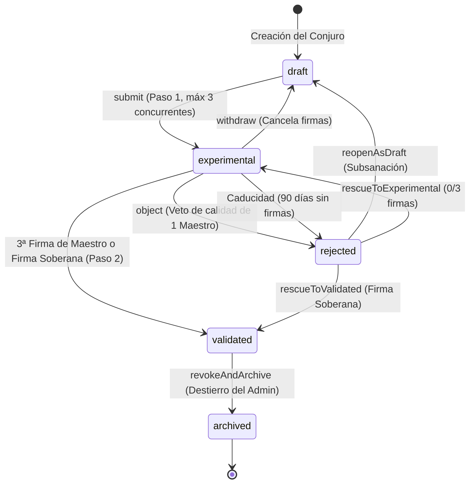

# PLAN-08: Plan Técnico de Implementación — Sistema de Moderación Solemne en Dos Pasos y Consecución de Firmas

> **Especificación Asociada:** [`specs/08-moderation-two-step.spec.md`](file:///C:/Users/Friki/.gemini/antigravity/scratch/grimorio-interactivo/specs/08-moderation-two-step.spec.md)  
> **Constitución:** [`constitution.md`](file:///C:/Users/Friki/.gemini/antigravity/scratch/grimorio-interactivo/constitution.md) | **Directrices:** [`AGENTS.md`](file:///C:/Users/Friki/.gemini/antigravity/scratch/grimorio-interactivo/AGENTS.md)  
> **Estado:** Listo para Implementación  
> **Restricción Suprema:** Dogma Vanilla (Cero librerías npm, frameworks externos o Composer) y Dualismo Lingüístico (Código, variables, clases y APIs en inglés `camelCase`/`snake_case`; narrativa, cánticos litúrgicos e interfaz en noble castellano).

---

## 1. Estructura de Módulos y Ficheros

La arquitectura se compone de servicios backend desacoplados en **PHP 8.2+ estricto** (`declare(strict_types=1);`), persistencia relacional transaccional en **SQLite PDO**, y componentes reactivos frontend en **Modern Vanilla JS (ES Modules nativos)** sin dependencias:

```
grimorio-interactivo/
├── src/                                         # Backend MVC en PHP 8.2+
│   ├── Dto/
│   │   ├── SpellReviewDto.php                   # Datos consolidados del estado de revisión de un conjuro [RF-01]
│   │   ├── MasterSignatureDto.php               # Firma emitida por un Maestro con glosa ceremonial [RF-02]
│   │   ├── ObjectionVerdictDto.php              # Dictamen de objeción con fundamentación litúrgica [RF-02.5]
│   │   ├── ImperialDecreeDto.php                # Decreto soberano del Administrador Supremo [RF-04]
│   │   └── ModerationQueueItemDto.php           # Elemento resumido para la Torre de Deliberación [RF-05.4]
│   ├── Repositories/
│   │   ├── SpellReviewRepository.php            # Mutaciones de estado, cupos y transiciones en `spell_reviews` [RF-01]
│   │   ├── MasterSignatureRepository.php        # Persistencia de firmas activas y revocadas [RF-02, RF-03]
│   │   ├── ObjectionVerdictRepository.php        # Dictámenes de objeción fundamentada y su memoria [RF-02.5, RF-06.2]
│   │   └── ImperialDecreeRepository.php         # Decretos soberanos con su edicto y su memoria en la bitácora [RF-04.5, RF-06.1]
│   ├── Services/
│   │   ├── ModerationWorkflowService.php        # Gestión de estados (draft/experimental/rejected), cupo de 3 y caducidad de 90 días [RF-01]
│   │   ├── MasterDeliberationService.php        # Firmas de Maestros, glosas (máx. 250 car.), retractación y consagración atómica en 3ª firma [RF-02]
│   │   ├── ConstitutionalEthicsValidator.php    # Veto ético de clan, veto de 30 días, pluralidad y anulación de firmas sobrevenidas [RF-03]
│   │   └── SovereignAdminService.php            # Firma Soberana (solo experimental), rescate limpio a 0/3, degradación póstuma y veto a clan propio [RF-04]
│   └── Controllers/
│       ├── ModerationController.php             # Endpoints para envíos, retiros, reaperturas y catálogo experimental [RF-01, RF-05]
│       ├── MasterDeliberationController.php     # Endpoints de la Torre: cola, firmas, objeciones y retractaciones [RF-02, RF-03]
│       └── SovereignAdminController.php         # Endpoints de intervención soberana, decretos y caducidad [RF-04]
├── public/                                      # Raíz pública del servidor web
│   └── assets/
│       ├── css/
│       │   └── components/
│       │       └── moderation.css               # Estilos solemnes del Atrio de Pruebas, Torre de Deliberación y modales [RF-05]
│       └── js/
│           ├── api/
│           │   └── moderationClient.js          # Cliente HTTP fetch para envíos, firmas, objeciones y decretos [RF-01 a RF-06]
│           ├── components/
│           │   ├── experimentalHallComponent.js # Catálogo público del Atrio de Pruebas con insignia ceremonial y contador [RF-05.1]
│           │   ├── mastersTowerComponent.js     # Panel de la Torre para Maestros con filtros, alertas éticas y acciones [RF-05.4]
│           │   ├── objectionModalComponent.js   # Diálogo modal de objeción fundamentada (mín. 20 car. en castellano) [RF-02.5]
│           │   ├── imperialDecreeModalComponent.js # Diálogo modal de edicto imperial para el Administrador Supremo [RF-04.5]
│           │   └── spellCorrectionComponent.js  # Panel del autor con 'reopenAsDraft' y visualización de objeciones previas [RF-01.4, RF-06.2]
│           └── views/
│               ├── experimentalHallView.js      # Vista general comunitaria del Atrio de los Arcanos Experimentales [RF-05.1]
│               └── mastersTowerView.js          # Vista restringida de la Torre de Deliberación para Maestros y Admin [RF-05.4]
└── scratch/
    └── test_moderation_workflow.php             # Suite de pruebas automatizadas CLI de gobernanza, ética y concurrencia
```

---

## 2. Modelo de Datos Relacional y Contratos de la API REST

### 2.1 Esquema DDL en SQLite (Cumplimiento del Artículo V)

> **Nota de dialecto y tipos estrictos (Tarea 1.1):** el bloque siguiente es el contrato canónico de columnas, claves e índices. En la implementación, `VARCHAR(n)` viaja como `TEXT` —dialecto consistente con `database/schema.sql`, donde SQLite no aplica longitudes—, `INT` como `INTEGER`, `BOOLEAN` como `INTEGER` 0/1 y `DATETIME` como `TEXT` en ISO 8601 UTC; la acotación que el tipo declara se impone con `CHECK`, que sí se aplica en SQLite y en MySQL. Los `CHECK` del dominio cerrado por la especificación —los cinco estados de RF-01.1, el techo de tres firmas de RF-02.1, la huella de 64 caracteres del Artículo II, la glosa de 250 de RF-02.2, la justificación de 20 de RF-02.5 y RF-04.5 y los cuatro decretos de RF-04— hacen de la base la última muralla de la Constitución. La enumeración de `revocation_reason` NO se cierra: la especificación nombra retractación, conflicto sobrevenido, pérdida de rango, retirada del autor y degradación póstuma, y admite motivos ceremoniales nuevos.
>
> **Dos moradas, un solo DDL:** las cuatro tablas viven en `database/schema.sql` (canónico: toda base nueva nace con ellas) y en `sql/08_moderation_schema.sql` (vía de ascensión idempotente para bases legadas). `scratch/test_moderation_schema.php` comprueba que ambas copias no divergen.

```sql
-- 1. Tabla de Seguimiento del Estado de Moderación [RF-01, RF-04, RF-05]
CREATE TABLE IF NOT EXISTS spell_reviews (
    id TEXT PRIMARY KEY,                                    -- UUID v4 de la revisión
    spell_id TEXT NOT NULL UNIQUE,                          -- Clave foránea 1:1 a la tabla `spells`
    author_id TEXT NOT NULL,                                -- Mago creador
    origin_clan_id TEXT NULL,                               -- Clan patrimonial de concepción (o null si ermitaño)
    status TEXT NOT NULL DEFAULT 'draft'                    -- 'draft' | 'experimental' | 'validated' | 'rejected' | 'archived'
           CHECK (status IN ('draft', 'experimental', 'validated', 'rejected', 'archived')),
    signatures_count INTEGER NOT NULL DEFAULT 0             -- Conteo activo de firmas válidas
                     CHECK (signatures_count >= 0 AND signatures_count <= 3),
    math_fingerprint TEXT NOT NULL                          -- Hash SHA-256 inmutable del balance sellado (Art. II)
                     CHECK (length(math_fingerprint) = 64),
    submitted_at TEXT NULL,                                 -- Fecha de entrada a la Torre de Moderación (ISO 8601 UTC)
    validated_at TEXT NULL,                                 -- Fecha de consagración solemne
    rejected_at TEXT NULL,                                  -- Fecha de objeción o caducidad
    reopened_at TEXT NULL,                                  -- Fecha de re-apertura como borrador
    archived_at TEXT NULL,                                  -- Fecha de degradación o destierro póstumo
    FOREIGN KEY (spell_id) REFERENCES spells (id) ON DELETE CASCADE,
    FOREIGN KEY (author_id) REFERENCES users (id) ON DELETE CASCADE,
    FOREIGN KEY (origin_clan_id) REFERENCES clans (id) ON UPDATE CASCADE
);

-- 2. Tabla de Firmas de Maestros y Glosas Litúrgicas [RF-02, RF-03]
CREATE TABLE IF NOT EXISTS master_signatures (
    id TEXT PRIMARY KEY,                                    -- UUID v4 de la firma
    spell_id TEXT NOT NULL,                                 -- Conjuro avalado
    master_id TEXT NOT NULL,                                -- Maestro firmante
    master_clan_id TEXT NULL,                               -- Clan al que pertenecía al firmar (o null si ermitaño)
    ceremonial_gloss TEXT NULL
                     CHECK (ceremonial_gloss IS NULL OR length(ceremonial_gloss) <= 250),  -- Glosa litúrgica opcional (máx. 250 car.)
    signed_at TEXT NOT NULL,                                -- Marca temporal de la firma
    is_revoked INTEGER NOT NULL DEFAULT 0                   -- 1 si fue retractada, anulada por conflicto ético o degradación
               CHECK (is_revoked IN (0, 1)),
    revoked_at TEXT NULL,                                   -- Fecha de revocación
    revocation_reason TEXT NULL,                            -- 'retracted' | 'clan_conflict_arisen' | 'rank_lost' | 'author_withdrawn' | 'sovereign_archive'
    FOREIGN KEY (spell_id) REFERENCES spells (id) ON DELETE CASCADE,
    FOREIGN KEY (master_id) REFERENCES users (id) ON DELETE CASCADE,
    FOREIGN KEY (master_clan_id) REFERENCES clans (id) ON UPDATE CASCADE
);

-- 3. Tabla de Dictámenes de Objeción Fundamentada [RF-02.5, RF-06.2]
CREATE TABLE IF NOT EXISTS objection_verdicts (
    id TEXT PRIMARY KEY,                                    -- UUID v4 del dictamen
    spell_id TEXT NOT NULL,                                 -- Conjuro objetado
    master_id TEXT NOT NULL,                                -- Maestro que emitió el veto
    objection_reason TEXT NOT NULL
                     CHECK (length(objection_reason) >= 20),  -- Motivo solemne obligatorio en castellano (mín. 20 car.)
    objected_at TEXT NOT NULL,                              -- Marca temporal del dictamen
    FOREIGN KEY (spell_id) REFERENCES spells (id) ON DELETE CASCADE,
    FOREIGN KEY (master_id) REFERENCES users(id) ON DELETE CASCADE
);

-- 4. Tabla de Decretos del Administrador Supremo [RF-04]
CREATE TABLE IF NOT EXISTS sovereign_decrees (
    id TEXT PRIMARY KEY,                                    -- UUID v4 del decreto
    spell_id TEXT NOT NULL,                                 -- Conjuro sobre el que se decretó
    admin_id TEXT NOT NULL,                                 -- Administrador Supremo actuante
    decree_type TEXT NOT NULL                               -- 'sovereignValidation' | 'rescueToExperimental' | 'rescueToValidated' | 'revokeAndArchive'
                CHECK (decree_type IN ('sovereignValidation', 'rescueToExperimental', 'rescueToValidated', 'revokeAndArchive')),
    imperial_decree_text TEXT NOT NULL
                         CHECK (length(imperial_decree_text) >= 20),  -- Edicto imperial obligatorio en castellano (mín. 20 car.)
    decreed_at TEXT NOT NULL,                               -- Marca temporal del decreto
    FOREIGN KEY (spell_id) REFERENCES spells (id) ON DELETE CASCADE,
    FOREIGN KEY (admin_id) REFERENCES users (id) ON DELETE CASCADE
);

-- Índices de Rendimiento, Pluralidad e Integridad Concurrente
CREATE UNIQUE INDEX IF NOT EXISTS idx_active_master_signature ON master_signatures(spell_id, master_id) WHERE is_revoked = 0;
CREATE INDEX IF NOT EXISTS idx_reviews_queue ON spell_reviews(status, submitted_at ASC);
CREATE INDEX IF NOT EXISTS idx_reviews_author_active ON spell_reviews(author_id, status);
CREATE INDEX IF NOT EXISTS idx_signatures_spell_active ON master_signatures(spell_id, is_revoked);
```

---

### 2.2 Contratos de la API REST

#### 1. Enviar Conjuro a Moderación (Paso 1)
* **Ruta:** `POST /api/v1/moderation/spells/{id}/submit`
* **Cabeceras:** `Authorization: Bearer <token>`
* **Respuestas:**
  * `200 OK`: Transicionado de `draft` a `experimental`, huella matemática sellada y firmas iniciadas en 0.
  * `400 Bad Request`: El conjuro no se encuentra en estado `draft` o carece de balance matemático válido.
  * `403 Forbidden`: Usuario con rol `reader` o en convalecencia arcana.
  * `409 Conflict`: El autor ya tiene tres (3) conjuros en estado `experimental`.

#### 2. Retirar Conjuro a Borrador Privado
* **Ruta:** `POST /api/v1/moderation/spells/{id}/withdraw`
* **Respuestas:**
  * `200 OK`: Transicionado a `draft`. Todas las firmas previas se marcan como revocadas con motivo `author_withdrawn`.
  * `403 Forbidden`: Solo el autor del conjuro puede retirarlo.
  * `409 Conflict`: No se puede retirar un conjuro que ya está `validated` o `archived`.

#### 3. Reabrir Conjuro Rechazado como Borrador (`reopenAsDraft`)
* **Ruta:** `POST /api/v1/moderation/spells/{id}/reopen`
* **Respuestas:**
  * `200 OK`: Transicionado de `rejected` a `draft`, habilitando la edición y manteniendo visible la última objeción.
  * `400 Bad Request`: El conjuro no se encuentra en estado `rejected`.

#### 4. Catálogo del Atrio de Pruebas (Público)
* **Ruta:** `GET /api/v1/moderation/experimental?element={element}&school={school}`
* **Respuestas:**
  * `200 OK`: Lista paginada de conjuros en deliberación con metadata, autor, clan originario, insignias de advertencia y conteo de firmas ($0/3$, $1/3$, $2/3$).

#### 5. Cola de la Torre de Deliberación (Exclusivo Maestros / Admin)
* **Ruta:** `GET /api/v1/moderation/queue`
* **Respuestas:**
  * `200 OK`: Conjuros en cola con indicador booleano `hasEthicalConflict` para el Maestro autenticado (calculado en servidor en base a clan propio y últimos 30 días).

#### 6. Estampar Firma de Consagración
* **Ruta:** `POST /api/v1/moderation/spells/{id}/sign`
* **Entrada:** `{ "ceremonialGloss": "Por la pureza del fulgor solar y la armonía de su invocación." }` (opcional, máx. 250 car.)
* **Respuestas:**
  * `200 OK`: Firma estampada. Si era la 3ª firma, devuelve `{ "status": "validated", "signaturesCount": 3, "consecrated": true }`.
  * `400 Bad Request`: El conjuro no está en `experimental` o la glosa supera 250 caracteres.
  * `403 Forbidden`: Conflicto ético de clan (Art. III), el usuario es el propio autor (auto-firma prohibida) o no ostenta rol `master`.
  * `409 Conflict`: Ya existe una firma activa de la misma hermandad en el conjuro o el usuario ya firmó.

#### 7. Retractar Firma de Maestro
* **Ruta:** `POST /api/v1/moderation/spells/{id}/retract`
* **Entrada:** `{ "reason": "Duda razonable sobre la resonancia elemental." }`
* **Respuestas:**
  * `200 OK`: Firma revocada, contador descendido a $N-1$.
  * `400 Bad Request`: No existe firma activa del usuario sobre el conjuro.
  * `409 Conflict`: El conjuro ya alcanzó `validated`, siendo la consagración irrevocable.

#### 8. Emitir Dictamen de Objeción (Veto de Calidad)
* **Ruta:** `POST /api/v1/moderation/spells/{id}/object`
* **Entrada:** `{ "objectionReason": "La descripción lírica presenta anacronismos manifiestos que vulneran el Velo Arcano (Art. IV)." }`
* **Respuestas:**
  * `200 OK`: Conjuro transicionado de inmediato a `rejected`, retirado del Atrio y devuelto a la libreta del autor.
  * `422 Unprocessable Entity`: La justificación tiene menos de 20 caracteres en castellano.
  * `403 Forbidden`: Conflicto ético o autor intentando objetar su propia obra.

#### 9. Firma Soberana Instantánea (`supremeAdmin`)
* **Ruta:** `POST /api/v1/moderation/sovereign/validate`
* **Entrada:** `{ "imperialDecreeText": "Por mandato del Cónclave Supremo, esta obra es consagrada de oficio por su excepcional belleza y equilibrio." }`
* **Respuestas:**
  * `200 OK`: Conjuro elevado inmediatamente a `validated` y acreditación de PDA ejecutada.
  * `400 Bad Request`: El conjuro no está en estado `experimental` (prohibida la validación de `draft` bajo Art. II).
  * `403 Forbidden`: El conjuro fue forjado por adeptos del clan del Administrador Supremo (Art. III.2) o es de su propia autoría.

#### 10. Rescate de Conjuro Rechazado (`supremeAdmin`)
* **Ruta:** `POST /api/v1/moderation/sovereign/rescue`
* **Entrada:** 
```json
{ 
  "targetStatus": "experimental", // o "validated"
  "imperialDecreeText": "Se determina que la objeción previa carecía de fundamento litúrgico objetivo; se reabre la deliberación colegiada." 
}
```
* **Respuestas:**
  * `200 OK`: Si `targetStatus == 'experimental'`, se reinicia con $0/3$ firmas. Si `targetStatus == 'validated'`, se consagra directamente (siempre que el autor no pertenezca a su propio clan).

#### 11. Revocación y Archivo Póstumo (`supremeAdmin`)
* **Ruta:** `POST /api/v1/moderation/sovereign/archive`
* **Entrada:** `{ "imperialDecreeText": "Se constata fraude en la composición del conjuro; queda desterrado del Gran Tomo.", "deductPoints": true }`
* **Respuestas:**
  * `200 OK`: Conjuro transicionado a `archived`, restando retroactivamente los PDA del clan originario si `deductPoints == true`.

#### 12. Tarea Programada de Caducidad por Letargo (Cron)
* **Ruta:** `POST /api/v1/moderation/cron-check-expiry`
* **Cabeceras:** `X-Arcane-Cron-Secret: <secret>`
* **Respuestas:**
  * `200 OK`: Transiciona a `rejected` todos los conjuros experimentales con más de 90 días naturales sin firmas activas.

---

## 3. Algoritmos Clave en Pseudocódigo y Máquinas de Estado

### 3.1 Máquina de Estados Canónica del Conjuro



---

### 3.2 Algoritmo de Firma de Consagración y Consagración Atómica en 3ª Firma

```
ALGORITMO signSpellByMaster(spellId, masterUserId, ceremonialGloss):
    INICIAR_TRANSACCION_ATOMICA()

    // 1. Bloqueo de fila del conjuro (SELECT ... FOR UPDATE)
    review = spellReviewRepository.findAndLockById(spellId)
    IF review == NULL OR review.status != 'experimental':
        CANCELAR_TRANSACCION()
        RETURN { success: FALSE, error: "SPELL_NOT_IN_REVIEW" }

    // 2. Bloqueo de Auto-Firma
    IF review.authorId == masterUserId:
        CANCELAR_TRANSACCION()
        RETURN { success: FALSE, error: "SELF_SIGNING_PROHIBITED" }

    // 3. Verificación de Veto Constitucional (Artículo III)
    isAllowed = constitutionalEthicsValidator.canMasterEvaluateSpell(masterUserId, review.originClanId)
    IF NOT isAllowed:
        CANCELAR_TRANSACCION()
        RETURN { success: FALSE, error: "CONSTITUTIONAL_ETHICS_VETO" }

    // 4. Verificación de Pluralidad de Clanes entre Firmantes Activos
    masterClanId = clanMemberRepository.findActiveClanId(masterUserId) // null si ermitaño
    activeSignatures = masterSignatureRepository.findActiveSignatures(spellId)

    FOR sig IN activeSignatures:
        IF sig.masterId == masterUserId:
            CANCELAR_TRANSACCION()
            RETURN { success: FALSE, error: "ALREADY_SIGNED" }
        // Si el firmante no es ermitaño, no puede coincidir con otro clan firmante
        IF masterClanId != NULL AND sig.masterClanId != NULL AND masterClanId == sig.masterClanId:
            CANCELAR_TRANSACCION()
            RETURN { success: FALSE, error: "CLAN_PLURALITY_VIOLATION" }

    // 5. Estampar Firma
    masterSignatureRepository.insertSignature(spellId, masterUserId, masterClanId, ceremonialGloss, getCurrentTimestampUtc())
    newCount = review.signaturesCount + 1
    spellReviewRepository.updateSignaturesCount(spellId, newCount)

    // Registrar en Bitácora de Auditoría
    auditLogRepository.log("MASTER_SIGNATURE_APPLIED", {
        spellId: spellId,
        masterId: masterUserId,
        clanId: masterClanId,
        signaturesCount: newCount,
        gloss: ceremonialGloss
    })

    // 6. Evaluación de Consagración (3ª Firma)
    IF newCount >= 3:
        nowUtc = getCurrentTimestampUtc()
        spellReviewRepository.setStatus(spellId, 'validated', nowUtc)
        spellRepository.setStatus(spellId, 'validated', nowUtc)

        // Acreditación de Puntos de Dominio Arcano (PDA) al Clan Originario (SPEC-07)
        IF review.originClanId != NULL:
            spellCircle = spellRepository.getCircle(spellId)
            spellElement = spellRepository.getElement(spellId)
            weeklyDominionService.awardPointsForValidatedSpell(review.originClanId, spellCircle, spellElement)

        auditLogRepository.log("SPELL_CONSECRATED_CANONICAL", {
            spellId: spellId,
            originClanId: review.originClanId,
            consecratedAt: nowUtc
        })

    CONSOLIDAR_TRANSACCION()
    RETURN { success: TRUE, status: (newCount >= 3 ? 'validated' : 'experimental'), signaturesCount: newCount }
```

---

### 3.3 Algoritmo de Anulación Automática por Conflicto Ético Sobrevenido o Pérdida de Rango

```
ALGORITMO onUserMembershipOrRankChanged(userId, eventType, newClanId, newRole):
    // Ejecutado como suscriptor de eventos cuando un usuario cambia de clan o pierde rango
    activeSignatures = masterSignatureRepository.findActiveSignaturesByMaster(userId)

    FOR sig IN activeSignatures:
        review = spellReviewRepository.findById(sig.spellId)
        // Solo aplica a conjuros que aún no alcanzaron la consagración
        IF review.status == 'experimental':
            mustRevoke = FALSE
            reason = ""

            // Caso A: Pérdida del rango de Maestro
            IF newRole != NULL AND newRole != 'master' AND newRole != 'supremeAdmin':
                mustRevoke = TRUE
                reason = "rank_lost"

            // Caso B: Conflicto sobrevenido por cambio de hermandad
            IF NOT mustRevoke AND review.originClanId != NULL:
                IF newClanId == review.originClanId:
                    mustRevoke = TRUE
                    reason = "clan_conflict_arisen"

            IF mustRevoke:
                INICIAR_TRANSACCION_ATOMICA()
                masterSignatureRepository.revokeSignature(sig.id, reason, getCurrentTimestampUtc())
                newCount = MAX(0, review.signaturesCount - 1)
                spellReviewRepository.updateSignaturesCount(sig.spellId, newCount)

                auditLogRepository.log("SIGNATURE_AUTOMATICALLY_ANNULLED", {
                    signatureId: sig.id,
                    spellId: sig.spellId,
                    masterId: userId,
                    reason: reason,
                    newSignaturesCount: newCount
                })
                CONSOLIDAR_TRANSACCION()
```

---

### 3.4 Algoritmo de Firma Soberana del Administrador Supremo

```
ALGORITMO executeSovereignValidation(spellId, adminUserId, imperialDecreeText):
    INICIAR_TRANSACCION_ATOMICA()

    review = spellReviewRepository.findAndLockById(spellId)
    // 1. Prohibido validar borradores bajo el Artículo II
    IF review.status != 'experimental':
        CANCELAR_TRANSACCION()
        RETURN { success: FALSE, error: "CANNOT_SOVEREIGN_VALIDATE_NON_EXPERIMENTAL" }

    // 2. Prohibido validar obras de propia autoría
    IF review.authorId == adminUserId:
        CANCELAR_TRANSACCION()
        RETURN { success: FALSE, error: "SELF_VALIDATION_PROHIBITED" }

    // 3. Veto al propio clan bajo el Artículo III.2
    adminClanId = clanMemberRepository.findActiveClanId(adminUserId)
    IF adminClanId != NULL AND review.originClanId != NULL AND adminClanId == review.originClanId:
        CANCELAR_TRANSACCION()
        RETURN { success: FALSE, error: "SOVEREIGN_OWN_CLAN_VETO" }

    // 4. Validación de longitud del Edicto Imperial
    IF LENGTH(TRIM(imperialDecreeText)) < 20:
        CANCELAR_TRANSACCION()
        RETURN { success: FALSE, error: "IMPERIAL_DECREE_TOO_SHORT" }

    nowUtc = getCurrentTimestampUtc()
    sovereignDecreeRepository.insertDecree(spellId, adminUserId, 'sovereignValidation', imperialDecreeText, nowUtc)
    spellReviewRepository.setStatus(spellId, 'validated', nowUtc)
    spellRepository.setStatus(spellId, 'validated', nowUtc)

    // Acreditación de PDA al clan originario
    IF review.originClanId != NULL:
        spellCircle = spellRepository.getCircle(spellId)
        spellElement = spellRepository.getElement(spellId)
        weeklyDominionService.awardPointsForValidatedSpell(review.originClanId, spellCircle, spellElement)

    auditLogRepository.log("SOVEREIGN_VALIDATION_DECREED", {
        spellId: spellId,
        adminId: adminUserId,
        decreeText: imperialDecreeText,
        consecratedAt: nowUtc
    })

    CONSOLIDAR_TRANSACCION()
    RETURN { success: TRUE, status: 'validated' }
```

---

## 4. Arquitectura de Eventos y Componentes Frontend Vanilla

### 4.1 Bus de Eventos Desacoplado (`window.addEventListener`)
* `moderation:submitted` $\rightarrow$ Actualiza el contador de cupo del autor y notifica a la Torre de Moderación.
* `moderation:signed` $\rightarrow$ Actualiza en vivo el progreso de firmas ($N/3$) en el Atrio y la Torre.
* `moderation:retracted` $\rightarrow$ Desciende el contador de firmas y reactiva el botón de firma para otros Maestros.
* `moderation:rejected` $\rightarrow$ Retira la tarjeta del Atrio de Pruebas y notifica privadamente al autor.
* `moderation:consecrated` $\rightarrow$ Efecto rúnico dorado triunfal, traslado del conjuro al Gran Tomo y emisión de puntos al clan.
* `moderation:decreed` $\rightarrow$ Despliegue del Edicto Imperial en la Bitácora de Auditoría pública.

### 4.2 Jerarquía de Componentes UI
1. **`experimentalHallComponent.js`:**  
   Pabellón público que renderiza los conjuros en deliberación con marco rúnico de advertencia (*«En Deliberación Arcana»*), medidor circular de firmas ($0/3, 1/3, 2/3$) y botón de prueba rápida en la Cámara de Conjuración (Canvas + Web Speech).
2. **`mastersTowerComponent.js`:**  
   Panel exclusivo de los Maestros de la Torre con filtros por círculo y elemento. Cada tarjeta evalúa en tiempo real si el Maestro tiene conflicto de hermandad; si existe incompatibilidad ética, el botón de firma se muestra inhabilitado con el distintivo: *«Veto Constitucional: Hermandad Incompatible (Art. III)»*.
3. **`objectionModalComponent.js`:**  
   Modal solemne que intercepta el veto de un Maestro, con contador decreciente de caracteres para asegurar un motivo en castellano $\ge 20$ caracteres.
4. **`spellCorrectionComponent.js`:**  
   Componente en la libreta del autor para conjuros en estado `rejected`, mostrando en un pergamino ámbar las notas litúrgicas del rechazo y el botón ceremonial **«Reabrir como Borrador»** (`reopenAsDraft`).

---

## 5. Decisiones Técnicas Justificadas y Alternativas Descartadas

| Decisión Técnica Adoptada | Justificación Canónica | Alternativas Descartadas |
| :--- | :--- | :--- |
| **Bloqueo Pesimista en Consagración (`SELECT ... FOR UPDATE`)** | Garantiza de forma estricta e inviolable la atomicidad de la 3ª firma frente a retractaciones simultáneas en la misma milésima de segundo (RNF-02). | **Bloqueo optimista por versión:** Riesgo de fallos silenciados y condiciones de carrera en ráfagas de firmas simultáneas.<br>**Polling en cliente:** Prohibido por Dogma Vanilla. |
| **Exclusión de `draft` de Facultades Soberanas** | Cumple de forma inquebrantable el Artículo II.3 (Ley del Maná), asegurando que ninguna obra sea validada sin haber sellado su huella matemática determinista en el servidor. | **Permitir validar borradores con auto-cálculo:** Viola la privacidad de la libreta personal del autor y fomenta abusos discrecionales. |
| **Reinicio Limpio a Cero Firmas ($0/3$) ante Rescate** | Si un conjuro rechazado es rescatado para volver a deliberación, reiniciar con $0/3$ garantiza un juicio fresco e imparcial de nuevos evaluadores. | **Restaurar firmas previas:** Puede arrastrar firmas de evaluadores que desconocían los defectos señalados en la objeción. |
| **Liberación Instantánea de Cupo al Rechazar** | Fomenta la creación activa permitiendo al autor postular otra obra de inmediato sin quedar bloqueado por un rechazo. | **Retener cupo hasta borrar el conjuro:** Frustra al creador y entorpece el flujo de aportaciones al santuario. |
| **El ciclo de vida tiene UN contador: `spell_reviews` manda y `spells` la espeja (Tarea 1.5)** | `spell_reviews` es la única autoridad del estado, del contador de firmas, de las marcas de cada transición y de la huella sellada; `spells.status` y `spells.signatures_count` son ESPEJO denormalizado —con el `CHECK` de estado ensanchado a los cinco valores canónicos— y su ÚNICO escritor es `SpellReviewRepository`, dentro de la MISMA transacción que el expediente. Un conjuro que nunca entró a moderación no tiene expediente, y entonces el espejo sostiene su estado embrionario `draft`; en cuanto la autoridad habla, el espejo la sigue sin voz propia. Es la misma forma que resolvió la afiliación de SPEC-07: autoridad con escritor único, espejo declarado y guion de reconciliación para las bases legadas. | **Retirar `spells.status` y servir todo por `JOIN`:** Invasivo —el Tomo, el Atrio y la libreta del autor consultan el estado en cada página— y obligaría a un `COALESCE` de tres tablas en SPEC-01 y SPEC-04.<br>**Dejar el espejo con TRES estados y derivar los otros dos del expediente:** Un conjuro desterrado volvería a `draft`, y el autor podría publicarlo de nuevo: el destierro soberano dejaría de existir.<br>**Un disparador del esquema que sincronice el espejo:** Silenciaría al segundo escritor en vez de impedirlo, y su cuerpo diverge entre SQLite (`BEGIN ... END`) y MySQL (una sola sentencia sin bloque).<br>**`?AuditService`-style opcionalidad en el escritor del espejo:** Abre un camino silencioso a la divergencia. |
| **El guion de ascensión ensancha el `CHECK` reconstruyendo la tabla (Tarea 1.5)** | SQLite no permite tocar un `CHECK` con `ALTER TABLE`, así que `sql/08_spell_status_single_source.sql` sigue el procedimiento canónico: `PRAGMA foreign_keys = OFF`, creación de la tabla nueva con los cinco estados, copia íntegra, `DROP`, `RENAME`, recreación de los seis índices, `PRAGMA foreign_key_check` y `ON`. El guion se declara SECUENCIAL y exclusivo de bases de esta generación, y documenta el dialecto alternativo de MySQL/MariaDB (`ALTER TABLE ... DROP CHECK` + `ADD CONSTRAINT`), que no necesita reconstrucción. | **Dejar la base legada con el `CHECK` estrecho y confiar en el espejo:** El primer veto que intente escribir `rejected` estallaría contra la base, con el expediente ya mutado y el espejo atrás.<br>**Aceptar un `CHECK` sin los dos estados nuevos y confiar en el servicio:** La base dejaría de ser la última muralla, contra el criterio de la Tarea 1.1. |
| **No se crea un `AuditLogRepository`: la bitácora se escribe por su canal único (Tarea 1.4)** | Este plan nombraba un `AuditLogRepository.php` como «conexión con la Bitácora», pero SPEC-03 ya construyó el canal: `AuditService::recordAction()` es el ÚNICO escritor de `audit_log`, y lo es por diseño —el catálogo cerrado de actos vive en `AuditEntry` y los disparadores del esquema prohíben enmendar o purgar la tabla—. Un repositorio intermedio hacia `audit_log` sería una segunda puerta al mismo recinto y, peor, invertiría las capas (un repositorio delegando en un servicio). Se sigue, por tanto, el precedente de todo el santuario: `ClanService`, `SpellManagementService` y `WeeklyDominionService` inscriben sus actos llamando a `AuditService` directamente. | **Crear `AuditLogRepository` que envuelva `AuditService`:** Duplica el catálogo de actos, invierte las capas y esquiva la validación de la entidad.<br>**Escribir en `audit_log` con un `INSERT` propio del repositorio:** Rompe el canal único de SPEC-03 y deja fuera el catálogo de acciones y de objetivos. |
| **El decreto y su memoria son un solo gesto (Tarea 1.4)** | `ImperialDecreeRepository` recibe `AuditService` como colaborador OBLIGATORIO y escribe la fila de `sovereign_decrees` y la entrada de `audit_log` dentro de la MISMA transacción: o el decreto queda inscrito con su edicto público, o nada de él se observa. Un decreto que no ha sido inscrito en la bitácora no ha ocurrido (RF-04.5), y admitir una construcción sin auditoría permitiría precisamente eso; la atomicidad no se afirma, se prueba con un disparador temporal que hace fracasar la bitácora y comprueba que el decreto se desvanece con ella. | **Inscribir la bitácora desde el servicio (Tarea 2.5):** El criterio de la Tarea 1.4 quedaría sin verificar hasta la Fase 2 y el invariante «no hay decreto sin edicto público» dependería de que cada llamante lo recuerde.<br>**Auditoría opcional (`?AuditService = null`):** Un camino silencioso hacia decretos sin memoria. |
| **El acto de la bitácora lo elige el repositorio, no el llamante (Tarea 1.4)** | El mapa cerrado decreto → acto canónico (`sovereignValidation` → `SOVEREIGN_VALIDATION`, ambos rescates → `SOVEREIGN_RESCUE`, `revokeAndArchive` → `SOVEREIGN_ARCHIVE`) impide que el llamante nombre el acto a su antojo: la bitácora siempre dice con precisión qué ocurrió. La identidad del actuante —alias público y rol técnico— se resuelve en `users` dentro de la misma transacción, para que la firma del llamante no arrastre datos de presentación falseables. | **Recibir el `actionType` por parámetro:** Un llamante podría inscribir un archivo soberano como una validación, y la bitácora dejaría de ser prueba.<br>**Aceptar alias y rol desde el llamante:** Abre la puerta a que la bitácora mienta sobre quién actuó. |
| **La unicidad se reconoce por su leyenda, no por su SQLSTATE (Tarea 1.3)** | `insertSignature()` traduce a `null` —«el Maestro ya avaló esta obra», 409— solo cuando el motor nombra la UNICIDAD. No basta mirar el SQLSTATE: SQLite y MySQL responden `23000` tanto a la violación de unicidad como a la de clave foránea, de modo que confiar en el código haría pasar una firma contra un conjuro inexistente o un clan fantasma por un aval duplicado, silenciando una corrupción real. Se reconoce por su nombre («UNIQUE constraint failed», «Duplicate entry», `23505` de PostgreSQL) y cualquier otro error de integridad se propaga intacto. | **Traducir por SQLSTATE 23000:** Convierte una clave foránea rota en un conflicto de negocio y la esconde del llamante.<br>**Dejar que reviente la excepción de unicidad:** El servicio tendría que inspeccionar excepciones del motor para dictar 409, contra el reparto de la Tarea 1.2. |
| **El aval vivo es la firma no revocada (Tarea 1.3)** | El índice único PARCIAL sobre `(spell_id, master_id) WHERE is_revoked = 0` grabado en la Tarea 1.1 convierte «un solo aval vivo por Maestro y conjuro» en una ley de la base, no en una comprobación del servicio: dos firmas simultáneas del mismo Maestro no pueden coexistir ni en una carrera. Revocar JAMÁS borra la fila —fija `is_revoked`, su instante y su motivo canónico—, de modo que RF-02.4 permite al Maestro volver a avalar y la bitácora conserva cuántas anulaciones de oficio hubo y por qué. | **Borrar la firma al retractarse:** Pierde el rastro que RF-03.4 y RF-03.5 necesitan para distinguir una anulación de oficio de una retractación.<br>**Un `UNIQUE (spell_id, master_id)` sin condición:** Impediría de por vida que un Maestro vuelva a avalar una obra tras retractarse (RF-02.4).<br>**Guardar una glosa en blanco como cadena vacía:** El silencio del Maestro no es una glosa, y ensuciaría el censo de firmas glosadas. |
| **El dictamen de objeción es INMUTABLE (Tarea 1.3)** | `ObjectionVerdictRepository` no ofrece método alguno de edición ni de borrado, y su tabla no tiene columnas de mutación: el texto que el autor lee en su libreta es el que el Maestro pronunció, carácter por carácter, con su puntuación y sus tildes (RF-06.2, Art. IV). La enmienda de RF-01.4 se logra con una nueva deliberación, jamás reescribiendo la anterior. | **Permitir editar el dictamen:** Haría desaparecer la prueba del veto justo cuando el autor la necesita para subsanar.<br>**Guardar la objeción como metadato resumido:** Convierte la subsanación en adivinación y vacía el Artículo IV de contenido. |
| **El repositorio MIDE; los servicios JUZGAN (Tarea 1.2)** | `SpellReviewRepository` no decide si el autor agotó su cupo, si un Maestro está vetado por el Artículo III ni si la obra alcanzó la consagración: expone los hechos —`countActiveReviewsByAuthor()`, la cola, el letargo— para que `ModerationWorkflowService` (Tarea 2.3) y `MasterDeliberationService` (Tarea 2.4) dicten 409 Conflict o 403 Forbidden sin inspeccionar excepciones del motor de datos. Una regla de negocio en el repositorio obligaría a duplicarla en cada consumidor y a re-descubrirla en cada prueba. | **Validar el cupo dentro del repositorio:** Convierte un contador en un veredicto y ata la capa de datos a un estado HTTP.<br>**Leer el cupo con `SELECT COUNT(*) FROM spells`:** Duplica la fuente de verdad del estado, que es precisamente el defecto que se cerró con la autoridad única de `spell_reviews`. |
| **Bloqueo de escritura por toque idempotente en SQLite (Tarea 1.2)** | `findAndLockById()` abre la transacción y TOUCA la fila con `UPDATE ... SET status = status`: el primer enunciado de escritura adquiere el bloqueo RESERVED del motor, de modo que la lectura y la escritura que le siguen quedan serializadas frente a cualquier otro escritor (RNF-02), y la transacción queda ABIERTA porque el bloqueo solo sirve si cubre la firma que lo sigue. Sobre MySQL y PostgreSQL se añade además `FOR UPDATE` a la consulta. (`BEGIN IMMEDIATE` se descartó: PDO no lo contabiliza y `commit()` fallaría con `inTransaction()` en falso.) | **Confiar en el bloqueo diferido de SQLite:** Dos Maestros podrían leer `2/3` a la vez antes de que ninguno escribiera, y la consagración de la 3ª firma dejaría de ser atómica.<br>**Bloqueo optimista por versión:** Fallos silenciados y reintentos en ráfaga, contra RNF-02.<br>**Fijar el conteo con un `UPDATE ... SET signatures_count = signatures_count + 1`:** Deja de medir firmas VIVAS y no puede reflejar la retractación de RF-02.4. |
| **Tipos Estrictos y Doble Morada del DDL del Cónclave (Tarea 1.1)** | El dominio que la especificación cierra se graba en la propia base con `CHECK`: los cinco estados de RF-01.1, el techo de tres firmas de RF-02.1, la huella de 64 caracteres del Artículo II, la glosa de 250 de RF-02.2, la justificación de 20 de RF-02.5 y RF-04.5 y los cuatro decretos de RF-04. La base es así la última muralla: ni un llamador descuidado inscribe una cuarta firma, ni un edicto imperial viaja sin razón. El DDL vive ADEMÁS en `database/schema.sql` —canónico, para que ninguna base nueva nazca sin el cónclave— y en `sql/08_moderation_schema.sql` —ascensión idempotente para bases legadas—, con un aserto que vigila que ambas copias no diverjan. | **Confiar el dominio al servicio y dejar la base abierta:** El error de un llamador se vuelve corrupción silenciosa del canon.<br>**Declarar el DDL solo en la migración `sql/`:** Es la fuga que SPEC-07 hubo de cerrar—un esquema repartido dejaba sin tablas a toda base levantada solo con el DDL raíz—.<br>**Partir las tablas con `ALTER TABLE`:** Otra vez un guion que no puede re-aplicarse; aquí las cuatro tablas nacen enteras y el guion es idempotente. |

---

## 6. Estrategia de Pruebas

### 6.1 Pruebas Automatizadas en CLI (`scratch/test_moderation_workflow.php`)

> **Arnés del ciclo de vida reconciliado (Tarea 1.5):** `scratch/test_spell_status_single_source.php` ejercita la autoridad y su espejo en siete fases (58 asertos): la superficie del guion y del DDL, el espejo siguiendo a la autoridad en sus tres caminos (`createOrUpdateReview`, `updateStatus`, `updateSignaturesCount`) con el borrador sin expediente intacto, la **auditoría estática que recorre todo `src/`** para exigir que ningún fichero fuera de `SpellReviewRepository` asigne `spells.status` ni `spells.signatures_count`, el recorrido de los cinco estados con la base como última muralla, la libreta del autor admitiendo `rejected` mientras el Tomo no, y el guion de ascensión sobre una base **LEGADA** con el `CHECK` antiguo de tres estados —siembra del expediente, ensanchado del `CHECK` con reconstrucción de la tabla, reconciliación, idempotencia al reaplicarlo y `PRAGMA foreign_key_check` limpio—.
>
> **Arnés de los decretos imperiales y la bitácora (Tarea 1.4):** `scratch/test_moderation_audit_integration.php` levanta una base efímera con el cónclave y ejerce `ImperialDecreeRepository` con el `AuditService` de SPEC-03 como único canal en ocho fases (78 asertos): la superficie del módulo y la obligatoriedad ESTRUCTURAL del canal de auditoría (por reflexión sobre el constructor), la inscripción del decreto y sus lecturas, el criterio «Hecho cuando» (actor, acto, objetivo, edicto íntegro e instante compartido en `audit_log`), los umbrales del edicto y del catálogo de decretos, la ATOMICIDAD probada con un disparador temporal que hace fracasar la bitácora, la inmutabilidad de la memoria, el catálogo de acciones de `AuditEntry` con su rótulo castellano cruzado contra `auditLogView.js`, y el `parameter binding` ante un edicto hostil.
>
> **Arnés de las firmas y los dictámenes (Tarea 1.3):** `scratch/test_moderation_signature_repositories.php` levanta una base efímera con el cónclave y ejerce los dos repositorios en once fases (99 asertos): la superficie de ambos módulos, el estampado de la firma (clan retratado, glosa de 250, ermitaños), la unicidad PARCIAL del aval vivo (segunda firma devuelta como `null`, y el mismo Maestro reestampando tras retractarse), `findActiveSignatures()` devolviendo solo las vivas —con la fila revocada aún en la base—, el censo del firmante, la revocación con motivo canónico e idempotencia, la anulación en bloque de `RF-02.6`, el contador 0/3 con la pluralidad de hermandades, el umbral de veinte caracteres del dictamen, `findLatestVerdictBySpell()` devolviendo el texto íntegro, la inmutabilidad del dictamen y el `parameter binding` ante entrada hostil.
>
> **Arnés del repositorio de revisiones (Tarea 1.2):** `scratch/test_moderation_review_repository.php` levanta una base efímera con el cónclave y ejerce `SpellReviewRepository` en diez fases (81 asertos): la superficie del módulo (tipado estricto y constantes del canon), la inscripción idempotente con relación 1:1 y preservación de `submitted_at`, las lecturas, las cinco transiciones con su marca temporal, el contador de firmas acotado, el cupo del autor, el bloqueo transaccional real (un segundo escritor es rechazado por el motor mientras la transacción vive), la cola del Atrio con sus filtros y paginación, el letargo de 90 días con reloj inyectable y el `parameter binding` ante entrada hostil. Los nueve métodos que la Tarea 1.2 exige quedan cubiertos por nombre.
>
> **Arnés del esquema (Tarea 1.1):** `scratch/test_moderation_schema.php` levanta una base SQLite efímera con la secuencia canónica (`database/schema.sql` + `database/seeds.sql` + `sql/08_moderation_schema.sql`) y comprueba el contrato del cónclave en nueve fases: idempotencia del guion de ascensión, las cuatro tablas y su contrato exacto de columnas, los `CHECK` del dominio, los índices (con la unicidad PARCIAL del de firma), el criterio «Hecho cuando» de las dos firmas activas del mismo Maestro, la condicionalidad de esa unicidad (retractación y pluralidad de tres Maestros), la integridad referencial con cascada y la anti-deriva entre las dos moradas del DDL. `scratch/test_moderation_workflow.php` queda reservado para el flujo de gobernanza completo de las fases posteriores.
1. **Flujo de Consagración Colegiada:**  
   Verificar que un conjuro experimental transiciona automáticamente a `validated` exactamente al recibir su 3ª firma de 3 Maestros de clanes distintos.
2. **Rechazo por Veto Constitucional (Artículo III):**  
   Comprobar que un Maestro perteneciente al clan del autor o que haya salido de él hace 29 días recibe un error 403 al intentar firmar u objetar.
3. **Bloqueo Inviolable de Auto-Firma:**  
   Comprobar que un autor con rango de `master` o `supremeAdmin` no puede firmar ni consagrar su propio conjuro.
4. **Regla de Pluralidad de Hermandades:**  
   Verificar que dos Maestros del mismo clan ajeno no pueden firmar el mismo conjuro, mientras que dos o tres Maestros ermitaños sin clan sí son admitidos.
5. **Veto de Calidad por Objeción:**  
   Verificar que un motivo $\ge 20$ caracteres transiciona de inmediato a `rejected`, cancela firmas previas y retira la obra del Atrio.
6. **Re-apertura Formal (`reopenAsDraft`):**  
   Validar que un conjuro rechazado pasa a `draft` habilitando la edición y manteniendo la nota del dictamen visible.
7. **Control del Límite de 3 Conjuros Concurrentes:**  
   Comprobar que un autor con 3 conjuros en `experimental` no puede enviar un 4º, y que al ser rechazado uno se libera el cupo de inmediato.
8. **Anulación Automática por Conflicto Sobrevenido:**  
   Simular la afiliación del autor al clan de un firmante previo y comprobar que la firma se revoca automáticamente ($N-1$).
9. **Inviolabilidad de `draft` y Veto a Clan Propio del `supremeAdmin`:**  
   Validar que el Administrador Supremo no puede validar un conjuro en `draft` y recibe error 403 si intenta validar una obra de su propia hermandad.
10. **Caducidad por Letargo (90 Días):**  
    Simular una marca de 91 días sin firmas y comprobar la transición automática a `rejected`.
11. **Herencia Ancestral ante Disolución de Clan:**  
    Validar que si el clan se disuelve durante la revisión, al consagrarse la obra se inscribe como «Herencia Ancestral» sumando solo puntos históricos.

---

## 7. Mapeo Estricto de Trazabilidad

| Requisito de la Spec | Módulo / Clase de Implementación | Prueba Automatizada Asociada |
| :--- | :--- | :--- |
| **RF-01.1 - RF-01.3** (Estados e Inmutabilidad) | `SpellReviewRepository` (autoridad y ESPEJO de `spells`), `ModerationWorkflowService`, `sql/08_spell_status_single_source.sql` | `testSpellReviewStateTransitions()`, `test_moderation_review_repository.php`, `test_spell_status_single_source.php` |
| **RF-01.4** (`reopenAsDraft`) | `ModerationWorkflowService::reopenAsDraft` | `testReopenAsDraftFlow()` |
| **RF-01.5** (Liberación de cupo de 3) | `SpellReviewRepository::countActiveReviewsByAuthor` | `testAuthorThreeSpellsQuota()` |
| **RF-01.6** (Caducidad por letargo de 90 días) | `ModerationWorkflowService::checkExpiryCron` | `testNinetyDaysLetargyExpiry()` |
| **RF-02.1** (3 firmas y pluralidad de hermandades) | `MasterDeliberationService::signSpell` | `testThreeSignaturesPlurality()` |
| **RF-02.2** (Glosa litúrgica máx. 250 car.) | `MasterSignatureDto`, `MasterDeliberationController` | `testCeremonialGlossMaxLength()` |
| **RF-02.3** (Consagración atómica y PDA) | `MasterDeliberationService`, `WeeklyDominionService` | `testAtomicConsecrationAndPdaAward()` |
| **RF-02.4** (Retractación voluntaria) | `MasterDeliberationService::retractSignature` | `testSignatureRetractionFlow()` |
| **RF-02.5 - RF-02.6** (Dictamen de objeción y veto) | `MasterDeliberationService::objectSpell` | `testQualityVetoReasonAndRejection()` |
| **RF-03.1 - RF-03.3** (Veto ético y auto-firma) | `ConstitutionalEthicsValidator` | `testArticleThreeEthicalVeto()` |
| **RF-03.4 - RF-03.5** (Conflicto sobrevenido y pérdida de rango) | `ConstitutionalEthicsValidator::revokeConflictedSignatures` | `testArisenConflictAndRankLoss()` |
| **RF-03.6** (Convalecencia como ermitaño) | `ConstitutionalEthicsValidator::canMasterEvaluateSpell` | `testConvalescentMasterDeliberation()` |
| **RF-03.7** (Herencia Ancestral tras disolución) | `MasterDeliberationService`, `WeeklyDominionService` | `testAncestralHeritageOnDissolution()` |
| **RF-04.1** (Firma Soberana solo en experimental) | `SovereignAdminService::executeSovereignValidation` | `testSovereignValidationOnlyExperimental()` |
| **RF-04.2** (Veto de clan al Admin Supremo) | `SovereignAdminService::executeSovereignValidation` | `testSovereignAdminOwnClanVeto()` |
| **RF-04.3** (Rescate a 0/3 o validated) | `SovereignAdminService::executeSovereignRescue` | `testSovereignRescueCleanReset()` |
| **RF-04.4 - RF-04.5** (Edicto Imperial obligatorio) | `SovereignDecreeRepository`, `AuditLogRepository` | `testImperialDecreeAuditObligation()` |
| **RF-05.1 - RF-05.3** (Atrio de Pruebas y aislamiento PDA) | `experimentalHallComponent.js`, `ModerationController` | `testExperimentalHallIsolation()` |
| **RF-05.4** (Torre de Deliberación para Maestros) | `mastersTowerComponent.js`, `MasterDeliberationController` | `testMastersTowerQueueAndFilters()` |
| **RF-06.1 - RF-06.2** (Bitácora inmutable y memoria) | `AuditLogRepository`, `spellCorrectionComponent.js` | `testAuditLogImmutability()` |
| **RNF-01 - RNF-05** (Dogma Vanilla y Dualismo Lingüístico) | Todo el código base, `declare(strict_types=1);` | `testStrictTypingAndVanillaDogma()` |

> **Evidencia previa de la Fase 1:** las suites de repositorio adelantan la cobertura de varios de estos requisitos antes de que existan los servicios de la Fase 2. `scratch/test_moderation_review_repository.php` cubre la parte de `RF-01.5` (el cupo del autor) y de `RF-01.6` (el letargo) que vive en la lectura de `spell_reviews`; `scratch/test_moderation_signature_repositories.php` cubre de `RF-02.1` la pluralidad y el contador 0/3, de `RF-02.4` la unicidad del aval vivo y la retractación, de `RF-02.5` el umbral de veinte caracteres, de `RF-02.6` la anulación de los avales previos, de `RF-03.4` y `RF-03.5` el censo del firmante que recorre el suscriptor de eventos y de `RF-06.2` la memoria íntegra del dictamen; `scratch/test_moderation_audit_integration.php` cubre de `RF-04.5` el edicto obligatorio con su inscripción automática e inmutable, y de `RF-06.1` el catálogo de actos de la bitácora y su rótulo castellano; `scratch/test_spell_status_single_source.php` cubre de `RF-01.1` el contador único de estado, de `RF-01.4` y `RF-06.2` el retorno de la obra vetada a la libreta de su autor y de `RF-02.1` el espejo del contador 0/3. Las suites de la Fase 4 quedan como cobertura de flujo completo —servicios, ética y concurrencia—, no como su único sostén.

---

## 8. Garantía de Dogma Vanilla y Dualismo Lingüístico

* **Dogma Vanilla Inviolable (Artículo I):**  
  Cero dependencias externas npm o Composer. Toda la gestión transaccional se apoya en SQLite PDO nativo con bloqueos inmediatos. La reactividad frontend utiliza ES Modules, Custom Properties de CSS3 y eventos nativos `CustomEvent`.
* **Dualismo Lingüístico (Artículo V):**  
  Todo símbolo de código, entidad, método, DTO y clave JSON se formula en inglés `camelCase`/`snake_case` (`spellId`, `signaturesCount`, `imperialDecreeText`, `masterClanId`). Toda la narrativa, descripciones litúrgicas, edictos imperiales, motivos de objeción y comentarios explicativos se redactan solemnemente en noble lengua castellana.
